# SONiC Submodule Pipeline Dependency Graph

This document describes the artifact download dependencies between submodule CI pipelines in sonic-buildimage.

## Pipeline ID Mapping

### Artifact Source Pipelines

These pipelines produce artifacts that other submodule pipelines download:

| Pipeline ID / Alias                          | Description                                       | Artifact Examples                        |
|----------------------------------------------|---------------------------------------------------|------------------------------------------|
| `Azure.sonic-buildimage.common_libs`         | sonic-buildimage common libs                      | libyang, libnl, libpcre debs             |
| `Azure.sonic-buildimage.official.vs`         | sonic-buildimage VS image                         | all debs + python wheels                 |
| `Azure.sonic-swss-common`                    | sonic-swss-common                                 | libswsscommon, python3-swsscommon debs    |
| `Azure.sonic-sairedis`                       | sonic-sairedis                                    | libsairedis, libsaimetadata debs         |
| `sonic-net.sonic-dash-api`                   | sonic-dash-api                                    | libdashapi debs                          |
| `sonic-net.sonic-platform-vpp`               | sonic-platform-vpp                                | libvppinfra-dev, vpp debs                |

### Consumer-Only Pipelines

These submodule pipelines download artifacts from the sources above but are not themselves referenced by other pipelines:

| Pipeline                    | Submodule Repo              |
|-----------------------------|-----------------------------|
| `Azure.sonic-swss`          | sonic-swss                  |
| `Azure.sonic-gnmi`          | sonic-gnmi                  |
| `Azure.sonic-utilities`     | sonic-utilities             |
| `Azure.sonic-bmp`           | sonic-bmp                   |
| `Azure.sonic-dash-ha`       | sonic-dash-ha               |
| `Azure.linkmgrd`            | linkmgrd                    |
| `Azure.dhcpmon`             | dhcpmon                     |
| `Azure.dhcprelay`           | dhcprelay                   |
| `Azure.sonic-stp`           | sonic-stp                   |
| `Azure.sonic-wpa-supplicant`| wpasupplicant               |
| `Azure.sonic-host-services` | sonic-host-services         |
| `Azure.sonic-mgmt-common`   | sonic-mgmt-common           |
| `Azure.sonic-mgmt-framework`| sonic-mgmt-framework        |
| `Azure.sonic-platform-common`| sonic-platform-common      |
| `Azure.sonic-platform-daemons`| sonic-platform-daemons    |
| `Azure.sonic-snmpagent`     | sonic-snmpagent             |
| `Azure.sonic-dbsyncd`       | sonic-dbsyncd               |

### Pipelines With No Cross-Pipeline Downloads

These submodules have pipeline definitions but do not download artifacts from other pipelines:

| Submodule             |
|-----------------------|
| sonic-py-swsssdk      |
| sonic-linux-kernel    |
| sonic-ztp             |
| sonic-dash-api        |

## Dependency Graph

```mermaid
graph TD
    CL["sonic-buildimage<br/>common_libs"]
    VS["sonic-buildimage<br/>official.vs"]
    SWC["sonic-swss-common"]
    SAI["sonic-sairedis"]
    SWSS["sonic-swss"]
    GNMI["sonic-gnmi"]
    UTIL["sonic-utilities"]
    BMP["sonic-bmp"]
    DHA["sonic-dash-ha"]
    LMG["linkmgrd"]
    DHM["dhcpmon"]
    DHR["dhcprelay"]
    STP["sonic-stp"]
    WPA["sonic-wpa-supplicant"]
    HSV["sonic-host-services"]
    MGC["sonic-mgmt-common"]
    MGF["sonic-mgmt-framework"]
    PLC["sonic-platform-common"]
    PLD["sonic-platform-daemons"]
    SNM["sonic-snmpagent"]
    DBS["sonic-dbsyncd"]
    DASH["sonic-dash-api"]
    VPP["sonic-platform-vpp"]

    CL --> SWC
    CL --> SAI
    CL --> GNMI
    CL --> LMG
    CL --> DHM
    CL --> DHR
    CL --> STP
    CL --> WPA
    CL --> DHA
    CL --> SWSS

    VS --> SWC
    VS --> GNMI
    VS --> BMP
    VS --> UTIL
    VS --> HSV
    VS --> MGC
    VS --> MGF
    VS --> PLC
    VS --> PLD
    VS --> SNM
    VS --> DBS

    SWC --> SAI
    SWC --> SWSS
    SWC --> GNMI
    SWC --> UTIL
    SWC --> BMP
    SWC --> DHA
    SWC --> LMG
    SWC --> DHM
    SWC --> DHR
    SWC --> STP
    SWC --> WPA

    SAI --> SWSS
    DASH --> SWSS
    DASH --> UTIL
    VPP --> SAI
    VPP --> SWSS
```



> Arrows mean **"provides artifacts to"** — e.g., `CL --> SWC` means sonic-swss-common downloads from common_libs.

## Build Order (Topological)

```
Level 0 (no dependencies):
  └── sonic-buildimage.common_libs    (libyang, libnl, libpcre, etc.)

Level 1 (depends on common_libs only):
  ├── sonic-buildimage.official.vs    (full VS image build)
  └── sonic-swss-common               (also needs buildimage.vs for yang wheels)

Level 2 (depends on Level 0 + Level 1):
  ├── sonic-sairedis       ← common_libs + swss-common + platform-vpp
  ├── sonic-dash-ha        ← common_libs + swss-common
  ├── linkmgrd             ← common_libs + swss-common
  ├── dhcpmon              ← common_libs + swss-common
  ├── dhcprelay            ← common_libs + swss-common
  ├── sonic-stp            ← common_libs + swss-common
  ├── sonic-wpa-supplicant ← common_libs + swss-common
  ├── sonic-gnmi           ← common_libs + buildimage.vs + swss-common
  ├── sonic-bmp            ← buildimage.vs + swss-common
  └── sonic-utilities      ← buildimage.vs + swss-common + dash-api

Level 3 (depends on Level 2):
  └── sonic-swss           ← swss-common + sairedis + common_libs + dash-api + platform-vpp

Independent (only need buildimage.vs):
  ├── sonic-host-services
  ├── sonic-mgmt-common
  ├── sonic-mgmt-framework
  ├── sonic-platform-common
  ├── sonic-platform-daemons
  ├── sonic-snmpagent
  └── sonic-dbsyncd
```

## Detailed Dependency Table

| Submodule Pipeline         | Downloads Artifacts From                                                        |
|----------------------------|---------------------------------------------------------------------------------|
| **sonic-swss-common**      | `common_libs` (libyang) + `buildimage.vs` (142, yang wheels)                    |
| **sonic-sairedis**         | `common_libs` (libyang, libnl) + `sonic-swss-common` (9) + `sonic-platform-vpp`|
| **sonic-swss**             | `sonic-swss-common` + `sonic-sairedis` + `common_libs` + `sonic-dash-api` + `sonic-platform-vpp` |
| **sonic-gnmi**             | `common_libs` + `buildimage.vs` (142) + `sonic-swss-common` (9)                |
| **sonic-utilities**        | `buildimage.vs` (142) + `sonic-swss-common` (9) + `sonic-dash-api`             |
| **sonic-bmp**              | `buildimage.vs` (142, libyang/libnl) + `sonic-swss-common`                     |
| **sonic-dash-ha**          | `common_libs` (libnl) + `sonic-swss-common`                                    |
| **linkmgrd**               | `common_libs` (libyang) + `sonic-swss-common` (9)                              |
| **dhcpmon**                | `common_libs` (libyang/libnl) + `sonic-swss-common`                            |
| **dhcprelay**              | `common_libs` (libyang) + `sonic-swss-common` (9)                              |
| **sonic-stp**              | `sonic-swss-common` (9) + `common_libs` (465, libyang/libnl)                   |
| **sonic-wpa-supplicant**   | `common_libs` (libyang) + `sonic-swss-common` (9)                              |
| **sonic-host-services**    | `buildimage.vs` (142)                                                           |
| **sonic-mgmt-common**      | `buildimage.vs` (142)                                                           |
| **sonic-mgmt-framework**   | `buildimage.vs` (142)                                                           |
| **sonic-platform-common**  | `buildimage.vs` (142)                                                           |
| **sonic-platform-daemons** | `buildimage.vs` (142)                                                           |
| **sonic-snmpagent**        | `buildimage.vs` (142)                                                           |
| **sonic-dbsyncd**          | `buildimage.vs` (142)                                                           |
