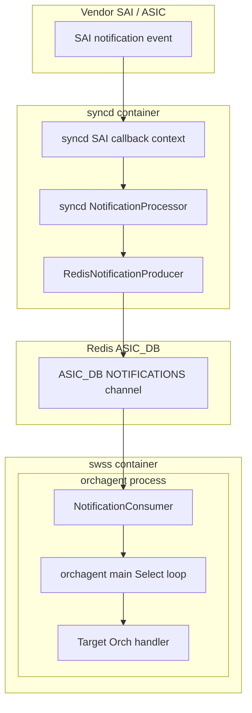
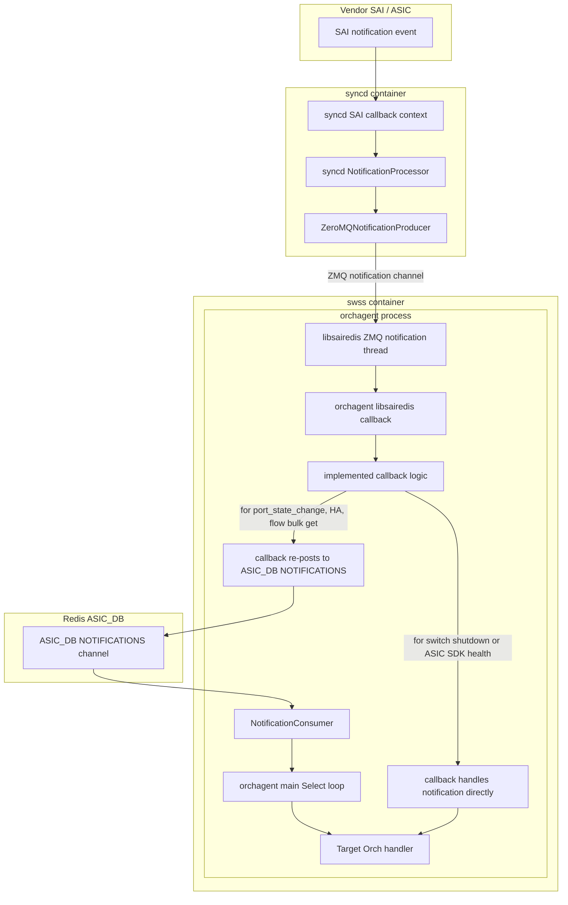
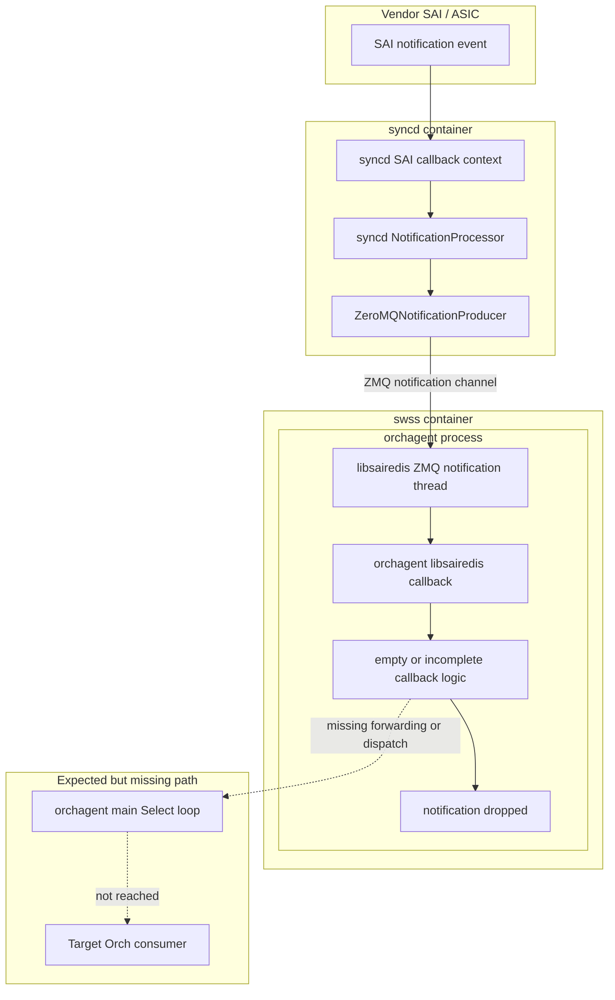
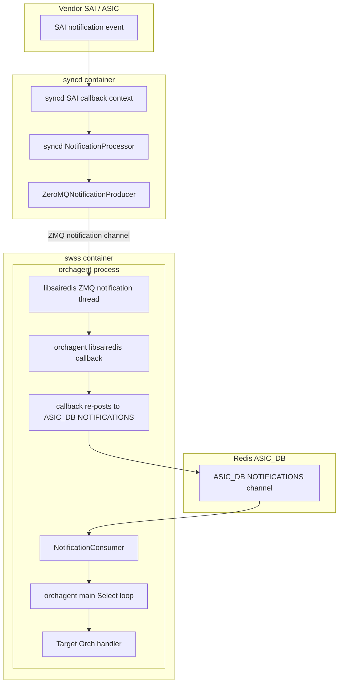
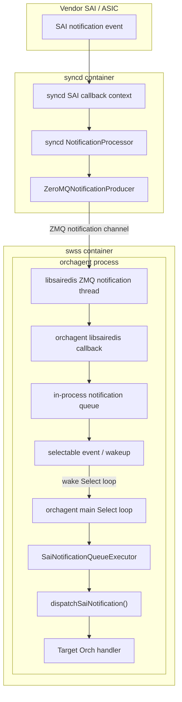
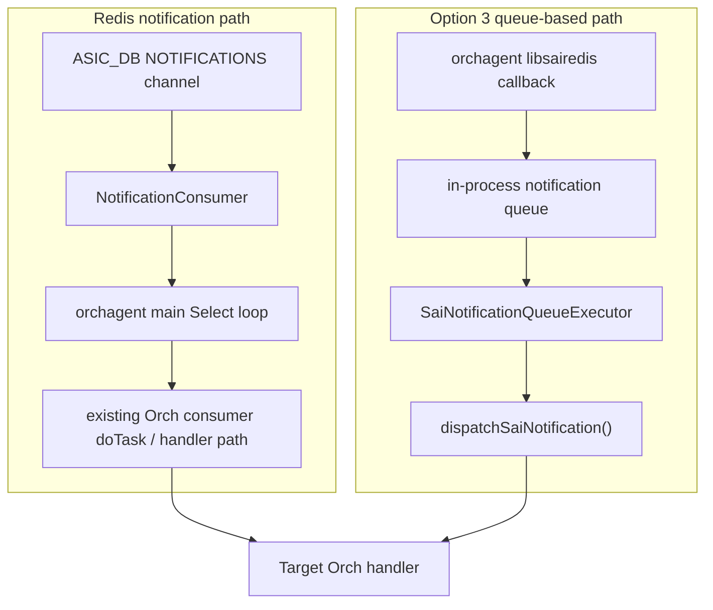
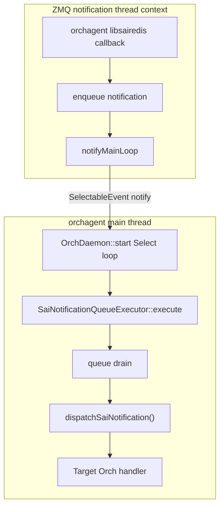
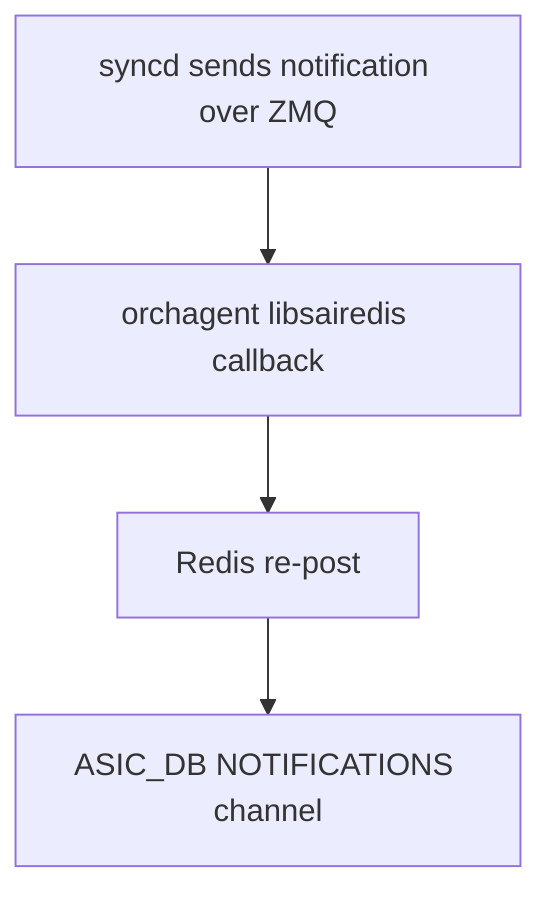
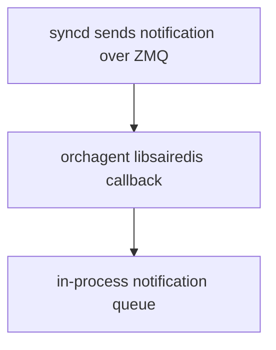

# HLD: SAI Notification Handling with ZMQ Southbound

## Table of Contents

- [1. Background](#1-background)
- [2. Problem Statement](#2-problem-statement)
- [3. Existing Notification Flows](#3-existing-notification-flows)
  - [3.1 Non-ZMQ Mode](#31-non-zmq-mode)
  - [3.2 ZMQ Mode Today](#32-zmq-mode-today)
- [4. Design Goals](#4-design-goals)
- [5. Design Options](#5-design-options)
  - [Option 1: `syncd` Publishes Notifications via Redis in ZMQ Mode](#option-1-syncd-publishes-notifications-via-redis-in-zmq-mode)
  - [Option 2: `orchagent` Callback Re-posts to `ASIC_DB:NOTIFICATIONS`](#option-2-orchagent-callback-re-posts-to-asic_dbnotifications)
  - [Option 3: In-process Notification Queue Drained by Orch Main Loop](#option-3-in-process-notification-queue-drained-by-orch-main-loop)
- [6. References](#6-references)

## 1. Background

SONiC recently added support for ZMQ southbound communication between `orchagent` and `syncd` for regular switches. This is controlled by the route-performance ZMQ setting:

```text
SYSTEM_DEFAULTS|swss_zmq.status = enabled
```

In non-ZMQ mode (Redis mode), SAI notifications are published by `syncd` into Redis `ASIC_DB:NOTIFICATIONS`. `orchagent` consumes those notifications from Redis in its normal main loop and dispatches them to the appropriate Orch components.

In ZMQ mode, `syncd` sends notifications to `orchagent` through ZMQ. These notifications arrive in `orchagent` libsairedis callback functions. Some callbacks already forward notifications to Redis, such as `on_port_state_change()`, but several callbacks are currently empty or incomplete. As a result, some notifications are dropped when ZMQ southbound is enabled.

This gap is tracked in [sonic-buildimage issue #27541](https://github.com/sonic-net/sonic-buildimage/issues/27541). An initial short-term implementation is proposed in [sonic-swss PR #4619](https://github.com/sonic-net/sonic-swss/pull/4619).

## 2. Problem Statement

When ZMQ southbound is enabled, the following SAI notifications may not reach their existing Orch consumers:

- `fdb_event`
- `bfd_session_state_change`
- `port_host_tx_ready`
- `icmp_echo_session_state_change`

Additional notification types may also need review, depending on platform and feature coverage.

Expected consumers include:

- `FdbOrch`
- `BfdOrch`
- `PortsOrch`
- `IcmpOrch`

Without a fix:

- Hardware-learned MAC entries may not propagate to `FdbOrch`.
- BFD session state transitions may not reach `BfdOrch`.
- Port host TX readiness may not reach `PortsOrch`.
- ICMP echo session monitoring may not reach `IcmpOrch`.

Notification prioritization and timely handling of high-priority notifications, such as port state changes and BFD session state changes, under high `orchagent` load is a broader concern for both ZMQ and non-ZMQ modes. This HLD considers that concern only in the context of the ZMQ notification handling [design options](#5-design-options); it does not propose changes to the existing non-ZMQ notification path.

## 3. Existing Notification Flows

The diagrams below show notification delivery paths at a high level. Where thread context affects the design, the text calls out the relevant execution contexts, such as the libsairedis notification thread and the `orchagent` main loop.

### 3.1 Non-ZMQ Mode



The non-ZMQ notification path has three main execution hops:

- Vendor SAI invokes the registered notification callback in `syncd`.
- `syncd` notification processing publishes the notification to `ASIC_DB:NOTIFICATIONS`.
- `orchagent` consumes the notification through `NotificationConsumer` in the main `Select` loop and dispatches it to the target Orch handler.

This is the existing proven notification path.

### 3.2 ZMQ Mode Today

ZMQ mode has existing notification handling gaps today. Some notifications already have callback handling logic, while the notifications covered by this HLD do not yet reach their existing Orch consumers.

### 3.2.1 Notifications Already Handled



### 3.2.2 Notifications With Missing Callback Handling



## 4. Design Goals

- Preserve existing non-ZMQ behavior.
- Restore missing notifications in ZMQ mode.
- Avoid duplicate notification delivery.
- Preserve existing Orch handler behavior.
- Keep Orch state updates on the `orchagent` main-loop path.

## 5. Design Options

## Option 1: `syncd` Publishes Notifications via Redis in ZMQ Mode

### Description

Under this option, when ZMQ southbound is enabled, regular SAI operations continue to use the existing ZMQ request/response channel between `orchagent` and `syncd` through `ZeroMQSelectableChannel`, while SAI notifications are published by `syncd` through Redis.

This option reuses the existing `RedisNotificationProducer` used in non-ZMQ mode; the change is only to select it for SAI notifications when ZMQ southbound is enabled.

### Notification Path

SAI notifications follow the same Redis notification path described in [Section 3.1](#31-non-zmq-mode). The difference is that this path is selected even when ZMQ southbound is enabled; regular SAI request/response operations still use ZMQ.

### Implementation Notes

Option 1 would change the ZMQ-mode notification producer selection in `syncd` from:

```cpp
m_notifications = std::make_shared<ZeroMQNotificationProducer>(m_contextConfig->m_zmqNtfEndpoint);
```

to:

```cpp
m_notifications = std::make_shared<RedisNotificationProducer>(m_contextConfig->m_dbAsic);
```

`orchagent` libsairedis notification callbacks remain no-op for these notifications in this option, because `syncd` publishes the notifications directly to Redis. If a callback re-publishes a Redis-delivered notification back to Redis, duplicate or looping notifications can occur.

### Pros

- Uses the existing Redis notification path.
- Existing Orch consumers continue unchanged.

### Cons

- Makes ZMQ mode asymmetric:
  - request/response operations use ZMQ.
  - SAI notifications use Redis.

## Option 2: `orchagent` Callback Re-posts to `ASIC_DB:NOTIFICATIONS`

### Description

In this option, `syncd` continues to send notifications to `orchagent` through ZMQ. The `libsairedis` ZMQ notification path invokes the registered SAI notification callback in `orchagent`, and that callback re-publishes the notification to `ASIC_DB:NOTIFICATIONS` only when ZMQ mode is enabled.

This follows the existing `on_port_state_change()` model and is the approach used by the initial fix in [sonic-swss PR #4619](https://github.com/sonic-net/sonic-swss/pull/4619). The same forwarding behavior would be added to each missing notification callback covered by this HLD.

### Flow



### Implementation Notes

The following snippet is high-level pseudo-code for the callback re-post model.

```cpp
void on_fdb_event(uint32_t count, const sai_fdb_event_notification_data_t *data)
{
    if (gRedisCommunicationMode != SAI_REDIS_COMMUNICATION_MODE_ZMQ_SYNC)
    {
        return;
    }

    static thread_local swss::DBConnector db("ASIC_DB", 0);
    static thread_local swss::NotificationProducer producer(&db, "NOTIFICATIONS");

    std::string payload = sai_serialize_fdb_event_ntf(count, data);
    std::vector<swss::FieldValueTuple> values;

    producer.send(SAI_SWITCH_NOTIFICATION_NAME_FDB_EVENT, payload, values);
}
```

Note: The callback must check whether ZMQ mode is enabled before re-publishing to Redis. In non-ZMQ mode, `syncd` already publishes the notification to `ASIC_DB:NOTIFICATIONS`, and the normal `orchagent` `NotificationConsumer` path handles it in the main loop. The libsairedis notification path can still deserialize Redis notifications and invoke the registered `orchagent` libsairedis callback in non-ZMQ mode. If the callback re-publishes the notification to Redis in that mode, duplicate or looping notifications can occur. Therefore, the callback only re-publishes when `gRedisCommunicationMode == SAI_REDIS_COMMUNICATION_MODE_ZMQ_SYNC`.

### Pros

- Low-risk short-term fix.
- No `syncd` change.
- Keeps ZMQ transport between `syncd` and `orchagent`.
- Reuses existing Orch Redis notification processing path.
- Can be implemented and validated event-by-event.

### Cons

- Compared with Option 1, notifications first travel over ZMQ before being re-posted to Redis for Orch processing, which can add latency.
- Uses Redis for final notification dispatch.

## Option 3: In-process Notification Queue Drained by Orch Main Loop

### Description

In this option, the `orchagent` libsairedis callback packages the notification and makes it available to the main loop through an in-process notification queue. The `orchagent` main loop drains the queue and dispatches the event to the appropriate Orch handler.

This model is similar in spirit to existing selectable-based processing such as `ZmqConsumerStateTable`, where data availability wakes the main loop and processing happens through an executor path.

### Flow



### Dispatch Relationship During Phased Migration to Option 3

Option 3 does not send migrated ZMQ notifications back through `ASIC_DB:NOTIFICATIONS`. For notification types moved to the Option 3 queue-based model, the `orchagent` libsairedis callback enqueues the notification, and the `orchagent` main loop drains the queue and dispatches it to the target Orch handler.

The existing Redis notification path remains unchanged for non-ZMQ mode and for notification types that continue to use the Option 2 Redis re-post model during phased rollout. In those cases, notifications are consumed through the existing `NotificationConsumer` path and dispatched by the corresponding Orch consumer `doTask()` / handler logic.



Both paths should preserve the same Orch handler behavior. The non-ZMQ mode and Option 2 paths continue to use the existing Redis `NotificationConsumer` and Orch consumer `doTask()` / handler flow, while Option 3 uses the new queue-based executor path for migrated ZMQ notification types.

### Existing Code References

Option 3 is expected to build on the following existing infrastructure:

- Callback implementations: some existing `orchagent` SAI notification callbacks are currently no-op or incomplete for ZMQ mode and need forwarding or queueing behavior. Examples include `on_fdb_event()`, `on_bfd_session_state_change()`, and `on_port_host_tx_ready()` in `src/sonic-swss/orchagent/notifications.cpp`, and `IcmpSaiSessionHandler::on_state_change()` in `src/sonic-swss/orchagent/icmporch.cpp`. Under Option 3, these callbacks would enqueue notifications for main-loop processing.
- Callback registration: notification callbacks are registered through existing Orch initialization and feature-specific setup paths. Examples include switch notification setup in `src/sonic-swss/orchagent/main.cpp`, `src/sonic-swss/orchagent/portsorch.cpp`, and `src/sonic-swss/orchagent/bfdorch.cpp`, and ICMP offload-session callback registration through `SaiOffloadSessionHandler`.
- Existing Orch notification consumers: in the existing non-ZMQ notification path, these notification types are consumed from `ASIC_DB:NOTIFICATIONS` by target Orch consumers such as `FdbOrch`, `BfdOrch`, `PortsOrch`, and `IcmpOrch`. Option 3 should preserve the same Orch handler behavior without sending migrated ZMQ notifications through Redis.
- Existing Redis notification dispatch: Redis-delivered SAI notifications are consumed through `NotificationConsumer` instances wrapped by `Notifier`. `Notifier::execute()` calls the corresponding Orch `doTask(NotificationConsumer&)`, preserving the existing per-Orch notification handling model for non-ZMQ mode and Option 2.
- Selectable-based ZMQ consumers: `src/sonic-swss-common/common/zmqconsumerstatetable.h` defines `ZmqConsumerStateTable`, an existing selectable-based ZMQ consumer that wakes the main loop when data is available and processes data through the executor path. Option 3 can follow a similar integration pattern for SAI notifications.
- Select priority: `swss::Selectable` carries a priority value used by `Select`; higher priority values are selected ahead of lower-priority ready selectables. Option 3 should use this existing priority model where practical.
- Main-loop infrastructure: `src/sonic-swss/orchagent/orchdaemon.cpp` contains the main `OrchDaemon::start()` `Select` loop that waits on registered selectables and dispatches `Executor::execute()` when a selectable becomes ready. The Option 3 integration approach is described in [Main-loop Integration](#main-loop-integration).

### Implementation Notes

The following snippets are high-level pseudo-code to illustrate the queue-based design; exact class names and integration points may change during implementation.

```cpp
struct SaiNotification
{
    std::string name;
    std::string payload;
    std::vector<swss::FieldValueTuple> values;
};
```

```cpp
class SaiNotificationQueue
{
public:
    void enqueue(SaiNotification notification)
    {
        {
            std::lock_guard<std::mutex> lock(m_mutex);
            m_queue.push(std::move(notification));
        }

        notifyMainLoop();
    }

    bool tryDequeue(SaiNotification &notification)
    {
        std::lock_guard<std::mutex> lock(m_mutex);

        if (m_queue.empty())
        {
            return false;
        }

        notification = std::move(m_queue.front());
        m_queue.pop();
        return true;
    }

private:
    std::mutex m_mutex;
    std::queue<SaiNotification> m_queue;
    SelectableEvent m_wakeupEvent;

    void notifyMainLoop()
    {
        m_wakeupEvent.notify();
    }
};
```

`notifyMainLoop()` represents a wakeup mechanism for the existing `orchagent` main loop. The implementation should reuse the existing swss selectable/executor model where practical, similar to `ZmqConsumerStateTable`, rather than introducing a separate main-loop mechanism. The important requirement is that enqueueing a notification makes a selectable object readable so the current `OrchDaemon::start()` loop can dispatch it like other selectables.

Callback:

```cpp
void on_fdb_event(uint32_t count, const sai_fdb_event_notification_data_t *data)
{
    if (gRedisCommunicationMode != SAI_REDIS_COMMUNICATION_MODE_ZMQ_SYNC)
    {
        return;
    }

    SaiNotification notification;
    notification.name = SAI_SWITCH_NOTIFICATION_NAME_FDB_EVENT;
    notification.payload = sai_serialize_fdb_event_ntf(count, data);

    gSaiNotificationQueue.enqueue(std::move(notification));
}
```

#### Main-loop Integration

Option 3 should expose the notification queue through an existing-style selectable/executor so the current `OrchDaemon::start()` `Select` loop can dispatch it like other selectables.



The existing main loop already waits on selectable executors:

```cpp
void OrchDaemon::start(long heartBeatInterval)
{
    for (Orch *o : m_orchList)
    {
        m_select->addSelectables(o->getSelectables());
    }

    while (true)
    {
        Selectable *s;
        int ret = m_select->select(&s, SELECT_TIMEOUT);

        if (ret == Select::OBJECT)
        {
            auto *executor = static_cast<Executor *>(s);
            executor->execute();
        }
    }
}
```

The queued ZMQ notification path would add a new executor to this same model:

```cpp
class SaiNotificationQueueExecutor : public Executor
{
public:
    void execute() override
    {
        m_queue.clearWakeupEvent();

        SaiNotification notification;
        while (m_queue.tryDequeue(notification))
        {
            dispatchSaiNotification(notification);
        }
    }
};
```

During `orchagent` initialization:

```cpp
Orch::addExecutor(new SaiNotificationQueueExecutor(...));
```

The conceptual equivalent is:

```cpp
void processQueuedZmqNotifications()
{
    SaiNotification notification;

    while (gSaiNotificationQueue.tryDequeue(notification))
    {
        dispatchSaiNotification(notification);
    }
}
```

### Priority and Fairness

Option 3 should use the existing `Select` priority mechanism where practical instead of introducing separate internal priority queues.

The flow diagram and pseudo-code above show the initial Option 3 design, where migrated SAI notifications share one notification queue and one selectable/executor priority. That selectable/executor should use an appropriate priority so time-sensitive SAI notifications can be processed ahead of lower-priority regular `orchagent` work. This follows the existing `Select` behavior where ready selectables are dispatched according to priority.

If notification-level priority is required, notifications can be split across multiple selectable/executor instances, such as a high-priority executor for port state, port host TX ready, and BFD notifications, and a normal-priority executor for other notifications. Each executor would use the existing `Select` priority mechanism.

Option 3 notification dispatch:

```cpp
void OrchDaemon::dispatchSaiNotification(const SaiNotification &notification)
{
    if (notification.name == SAI_SWITCH_NOTIFICATION_NAME_FDB_EVENT)
    {
        gFdbOrch->handleNotification(notification.name, notification.payload, notification.values);
    }
    else if (notification.name == SAI_SWITCH_NOTIFICATION_NAME_PORT_STATE_CHANGE)
    {
        gPortsOrch->handleNotification(notification.name, notification.payload, notification.values);
    }
    else if (notification.name == SAI_SWITCH_NOTIFICATION_NAME_BFD_SESSION_STATE_CHANGE)
    {
        gBfdOrch->handleNotification(notification.name, notification.payload, notification.values);
    }
}
```

### Migration Note for Existing Option 2-style Callbacks

For phased rollout of the long-term Option 3 queue-based model, notification types can be migrated incrementally. Notifications not yet migrated can continue to use Option 2, where libsairedis callbacks re-post notifications to Redis and the existing `ASIC_DB:NOTIFICATIONS` subscription handles final Orch dispatch.

Existing Option 2-style callbacks can be migrated notification type by notification type.

Current short-term / Option 2-style path:



Long-term / Option 3 queue-based path:



### Pros

- Compared with Option 2, avoids the Redis re-post for migrated notifications and can reduce notification latency.
- Keeps Orch state updates on the `orchagent` main-loop path.
- Uses the existing selectable/executor model and `Select` priority mechanism where practical.
- Supports incremental migration from Option 2 to Option 3 per notification type.

### Cons

- Requires implementation and validation of a new selectable/executor path for SAI notifications.
- Requires backpressure behavior for the in-process notification queue.
- Requires lifecycle handling for the shared queue and wakeup mechanism during startup, shutdown, and callback teardown.
- More implementation and test effort than Option 2.
- Larger design review scope.

## 6. References

- [sonic-buildimage issue #27541](https://github.com/sonic-net/sonic-buildimage/issues/27541): Missing notification forwarding for FDB/BFD when ZMQ southbound is enabled
- [sonic-swss PR #4619](https://github.com/sonic-net/sonic-swss/pull/4619): Forward SAI notifications to Redis in ZMQ southbound mode
