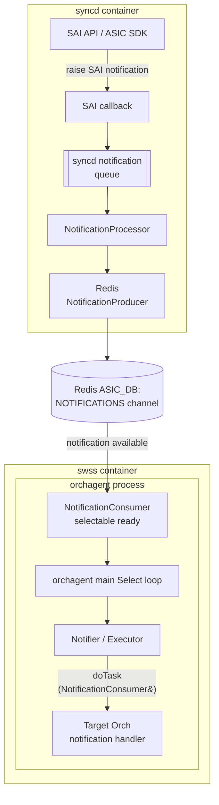
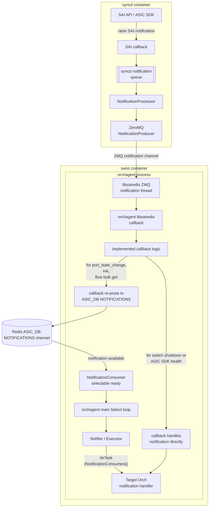
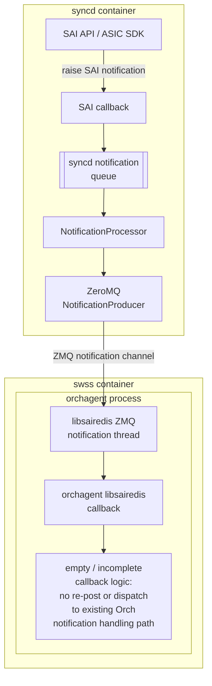
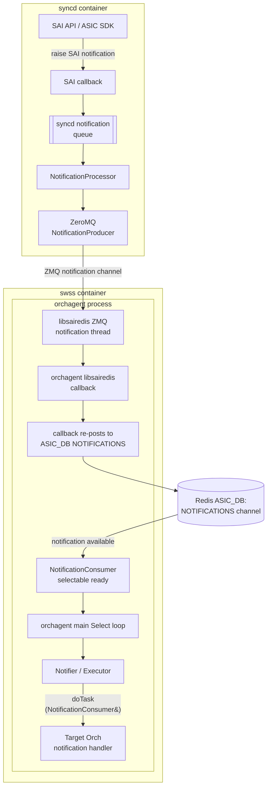
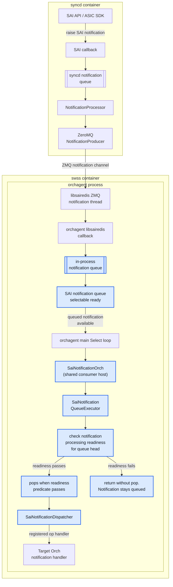
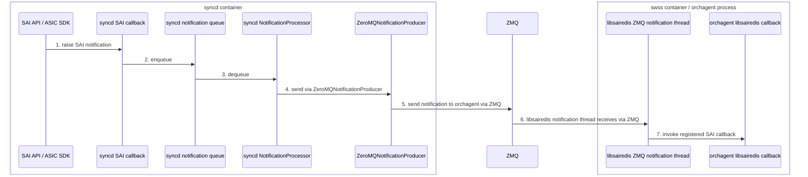
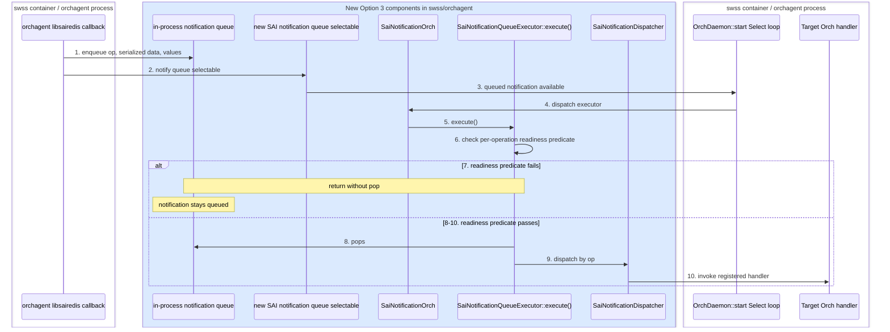
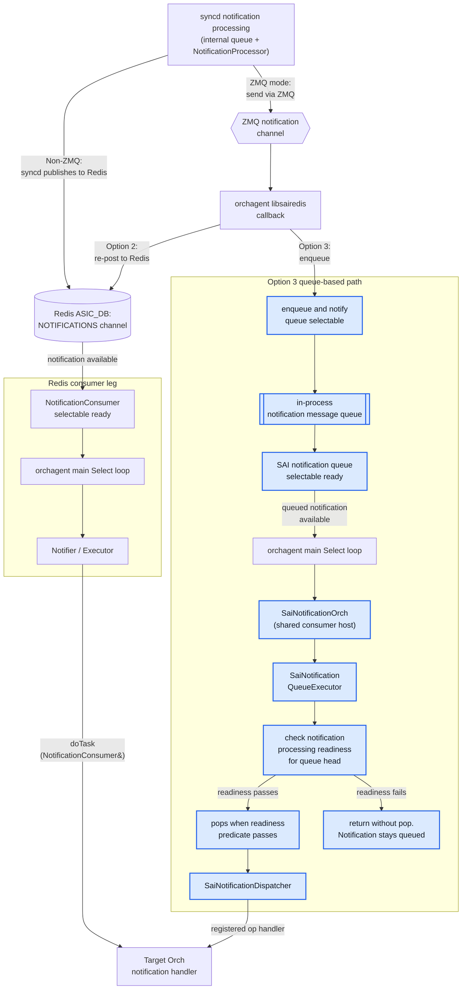
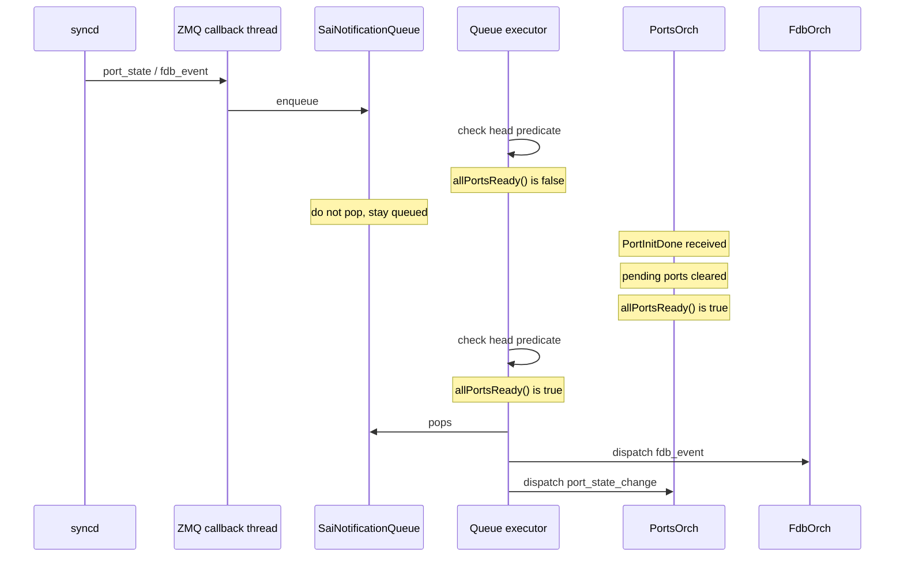

# HLD: SAI Notification Handling with ZMQ Southbound

## Table of Contents

- [1. Background](#1-background)
- [2. Problem Statement](#2-problem-statement)
- [3. Existing Notification Flows](#3-existing-notification-flows)
  - [3.1 Non-ZMQ Mode](#31-non-zmq-mode)
  - [3.2 ZMQ Mode Today](#32-zmq-mode-today)
    - [3.2.1 Notifications Already Handled](#321-notifications-already-handled)
    - [3.2.2 Notifications With Missing Callback Handling](#322-notifications-with-missing-callback-handling)
- [4. Design Goals](#4-design-goals)
- [5. Design Options](#5-design-options)
  - [5.1 Option 1: `syncd` Publishes Notifications via Redis in ZMQ Mode](#51-option-1-syncd-publishes-notifications-via-redis-in-zmq-mode)
    - [5.1.1 Description](#511-description)
    - [5.1.2 Notification Path](#512-notification-path)
    - [5.1.3 Implementation Notes](#513-implementation-notes)
    - [5.1.4 Pros](#514-pros)
    - [5.1.5 Cons](#515-cons)
  - [5.2 Option 2: `orchagent` Callback Re-posts to `ASIC_DB:NOTIFICATIONS`](#52-option-2-orchagent-callback-re-posts-to-asic_dbnotifications)
    - [5.2.1 Description](#521-description)
    - [5.2.2 Option 2 Flow](#522-option-2-flow)
    - [5.2.3 Implementation Notes](#523-implementation-notes)
    - [5.2.4 Pros](#524-pros)
    - [5.2.5 Cons](#525-cons)
  - [5.3 Option 3: In-process Notification Queue Drained by Orch Main Loop](#53-option-3-in-process-notification-queue-drained-by-orch-main-loop)
    - [5.3.1 Description](#531-description)
    - [5.3.2 Option 3 Flow](#532-option-3-flow)
    - [5.3.3 Option 3 Sequence](#533-option-3-sequence)
      - [5.3.3.1 ZMQ notification delivery to `orchagent` callback](#5331-zmq-notification-delivery-to-orchagent-callback)
      - [5.3.3.2 Callback to main-loop processing](#5332-callback-to-main-loop-processing)
    - [5.3.4 Notification Dispatch Path Comparison (Non-ZMQ, Option 2, and Option 3)](#534-notification-dispatch-path-comparison-non-zmq-option-2-and-option-3)
    - [5.3.5 Existing Code References](#535-existing-code-references)
    - [5.3.6 Implementation Notes](#536-implementation-notes)
    - [5.3.7 Main-loop Integration](#537-main-loop-integration)
    - [5.3.8 Readiness predicates and boot-time behavior](#538-readiness-predicates-and-boot-time-behavior)
      - [5.3.8.1 Readiness-gated boot-time sequence (example: port readiness)](#5381-readiness-gated-boot-time-sequence-example-port-readiness)
      - [5.3.8.2 Non-readiness-gated boot-time sequence](#5382-non-readiness-gated-boot-time-sequence)
    - [5.3.9 Notification inventory](#539-notification-inventory)
    - [5.3.10 Priority, Fairness, and Shared Handler](#5310-priority-fairness-and-shared-handler)
    - [5.3.11 Validation and Unit Test Coverage](#5311-validation-and-unit-test-coverage)
    - [5.3.12 Pros](#5312-pros)
    - [5.3.13 Cons](#5313-cons)
    - [5.3.14 Follow-on work](#5314-follow-on-work)
  - [5.4 Recommendation](#54-recommendation)
- [6. References](#6-references)

## 1. Background

SONiC recently added support for ZMQ southbound communication between `orchagent` and `syncd` for regular switches. This is controlled by the route-performance ZMQ setting:

```text
SYSTEM_DEFAULTS|swss_zmq.status = enabled
```

In non-ZMQ mode (Redis mode), SAI notifications are published by `syncd` into Redis `ASIC_DB:NOTIFICATIONS`. `orchagent` consumes those notifications from Redis in its normal main loop and dispatches them to the appropriate Orch components.

In ZMQ mode, `syncd` sends notifications to `orchagent` through ZMQ. These notifications arrive in `orchagent` libsairedis callback functions. Some callbacks already re-post notifications to Redis, such as `on_port_state_change()`, but several callbacks are currently empty or incomplete. As a result, some notifications are dropped when ZMQ southbound is enabled.

This gap is tracked in [sonic-buildimage issue #27541](https://github.com/sonic-net/sonic-buildimage/issues/27541). An initial short-term implementation is proposed in [sonic-swss PR #4619](https://github.com/sonic-net/sonic-swss/pull/4619).

## 2. Problem Statement

When ZMQ southbound is enabled, SAI notifications delivered over ZMQ may not reach their existing Orch consumers. The primary gaps called out in [sonic-buildimage issue #27541](https://github.com/sonic-net/sonic-buildimage/issues/27541) are:

- `fdb_event`
- `bfd_session_state_change`
- `port_host_tx_ready`
- `icmp_echo_session_state_change`

Additional `ASIC_DB:NOTIFICATIONS` types should be reviewed for ZMQ-mode parity with the existing non-ZMQ Redis path, including `port_state_change` (currently re-posted to Redis in ZMQ mode), `twamp_session_event`, and MACsec post-status notifications.

Expected consumers include `FdbOrch`, `BfdOrch`, `PortsOrch`, `IcmpOrch`, `TwampOrch`, and `MACsecOrch`, depending on platform and feature coverage.

Without a fix:

- Hardware-learned MAC entries may not propagate to `FdbOrch`.
- BFD session state transitions may not reach `BfdOrch`.
- Port host TX readiness may not reach `PortsOrch`.
- ICMP echo session monitoring may not reach `IcmpOrch`.
- Other `ASIC_DB:NOTIFICATIONS` types covered by this HLD (for example `twamp_session_event`, MACsec post-status, and HA/flow-bulk events; see [Section 5.3.9](#539-notification-inventory) for the full set) may be dropped or may not reach their owning orchs when ZMQ southbound is enabled.

This HLD does not change notification channels outside `ASIC_DB:NOTIFICATIONS` SAI delivery, such as `RESTARTCHECK` (`SwitchOrch`) or `APPL_DB` requests such as `WATERMARK_CLEAR_REQUEST` (`WatermarkOrch`). These are out of scope because they are not delivered via syncd SAI notifications over ZMQ; they continue to use their existing Redis consumers unchanged in ZMQ mode.

Notification prioritization and timely handling of high-priority notifications, such as port state changes and BFD session state changes, under high `orchagent` load is a broader concern for both ZMQ and non-ZMQ modes. This HLD considers that concern only in the context of the ZMQ notification handling [design options](#5-design-options); it does not propose changes to the existing non-ZMQ notification path.

## 3. Existing Notification Flows

The diagrams below show notification delivery paths at a high level. Where thread context affects the design, the text calls out the relevant execution contexts, such as the libsairedis notification thread and the `orchagent` main loop.

### 3.1 Non-ZMQ Mode


```mermaid
flowchart TD
    subgraph syncdContainer["syncd container"]
        saiApi["SAI API / ASIC SDK"]
        syncdCallback["SAI callback"]
        ntfQueue[["syncd notification<br/>queue"]]
        notificationProcessor["NotificationProcessor"]
        redisProducer["Redis<br/>NotificationProducer"]
    end

    redisNotifications[("Redis ASIC_DB:<br/>NOTIFICATIONS channel")]

    subgraph swssContainer["swss container"]
        subgraph orchagentProcess["orchagent process"]
            redisConsumerReady["NotificationConsumer<br/>selectable ready"]
            mainLoop["orchagent main Select loop"]
            notifier["Notifier / Executor"]
            orchHandler["Target Orch<br/>notification handler"]
        end
    end

    saiApi -->|"raise SAI notification"| syncdCallback
    syncdCallback --> ntfQueue
    ntfQueue --> notificationProcessor
    notificationProcessor --> redisProducer
    redisProducer --> redisNotifications
    redisNotifications -->|"notification available"| redisConsumerReady
    redisConsumerReady --> mainLoop
    mainLoop --> notifier
    notifier -->|"doTask<br/>(NotificationConsumer&)"| orchHandler
```

The non-ZMQ notification path has three main execution hops:

- `SAI API / ASIC SDK` invokes the registered notification callback in `syncd`.
- The `syncd` SAI callback enqueues the notification on the internal `syncd` notification queue; `NotificationProcessor` dequeues and publishes the notification to `ASIC_DB:NOTIFICATIONS`.
- `orchagent` main `Select` loop detects the ready `NotificationConsumer` selectable and dispatches the corresponding `Notifier` / executor. `Notifier::execute()` calls the corresponding Orch `doTask(NotificationConsumer&)`, which handles the notification through the existing Orch handler logic.

This is the existing proven notification path.

### 3.2 ZMQ Mode Today

ZMQ mode has existing notification handling gaps today. Some notifications already have callback handling logic, while the notifications covered by this HLD do not yet reach their existing Orch consumers.

### 3.2.1 Notifications Already Handled


```mermaid
flowchart TD
    subgraph syncdContainer["syncd container"]
        saiApi["SAI API / ASIC SDK"]
        syncdCallback["SAI callback"]
        ntfQueue[["syncd notification<br/>queue"]]
        notificationProcessor["NotificationProcessor"]
        zmqProducer["ZeroMQ<br/>NotificationProducer"]
    end

    redisNotifications[("Redis ASIC_DB:<br/>NOTIFICATIONS channel")]

    subgraph swssContainer["swss container"]
        subgraph orchagentProcess["orchagent process"]
            zmqThread["libsairedis ZMQ<br/>notification thread"]
            saiCallback["orchagent libsairedis<br/>callback"]
            callbackLogic["implemented callback logic"]
            redisRepost["callback re-posts to<br/>ASIC_DB NOTIFICATIONS"]
            directHandler["callback handles<br/>notification directly"]
            redisConsumerReady["NotificationConsumer<br/>selectable ready"]
            mainLoop["orchagent main Select loop"]
            notifier["Notifier / Executor"]
            orchHandler["Target Orch<br/>notification handler"]
        end
    end

    saiApi -->|"raise SAI notification"| syncdCallback
    syncdCallback --> ntfQueue
    ntfQueue --> notificationProcessor
    notificationProcessor --> zmqProducer
    zmqProducer -->|"ZMQ notification channel"| zmqThread
    zmqThread --> saiCallback
    saiCallback --> callbackLogic

    callbackLogic -->|"for port_state_change,<br/>HA,<br/>flow bulk get"| redisRepost
    redisRepost --> redisNotifications
    redisNotifications -->|"notification available"| redisConsumerReady
    redisConsumerReady --> mainLoop
    mainLoop --> notifier
    notifier -->|"doTask<br/>(NotificationConsumer&)"| orchHandler

    callbackLogic -->|"for switch shutdown or<br/>ASIC SDK health"| directHandler
    directHandler --> orchHandler
```

In ZMQ mode, notifications that already have callback handling follow one of the existing callback-specific paths:

- Some callbacks re-post the notification to `ASIC_DB:NOTIFICATIONS`. From there, the existing Redis notification consumer path is used: the `orchagent` main `Select` loop detects the ready `NotificationConsumer` selectable and dispatches the corresponding `Notifier` / executor. `Notifier::execute()` calls the corresponding Orch `doTask(NotificationConsumer&)`, which handles the notification through the existing Orch handler logic.
- Other callbacks, such as switch shutdown or ASIC SDK health handling, are handled directly by callback-specific logic.

### 3.2.2 Notifications With Missing Callback Handling


```mermaid
flowchart TD
    subgraph syncdContainer["syncd container"]
        saiApi["SAI API / ASIC SDK"]
        syncdCallback["SAI callback"]
        ntfQueue[["syncd notification<br/>queue"]]
        notificationProcessor["NotificationProcessor"]
        zmqProducer["ZeroMQ<br/>NotificationProducer"]
    end

    subgraph swssContainer["swss container"]
        subgraph orchagentProcess["orchagent process"]
            zmqThread["libsairedis ZMQ<br/>notification thread"]
            saiCallback["orchagent libsairedis<br/>callback"]
            callbackLogic["empty / incomplete<br/>callback logic:<br/>no re-post or dispatch<br/>to existing Orch<br/>notification handling path"]
        end
    end

    saiApi -->|"raise SAI notification"| syncdCallback
    syncdCallback --> ntfQueue
    ntfQueue --> notificationProcessor
    notificationProcessor --> zmqProducer
    zmqProducer -->|"ZMQ notification channel"| zmqThread
    zmqThread --> saiCallback
    saiCallback --> callbackLogic
```

In this case, ZMQ transport delivers the notification to the `orchagent` libsairedis notification thread, which invokes the registered `orchagent` libsairedis callback. The callback does not re-post or dispatch the notification to the existing Orch notification handling path. Because that re-post/dispatch is missing today, the notification is dropped.

## 4. Design Goals

- Preserve existing non-ZMQ behavior.
- Restore missing notifications in ZMQ mode for every `ASIC_DB:NOTIFICATIONS` type listed in [Section 5.3.9](#539-notification-inventory) except **Unchanged** ops.
- Avoid duplicate notification delivery.
- Preserve existing Orch handler behavior, including per-orch readiness rules in `doTask(NotificationConsumer&)`.
- Keep Orch state updates on the `orchagent` main-loop path.

## 5. Design Options

This section compares three alternative ways to deliver `ASIC_DB:NOTIFICATIONS` SAI notifications when **ZMQ southbound is enabled** (`swss_zmq.status = enabled`). Throughout this document, **Option 1**, **Option 2**, and **Option 3** mean these ZMQ-mode notification delivery alternatives only.

The existing **non-ZMQ** notification path ([Section 3.1](#31-non-zmq-mode)) is unchanged by this HLD and is not an Option in this comparison. [Section 5.3.4](#534-notification-dispatch-path-comparison-non-zmq-option-2-and-option-3) shows how non-ZMQ delivery relates to Option 2 and Option 3.

| Option | Summary |
|--------|---------|
| **Option 1** | `syncd` publishes notifications to Redis while request/response stays on ZMQ |
| **Option 2** | ZMQ transport + `orchagent` callback re-post to Redis ([sonic-swss PR #4619](https://github.com/sonic-net/sonic-swss/pull/4619)) |
| **Option 3** | ZMQ transport + `orchagent` callback enqueue to in-process queue (main-loop drain) |

See [Section 5.4](#54-recommendation) for the proposed path.

### 5.1 Option 1: `syncd` Publishes Notifications via Redis in ZMQ Mode

#### 5.1.1 Description

Under this option, when ZMQ southbound is enabled, regular SAI operations continue to use the existing ZMQ request/response channel between `orchagent` and `syncd` through `ZeroMQSelectableChannel`, while SAI notifications are published by `syncd` through Redis.

This option reuses the existing `RedisNotificationProducer` used in non-ZMQ mode; the change is only to select it for SAI notifications when ZMQ southbound is enabled.

#### 5.1.2 Notification Path

SAI notifications follow the same Redis notification path described in [Section 3.1](#31-non-zmq-mode). The difference is that this path is selected even when ZMQ southbound is enabled; regular SAI request/response operations still use ZMQ.

#### 5.1.3 Implementation Notes

Option 1 would change the ZMQ-mode notification producer selection in `syncd` from:

```cpp
m_notifications = std::make_shared<ZeroMQNotificationProducer>(m_contextConfig->m_zmqNtfEndpoint);
```

to:

```cpp
m_notifications = std::make_shared<RedisNotificationProducer>(m_contextConfig->m_dbAsic);
```

`orchagent` libsairedis notification callbacks remain no-op for these notifications in this option, because `syncd` publishes the notifications directly to Redis. If a callback re-publishes a Redis-delivered notification back to Redis, duplicate or looping notifications can occur.

#### 5.1.4 Pros

- Uses the existing Redis notification path.
- Existing Orch consumers continue unchanged.

#### 5.1.5 Cons

- Makes ZMQ mode asymmetric:
  - request/response operations use ZMQ.
  - SAI notifications use Redis.

### 5.2 Option 2: `orchagent` Callback Re-posts to `ASIC_DB:NOTIFICATIONS`

#### 5.2.1 Description

In this option, `syncd` continues to send notifications to `orchagent` through ZMQ. The `libsairedis` ZMQ notification path invokes the registered SAI notification callback in `orchagent`, and that callback re-publishes the notification to `ASIC_DB:NOTIFICATIONS` only when ZMQ mode is enabled.

This follows the existing `on_port_state_change()` model and is the approach used by the initial fix in [sonic-swss PR #4619](https://github.com/sonic-net/sonic-swss/pull/4619). The same re-post behavior would be added to each missing notification callback covered by this HLD.

#### 5.2.2 Option 2 Flow


```mermaid
flowchart TD
    subgraph syncdContainer["syncd container"]
        saiApi["SAI API / ASIC SDK"]
        syncdCallback["SAI callback"]
        ntfQueue[["syncd notification<br/>queue"]]
        notificationProcessor["NotificationProcessor"]
        zmqProducer["ZeroMQ<br/>NotificationProducer"]
    end

    redisNotifications[("Redis ASIC_DB:<br/>NOTIFICATIONS channel")]

    subgraph swssContainer["swss container"]
        subgraph orchagentProcess["orchagent process"]
            zmqThread["libsairedis ZMQ<br/>notification thread"]
            saiCallback["orchagent libsairedis<br/>callback"]
            redisRepost["callback re-posts to<br/>ASIC_DB NOTIFICATIONS"]
            redisConsumerReady["NotificationConsumer<br/>selectable ready"]
            mainLoop["orchagent main Select loop"]
            notifier["Notifier / Executor"]
            orchHandler["Target Orch<br/>notification handler"]
        end
    end

    saiApi -->|"raise SAI notification"| syncdCallback
    syncdCallback --> ntfQueue
    ntfQueue --> notificationProcessor
    notificationProcessor --> zmqProducer
    zmqProducer -->|"ZMQ notification channel"| zmqThread
    zmqThread --> saiCallback
    saiCallback --> redisRepost
    redisRepost --> redisNotifications
    redisNotifications -->|"notification available"| redisConsumerReady
    redisConsumerReady --> mainLoop
    mainLoop --> notifier
    notifier -->|"doTask<br/>(NotificationConsumer&)"| orchHandler
```

In Option 2, ZMQ transport delivers the notification to the `orchagent` libsairedis notification thread, which invokes the registered `orchagent` libsairedis callback. The callback re-posts the notification to `ASIC_DB:NOTIFICATIONS` only when ZMQ mode is enabled. After the re-post, the existing Redis notification consumer path is used: the `orchagent` main `Select` loop detects the ready `NotificationConsumer` selectable and dispatches the corresponding `Notifier` / executor. `Notifier::execute()` calls the corresponding Orch `doTask(NotificationConsumer&)`, which handles the notification through the existing Orch handler logic.

#### 5.2.3 Implementation Notes

The following snippet is high-level pseudo-code for the callback re-post model.

```cpp
void on_fdb_event(uint32_t count, const sai_fdb_event_notification_data_t *data)
{
    if (gRedisCommunicationMode != SAI_REDIS_COMMUNICATION_MODE_ZMQ_SYNC)
    {
        return;
    }

    static thread_local swss::DBConnector db("ASIC_DB", 0);
    static thread_local swss::NotificationProducer producer(&db, "NOTIFICATIONS");

    std::string payload = sai_serialize_fdb_event_ntf(count, data);
    std::vector<swss::FieldValueTuple> values;

    producer.send(SAI_SWITCH_NOTIFICATION_NAME_FDB_EVENT, payload, values);
}
```

Note: The callback must check whether ZMQ mode is enabled before re-publishing to Redis. In non-ZMQ mode, `syncd` already publishes the notification to `ASIC_DB:NOTIFICATIONS`, and the normal `orchagent` `NotificationConsumer` path handles it in the main loop. The libsairedis notification path can still deserialize Redis notifications and invoke the registered `orchagent` libsairedis callback in non-ZMQ mode. If the callback re-publishes the notification to Redis in that mode, duplicate or looping notifications can occur. Therefore, the callback only re-publishes when `gRedisCommunicationMode == SAI_REDIS_COMMUNICATION_MODE_ZMQ_SYNC`.

#### 5.2.4 Pros

- Low-risk short-term fix.
- No `syncd` change.
- Keeps ZMQ transport between `syncd` and `orchagent`.
- Reuses existing Orch Redis notification processing path.
- Can be implemented and validated event-by-event.

#### 5.2.5 Cons

- Compared with Option 1, notifications first travel over ZMQ before being re-posted to Redis for Orch processing, which can add latency.
- Uses Redis for final notification dispatch.

### 5.3 Option 3: In-process Notification Queue Drained by Orch Main Loop

#### 5.3.1 Description

In this option, the `orchagent` libsairedis callback packages the notification as an operation name, serialized payload, and optional field-value list, then makes it available to the main loop through an in-process notification queue. The `orchagent` main loop drains the queue and dispatches the event to the appropriate Orch handler.

This model is similar in spirit to existing selectable-based processing such as `ZmqConsumerStateTable`, where data availability wakes the main loop and processing happens through an executor path.

#### 5.3.2 Option 3 Flow

Note: Blue-highlighted boxes identify new Option 3 components and executor processing steps introduced by this design.


```mermaid
flowchart TD
    subgraph syncdContainer["syncd container"]
        saiApi["SAI API / ASIC SDK"]
        syncdCallback["SAI callback"]
        ntfQueue[["syncd notification<br/>queue"]]
        notificationProcessor["NotificationProcessor"]
        zmqProducer["ZeroMQ<br/>NotificationProducer"]
    end

    subgraph swssContainer["swss container"]
        subgraph orchagentProcess["orchagent process"]
            zmqThread["libsairedis ZMQ<br/>notification thread"]
            saiCallback["orchagent libsairedis<br/>callback"]
            notificationQueue[["in-process<br/>notification queue"]]
            queueSelectableReady["SAI notification queue<br/>selectable ready"]
            mainLoop["orchagent main Select loop"]
            saiNotificationOrch["SaiNotificationOrch<br/>(shared consumer host)"]
            queueExecutor["SaiNotification<br/>QueueExecutor"]
            headPredicate["check notification<br/>processing readiness<br/>for queue head"]
            queueDrain["pops when readiness<br/>predicate passes"]
            stayQueued["return without pop.<br/>Notification stays queued"]
            dispatcher["SaiNotificationDispatcher"]
            orchHandler["Target Orch<br/>notification handler"]
        end
    end

    saiApi -->|"raise SAI notification"| syncdCallback
    syncdCallback --> ntfQueue
    ntfQueue --> notificationProcessor
    notificationProcessor --> zmqProducer
    zmqProducer -->|"ZMQ notification channel"| zmqThread
    zmqThread --> saiCallback

    saiCallback --> notificationQueue
    notificationQueue --> queueSelectableReady
    queueSelectableReady -->|"queued notification<br/>available"| mainLoop
    mainLoop --> saiNotificationOrch
    saiNotificationOrch --> queueExecutor
    queueExecutor --> headPredicate
    headPredicate -->|"readiness passes"| queueDrain
    headPredicate -->|"readiness fails"| stayQueued
    queueDrain --> dispatcher
    dispatcher -->|"registered op handler"| orchHandler

    classDef option3New fill:#dbeafe,stroke:#2563eb,stroke-width:2px,color:#111827
    class notificationQueue,queueSelectableReady,saiNotificationOrch,queueExecutor,headPredicate,queueDrain,stayQueued,dispatcher option3New
```

#### 5.3.3 Option 3 Sequence

The flow diagram above shows the components involved. The sequence diagrams below show the expected ordering and execution-context handoff for Option 3.

Option 3 does not change notification delivery up to the `orchagent` libsairedis callback; its changes start after the callback receives the notification.

##### 5.3.3.1 ZMQ notification delivery to `orchagent` callback


```mermaid
sequenceDiagram
    box syncd container
        participant SaiApi as SAI API / ASIC SDK
        participant SyncdCb as syncd SAI callback
        participant NtfQueue as syncd notification queue
        participant Processor as syncd NotificationProcessor
        participant ZmqProducer as ZeroMQNotificationProducer
    end

    participant ZMQ as ZMQ

    box swss container / orchagent process
        participant ZmqThread as libsairedis ZMQ notification thread
        participant Callback as orchagent libsairedis callback
    end

    SaiApi->>SyncdCb: 1. raise SAI notification
    SyncdCb->>NtfQueue: 2. enqueue
    NtfQueue->>Processor: 3. dequeue
    Processor->>ZmqProducer: 4. send via ZeroMQNotificationProducer
    ZmqProducer->>ZMQ: 5. send notification to orchagent via ZMQ
    ZMQ->>ZmqThread: 6. libsairedis notification thread receives via ZMQ
    ZmqThread->>Callback: 7. invoke registered SAI callback
```

The notification delivery sequence is:

1. `SAI API / ASIC SDK` raises a notification and invokes the registered `syncd` SAI callback.
2. The `syncd` SAI callback performs minimal work and enqueues the notification on the internal `syncd` notification queue (same pattern as non-ZMQ mode).
3. The `syncd` `NotificationProcessor` thread dequeues the notification from the queue.
4. `NotificationProcessor` sends the notification through `ZeroMQNotificationProducer`.
5. `ZeroMQNotificationProducer` sends the notification to `orchagent` via ZMQ.
6. The libsairedis ZMQ notification thread in `orchagent` receives the notification via ZMQ.
7. The libsairedis ZMQ notification thread invokes the registered `orchagent` libsairedis callback.

Steps 1–2 run on the SAI callback thread; steps 3–4 run on the `NotificationProcessor` thread; steps 5–7 run on the libsairedis ZMQ notification thread.

##### 5.3.3.2 Callback to main-loop processing

The main-loop processing sequence is: steps 1–2 run on the libsairedis ZMQ notification thread; steps 3–10 run on the `orchagent` main-loop thread.


```mermaid
sequenceDiagram
    box swss container / orchagent process
        participant Callback as orchagent libsairedis callback
    end

    box rgb(219, 234, 254) New Option 3 components in swss/orchagent
        participant Queue as in-process notification queue
        participant Wakeup as new SAI notification queue selectable
        participant SaiNotificationOrch as SaiNotificationOrch
        participant Executor as SaiNotificationQueueExecutor::execute()
        participant Dispatcher as SaiNotificationDispatcher
    end

    box swss container / orchagent process
        participant MainLoop as OrchDaemon::start Select loop
        participant Orch as Target Orch handler
    end

    Callback->>Queue: 1. enqueue op, serialized data, values
    Callback->>Wakeup: 2. notify queue selectable
    Wakeup->>MainLoop: 3. queued notification available
    MainLoop->>SaiNotificationOrch: 4. dispatch executor
    SaiNotificationOrch->>Executor: 5. execute()
    Executor->>Executor: 6. check per-operation readiness predicate
    alt 7. readiness predicate fails
        Note over Executor,Queue: return without pop
        Note over Queue: notification stays queued
    else 8-10. readiness predicate passes
        Executor->>Queue: 8. pops
        Executor->>Dispatcher: 9. dispatch by op
        Dispatcher->>Orch: 10. invoke registered handler
    end
```

1. The callback serializes/packages the notification as a `KeyOpFieldsValuesTuple`-compatible entry and enqueues it into the in-process notification queue.
2. The callback notifies the new SAI notification queue selectable.
3. The current `OrchDaemon::start()` `Select` loop is notified that queued notifications are available.
4. The main loop dispatches the executor owned by `SaiNotificationOrch`.
5. `SaiNotificationQueueExecutor::execute()` is invoked on the main-loop path.
6. The executor checks the **per-operation readiness predicate** for the notification queue head entry — a per-op function that returns true when the owning orch is ready to process that notification type (for example `gPortsOrch->allPortsReady()` for ops that gate on port readiness, or always true when no predicate is registered, such as `bfd_session_state_change`). See [Section 5.3.8](#538-readiness-predicates-and-boot-time-behavior) for readiness predicate registration, boot-time behavior, and head-of-line blocking.
7. If the readiness predicate fails, the executor returns without popping; queued notifications are preserved for a later main-loop iteration.
8. If the readiness predicate passes, the executor pops queued notifications from the in-process notification message queue. Each `execute()` call is batch-limited via `DEFAULT_NC_POP_BATCH_SIZE` (see [Section 5.3.6](#536-implementation-notes)); if more entries remain, the queue selectable is re-notified so later main-loop iterations can drain them.
9. The executor dispatches each popped entry by notification op through `SaiNotificationDispatcher` (the handler registry; see [Section 5.3.7](#537-main-loop-integration)).
10. The dispatcher invokes the target Orch handler registered for that notification op on the `orchagent` main-loop path.

#### 5.3.4 Notification Dispatch Path Comparison (Non-ZMQ, Option 2, and Option 3)

This section compares how `ASIC_DB:NOTIFICATIONS` SAI notifications reach target Orch handlers under non-ZMQ mode, ZMQ Option 2, and ZMQ Option 3.

The diagram below shows three entry paths:

- **Non-ZMQ mode** — `syncd` SAI callback enqueues on the internal notification queue; `NotificationProcessor` publishes to `ASIC_DB:NOTIFICATIONS`. The `orchagent` libsairedis callback is not part of notification delivery. The Redis consumer leg ([Section 3.1](#31-non-zmq-mode)) dispatches to the target Orch handler.
- **Option 2** — ZMQ-mode interim fix ([sonic-swss PR #4619](https://github.com/sonic-net/sonic-swss/pull/4619)): the callback re-posts to `ASIC_DB:NOTIFICATIONS`, then uses the same Redis consumer leg as non-ZMQ mode.
- **Option 3** — ZMQ-mode target design: the callback enqueues to the in-process notification message queue; the main loop drains through the shared queue executor and `SaiNotificationDispatcher`. Option 3 does not send notifications back through `ASIC_DB:NOTIFICATIONS`.

**Option 3 scope.** In ZMQ mode, Option 3 migrates every notification op listed in [Section 5.3.9](#539-notification-inventory) except **Unchanged** to the in-process queue. There is **no hybrid Option 2 + Option 3 coexistence** for the same notification type: queue-path ops enqueue only; they do not also re-post to Redis. Non-ZMQ mode continues to use the existing Redis notification path ([Section 3.1](#31-non-zmq-mode)).


```mermaid
flowchart TD
    syncd["syncd notification processing<br/>(internal queue + NotificationProcessor)"]
    zmq{{"ZMQ notification<br/>channel"}}
    libsairedisCallback["orchagent libsairedis<br/>callback"]

    redisNotifications[("Redis ASIC_DB:<br/>NOTIFICATIONS channel")]

    subgraph redisPath["Redis consumer leg"]
        redisConsumerReady["NotificationConsumer<br/>selectable ready"]
        redisMainLoop["orchagent main Select loop"]
        notifier["Notifier / Executor"]
    end

    subgraph option3Path["Option 3 queue-based path"]
        enqueueNotify["enqueue and notify<br/>queue selectable"]
        notificationQueue[["in-process<br/>notification message queue"]]
        queueSelectableReady["SAI notification queue<br/>selectable ready"]
        option3MainLoop["orchagent main Select loop"]
        saiNotificationOrch["SaiNotificationOrch<br/>(shared consumer host)"]
        queueExecutor["SaiNotification<br/>QueueExecutor"]
        headPredicate["check notification<br/>processing readiness<br/>for queue head"]
        queueDrain["pops when readiness<br/>predicate passes"]
        stayQueued["return without pop.<br/>Notification stays queued"]
        dispatcher["SaiNotificationDispatcher"]
    end

    targetHandler["Target Orch<br/>notification handler"]

    syncd -->|"Non-ZMQ:<br/>syncd publishes to Redis"| redisNotifications
    syncd -->|"ZMQ mode:<br/>send via ZMQ"| zmq
    zmq --> libsairedisCallback
    libsairedisCallback -->|"Option 2:<br/>re-post to Redis"| redisNotifications
    libsairedisCallback -->|"Option 3:<br/>enqueue"| enqueueNotify

    redisNotifications -->|"notification available"| redisConsumerReady
    redisConsumerReady --> redisMainLoop
    redisMainLoop --> notifier
    notifier -->|"doTask<br/>(NotificationConsumer&)"| targetHandler

    enqueueNotify --> notificationQueue
    notificationQueue --> queueSelectableReady
    queueSelectableReady -->|"queued notification<br/>available"| option3MainLoop
    option3MainLoop --> saiNotificationOrch
    saiNotificationOrch --> queueExecutor
    queueExecutor --> headPredicate
    headPredicate -->|"readiness passes"| queueDrain
    headPredicate -->|"readiness fails"| stayQueued
    queueDrain --> dispatcher
    dispatcher -->|"registered op handler"| targetHandler

    classDef option3New fill:#dbeafe,stroke:#2563eb,stroke-width:2px,color:#111827
    class enqueueNotify,notificationQueue,queueSelectableReady,saiNotificationOrch,queueExecutor,headPredicate,queueDrain,stayQueued,dispatcher option3New
```

All three paths preserve the same target Orch handler behavior. In non-ZMQ mode, `syncd` publishes directly to `ASIC_DB:NOTIFICATIONS` and the `orchagent` libsairedis callback is not part of notification delivery; the Redis consumer leg (`NotificationConsumer` / `Notifier` / Orch `doTask(NotificationConsumer&)`) handles it. Option 2 reuses that same Redis consumer leg, but reaches it by re-posting from the ZMQ-mode callback. Option 3 replaces the Redis leg with the queue-based executor path and dispatches queued notifications by op through `SaiNotificationDispatcher` to registered target Orch handlers. The Redis and queue paths should share the same notification-specific handler logic where practical.

#### 5.3.5 Existing Code References

Option 3 is expected to build on the following existing infrastructure.

Current notification callbacks and consumers:

- Callback implementations: some existing `orchagent` SAI notification callbacks are currently no-op or incomplete for ZMQ mode and need re-post (Option 2) or enqueue (Option 3) behavior. Examples include `on_fdb_event()`, `on_bfd_session_state_change()`, and `on_port_host_tx_ready()` in `src/sonic-swss/orchagent/notifications.cpp`, and `IcmpSaiSessionHandler::on_state_change()` in `src/sonic-swss/orchagent/icmporch.cpp`. Under Option 3, these callbacks enqueue notifications for main-loop processing.
- Callback registration: notification callbacks are registered through existing Orch initialization and feature-specific setup paths. Examples include switch notification setup in `src/sonic-swss/orchagent/main.cpp`, `src/sonic-swss/orchagent/portsorch.cpp`, and `src/sonic-swss/orchagent/bfdorch.cpp`, and ICMP offload-session callback registration through `SaiOffloadSessionHandler`.
- Existing Orch notification consumers: in the existing non-ZMQ notification path, these notification types are consumed from `ASIC_DB:NOTIFICATIONS` by target Orch consumers such as `FdbOrch`, `BfdOrch`, `PortsOrch`, and `IcmpOrch`. Option 3 should preserve the same Orch handler behavior without sending migrated ZMQ notifications through Redis.
- Existing Redis notification dispatch: Redis-delivered SAI notifications are consumed through `NotificationConsumer` instances wrapped by `Notifier`. `Notifier::execute()` calls the corresponding Orch `doTask(NotificationConsumer&)`, preserving the existing per-Orch notification handling model for non-ZMQ mode and Option 2.

Selectable/executor integration:

- Selectable-based ZMQ consumers: `src/sonic-swss-common/common/zmqconsumerstatetable.h` defines `ZmqConsumerStateTable`, an existing selectable-based ZMQ consumer that wakes the main loop when data is available and processes data through the executor path. Option 3 can follow a similar integration pattern for SAI notifications.
- `ZmqConsumerStateTable` processing model: the referenced SONiC ZMQ producer/consumer state table design describes a receive-thread-to-main-loop pattern where `ZmqServer` receives and deserializes ZMQ messages, dispatches them to `ZmqConsumerStateTable`, `ZmqConsumerStateTable` notifies `Select`, and the main loop later pops operations through `ZmqConsumerStateTable::pops()`. Option 3 follows the same general pattern for SAI notifications: the `orchagent` libsairedis callback enqueues the notification, notifies the main loop, and processing happens through the executor path.
- Select priority: `swss::Selectable` carries a priority value used by `Select`; higher priority values are selected ahead of lower-priority ready selectables. Option 3 should use this existing priority model where practical.
- Main-loop infrastructure: `src/sonic-swss/orchagent/orchdaemon.cpp` contains the main `OrchDaemon::start()` `Select` loop that waits on registered selectables and dispatches `Executor::execute()` when a selectable becomes ready. The Option 3 integration approach is described in [Section 5.3.7](#537-main-loop-integration).
- `SaiNotificationOrch`: shared SAI notification queue consumer host; see [Section 5.3.7](#537-main-loop-integration) for construction order, ZMQ vs non-ZMQ registration, executor ownership, and `SaiNotificationDispatcher` handler registry.

#### 5.3.6 Implementation Notes

The following snippets are high-level pseudo-code aligned with the proposed implementation. The queue stores the same shape used by existing swss notification consumers: operation name, serialized data, and optional field-value list.

The queue and executor pattern is generic. Migrated callbacks enqueue into one shared `SaiNotificationQueue`. A queue executor drains that queue and dispatches each entry by operation name to a registered target Orch handler. The examples below use `FdbOrch` and `fdb_event`, but the same registry pattern applies to `BfdOrch`, `PortsOrch`, `IcmpOrch`, or other notification owners.

```cpp
class SaiNotificationQueue : public swss::Selectable
{
public:
    SaiNotificationQueue(int pri = 100,
                         size_t popBatchSize = swss::DEFAULT_NC_POP_BATCH_SIZE);

    void enqueue(const std::string &op,
                 std::string data,
                 std::vector<swss::FieldValueTuple> values)
    {
        {
            std::lock_guard<std::mutex> lock(m_mutex);
            m_queue.emplace(std::move(data), op, std::move(values));
        }

        m_selectableEvent.notify();
    }

    int getFd() override
    {
        return m_selectableEvent.getFd();
    }

    uint64_t readData() override
    {
        return m_selectableEvent.readData();
    }

    bool hasData() override
    {
        std::lock_guard<std::mutex> lock(m_mutex);
        return !m_queue.empty();
    }

    bool hasCachedData() override
    {
        return hasData();
    }

    bool peekFrontOp(std::string &op) const
    {
        std::lock_guard<std::mutex> lock(m_mutex);
        if (m_queue.empty())
        {
            return false;
        }
        op = kfvOp(m_queue.front());
        return true;
    }

    void pops(std::deque<swss::KeyOpFieldsValuesTuple> &entries)
    {
        entries.clear();

        std::lock_guard<std::mutex> lock(m_mutex);
        // Limit each drain to preserve main-loop fairness across ready executors.
        const auto count = std::min(m_queue.size(), m_popBatchSize);
        for (size_t i = 0; i < count; ++i)
        {
            entries.push_back(std::move(m_queue.front()));
            m_queue.pop();
        }

        if (!m_queue.empty())
        {
            m_selectableEvent.notify();
        }
    }

private:
    std::mutex m_mutex;
    std::queue<swss::KeyOpFieldsValuesTuple> m_queue;
    swss::SelectableEvent m_selectableEvent;
    size_t m_popBatchSize;
};
```

`m_selectableEvent.notify()` wakes the new SAI notification queue selectable. The implementation should reuse the existing swss selectable/executor model rather than introducing a separate main-loop mechanism. `ZmqConsumerStateTable` is one existing example of this wake-up pattern: data availability is represented through a selectable, and the main `Select` loop later dispatches an executor. The important requirement is that enqueueing a notification makes queued notification work visible to the current `OrchDaemon::start()` loop so it can dispatch the queue executor like other selectable executors.

The queue is created lazily so early notifications that arrive before the target Orch registers its queue-path handler with `gSaiNotificationOrch` can still be enqueued instead of being dropped. The shared `SaiNotificationQueueExecutor` is owned by `SaiNotificationOrch` (see [Section 5.3.7](#537-main-loop-integration)); feature orchs register per-op handlers, not separate executors.

**Backpressure.** The in-process queue is not expected to grow without bound under normal operation: SAI/SDK notification rates are finite, and batch-limited `pops()` preserve main-loop fairness across ready executors.

```cpp
SaiNotificationQueue *getSaiNotificationQueue()
{
    static std::mutex queueMutex;

    std::lock_guard<std::mutex> lock(queueMutex);
    // Create on first use so early callbacks can enqueue before executor setup.
    if (gSaiNotificationQueue == nullptr)
    {
        gSaiNotificationQueue = new SaiNotificationQueue(
            100, // pri -- match swss-common NotificationConsumer default
            swss::DEFAULT_NC_POP_BATCH_SIZE);
    }

    return gSaiNotificationQueue;
}

void enqueueSaiNotification(const std::string &op,
                            std::string data,
                            std::vector<swss::FieldValueTuple> values)
{
    getSaiNotificationQueue()->enqueue(op, std::move(data), std::move(values));
}
```

Callback:

```cpp
void on_fdb_event(uint32_t count, sai_fdb_event_notification_data_t *data)
{
    if (gRedisCommunicationMode == SAI_REDIS_COMMUNICATION_MODE_ZMQ_SYNC)
    {
        std::string sdata = sai_serialize_fdb_event_ntf(count, data);
        std::vector<swss::FieldValueTuple> values;

        enqueueSaiNotification("fdb_event", std::move(sdata), std::move(values));
    }
}
```

`fdb_event` is used here as an example because it is one of the notification types with missing ZMQ callback handling and is owned by `FdbOrch`. Other migrated callbacks enqueue into the same shared queue with their own operation names. See [Section 5.3.9](#539-notification-inventory) for the full set.

For a notification type migrated to Option 3, the ZMQ-mode callback should enqueue to the in-process queue and should not re-post the same notification to `ASIC_DB:NOTIFICATIONS` as a fallback. Non-ZMQ mode continues to use the existing Redis notification path.

#### 5.3.7 Main-loop Integration

Option 3 should expose the notification queue through an existing-style selectable/executor so the current `OrchDaemon::start()` `Select` loop can dispatch it like other selectables.

For end-to-end flow and diagrams, see [Section 5.3.2](#532-option-3-flow), [Section 5.3.3](#533-option-3-sequence), and [Section 5.3.4](#534-notification-dispatch-path-comparison-non-zmq-option-2-and-option-3). This section focuses on how Option 3 wires into the existing main loop and the implementation details behind that wiring.

**Thread handoff.** In ZMQ mode, the `orchagent` libsairedis callback runs on the libsairedis ZMQ notification thread. That callback must not call Orch handler logic directly. Instead, it enqueues the notification into the shared `SaiNotificationQueue` and calls `SelectableEvent::notify()` so the main loop can process the entry later. The enqueue path is defined in [Section 5.3.6](#536-implementation-notes) (`SaiNotificationQueue::enqueue()`). After enqueue, predicate gating, queue pop, and handler dispatch all run on the `orchagent` main thread.

**Main-loop wiring.** `SaiNotificationOrch` is a thin **infrastructure** orch — a shared SAI notification queue consumer host, not a feature orch. This pattern plugs into the existing `Orch` / `Executor` / `Orch::addExecutor()` model (the same consumer + executor pattern used elsewhere in orchagent, for example `ZmqConsumerStateTable` with its executor on an existing orch). `SaiNotificationOrch` does not own feature state, has no `APP_DB` tables, and does not implement `doTask(Consumer&)`. Functionally it acts as a notification consumer: it owns the shared `SaiNotificationQueueExecutor` and exposes `registerHandler()` so feature orchs attach per-op callbacks through `SaiNotificationDispatcher`.

`SaiNotificationOrch` is created by `OrchDaemon` in ZMQ mode before orchs that register queue-path handlers, similar to how `NotificationConsumerStatsOrch` is constructed before orchs that register `NotificationConsumer` stats. When ZMQ mode is enabled, feature orchs such as `FdbOrch` and `PortsOrch` register per-operation handlers and optional readiness predicates for the notification operations they own through `gSaiNotificationOrch->registerHandler()` once `gSaiNotificationOrch` is constructed. In non-ZMQ mode, notifications continue to use the existing Redis `NotificationConsumer` path and no queue handlers are registered.

When the queue selectable becomes ready, the existing `OrchDaemon::start()` `Select` loop dispatches `SaiNotificationQueueExecutor::execute()` like any other executor. Head-of-line readiness, pop, and dispatch behavior are described in [Section 5.3.8](#538-readiness-predicates-and-boot-time-behavior).

**Lifecycle.** The shared `SaiNotificationQueue` and `gSaiNotificationOrch` live for the `orchagent` process lifetime, consistent with other global orch infrastructure. `SaiNotificationQueueSelectable` is owned by `SaiNotificationQueueExecutor` and destroyed with the executor; the shared queue outlives the adapter. Once graceful shutdown begins, libsairedis ZMQ callbacks must not enqueue new notifications (for example by checking the same `gOrchShutdownRequested` flag used by `OrchDaemon::start()`), because the main loop will no longer dispatch the queue executor.

**Selectable ownership.** The real `SaiNotificationQueue` is shared and kept for the lifetime of the `orchagent` process. However, `Executor` owns and deletes the `Selectable` object passed to it. To avoid giving ownership of the shared queue to the executor, the design passes a small `Selectable` adapter, `SaiNotificationQueueSelectable`, to `Executor`. The adapter is owned by the executor and forwards readiness checks to the shared `SaiNotificationQueue`.

The existing main loop already waits on selectable executors:

```cpp
void OrchDaemon::start(long heartBeatInterval)
{
    for (Orch *o : m_orchList)
    {
        m_select->addSelectables(o->getSelectables());
    }

    while (true)
    {
        Selectable *s;
        int ret = m_select->select(&s, SELECT_TIMEOUT);

        if (ret == Select::OBJECT)
        {
            auto *executor = static_cast<Executor *>(s);
            executor->execute();
        }
    }
}
```

**Executor and dispatcher pseudo-code.** The snippets below show how the queue executor plugs into the existing `Executor` model, how `SaiNotificationDispatcher` handler registration and per-op readiness predicates work, and how `SaiNotificationOrch` is constructed and wired into `OrchDaemon`. Predicate evaluation, pop, and dispatch semantics are covered in [Section 5.3.8](#538-readiness-predicates-and-boot-time-behavior).

```cpp
class SaiNotificationQueueSelectable : public swss::Selectable
{
public:
    explicit SaiNotificationQueueSelectable(SaiNotificationQueue *queue)
        : m_queue(queue)
    {
    }

    int getFd() override
    {
        return m_queue->getFd();
    }

    uint64_t readData() override
    {
        return m_queue->readData();
    }

    bool hasData() override
    {
        return m_queue->hasData();
    }

    bool hasCachedData() override
    {
        return m_queue->hasCachedData();
    }

private:
    SaiNotificationQueue *m_queue;
};

class SaiNotificationDispatcher
{
public:
    using Handler = std::function<void(swss::KeyOpFieldsValuesTuple &)>;
    using ReadinessPredicate = std::function<bool()>;

    void registerHandler(const std::string &op, Handler handler,
                         ReadinessPredicate ready = nullptr)
    {
        std::lock_guard<std::mutex> lock(m_mutex);
        m_handlers[op] = std::move(handler);
        m_readiness[op] = std::move(ready);
    }

    bool isReady(const std::string &op) const
    {
        std::lock_guard<std::mutex> lock(m_mutex);
        auto readyIt = m_readiness.find(op);
        if (readyIt == m_readiness.end() || !readyIt->second)
        {
            return true;
        }
        return readyIt->second();
    }

    void dispatch(swss::KeyOpFieldsValuesTuple &entry)
    {
        Handler handler;
        auto op = kfvOp(entry);

        {
            std::lock_guard<std::mutex> lock(m_mutex);
            auto handlerIt = m_handlers.find(op);
            if (handlerIt != m_handlers.end())
            {
                handler = handlerIt->second;
            }
        }

        if (handler)
        {
            handler(entry);
        }
    }

private:
    std::mutex m_mutex;
    std::unordered_map<std::string, Handler> m_handlers;
    std::unordered_map<std::string, ReadinessPredicate> m_readiness;
};

class SaiNotificationQueueExecutor : public Executor
{
public:
    SaiNotificationQueueExecutor(SaiNotificationQueue *queue,
                                 Orch *orch,
                                 SaiNotificationDispatcher *dispatcher,
                                 const std::string &name)
        : Executor(new SaiNotificationQueueSelectable(queue), orch, name)
        , m_queue(queue)
        , m_dispatcher(dispatcher)
    {
    }

    void execute() override
    {
        // Head-of-line readiness: do not pop if the front entry's op is not ready.
        std::string frontOp;
        if (!m_queue->peekFrontOp(frontOp) || !m_dispatcher->isReady(frontOp))
        {
            return;
        }

        std::deque<swss::KeyOpFieldsValuesTuple> entries;
        m_queue->pops(entries);

        for (auto &entry : entries)
        {
            m_dispatcher->dispatch(entry);
        }
    }

private:
    SaiNotificationQueue *m_queue;
    SaiNotificationDispatcher *m_dispatcher;
};
```

`SaiNotificationQueue::peekFrontOp()` is a small helper used only by the executor to evaluate the readiness predicate for the notification queue head without dequeuing.

`SaiNotificationOrch` registers the shared queue executor once during construction:

```cpp
class SaiNotificationOrch : public Orch
{
public:
    SaiNotificationOrch();

    void registerHandler(const std::string &op,
                         SaiNotificationDispatcher::Handler handler,
                         SaiNotificationDispatcher::ReadinessPredicate ready = nullptr);

private:
    SaiNotificationQueue *m_queue;
    SaiNotificationDispatcher *m_dispatcher;
};

extern SaiNotificationOrch *gSaiNotificationOrch;
```

`OrchDaemon` constructs `SaiNotificationOrch` in ZMQ mode before orchs that register queue-path handlers:

```cpp
if (gRedisCommunicationMode == SAI_REDIS_COMMUNICATION_MODE_ZMQ_SYNC)
{
    gSaiNotificationOrch = new SaiNotificationOrch();
}

gPortsOrch = new PortsOrch(...);
gFdbOrch = new FdbOrch(...);
// other orchs register handlers from their constructors
```

#### 5.3.8 Readiness predicates and boot-time behavior

**Why this is needed.** Option 3 must preserve the same boot-time behavior as the existing Redis `NotificationConsumer` path. In Redis, many orchs return from `doTask(NotificationConsumer&)` before `pop()` or `pops()` until their readiness conditions are met, so notifications stay in the consumer queue instead of being dropped. Option 3 uses the same model: the queue executor checks a per-operation readiness predicate for the notification queue head before `pops()`. If the head entry is not ready, the executor returns without popping.

The predicate is evaluated on each `SaiNotificationQueueExecutor::execute()` call. `SaiNotificationOrch` does not receive a separate event when readiness changes (for example when `PortsOrch::allPortsReady()` becomes true). The orchagent main loop keeps invoking the queue executor while notifications remain queued, so the head readiness predicate is re-checked on later iterations until it passes.

**How readiness is registered.** Each queue-path handler registers an optional readiness predicate alongside its handler through `SaiNotificationDispatcher::registerHandler()` (see the [Section 5.3.9](#539-notification-inventory) table). Do not use one shared `allPortsReady()` gate on `SaiNotificationOrch` for all notification types. The predicate must match the owning orch's Redis `doTask(NotificationConsumer&)` behavior for that op.

**Early enqueue and handler registration.** Notifications can be enqueued before the owning orch calls `registerHandler()` (see [Section 5.3.6](#536-implementation-notes)). The `OrchDaemon` construction order in [Section 5.3.7](#537-main-loop-integration) creates `gSaiNotificationOrch` before feature orchs so handlers are registered during orch construction. A readiness-gated head-of-line predicate (for example port readiness) may keep entries queued until the predicate passes.

**Missing handler at dispatch.** If `dispatch()` finds no registered handler for a popped entry, the implementation should log a warning rather than silently dropping the notification. By the time `dispatch()` runs, the executor has already popped the entry from the in-process queue, so a silent drop would lose the notification with no visible signal that handler logic never ran. The warning makes the gap visible when this condition occurs, instead of dropping the notification silently.

**Readiness-gated notifications (example: port readiness).** Some ops register `gPortsOrch->allPortsReady()` as their readiness predicate — for example `port_state_change`, `fdb_event`, `port_host_tx_ready`, and `twamp_session_event`:

- On boot, `PortsOrch::allPortsReady()` is false until `PortInitDone` is received and no ports remain in `m_pendingPortSet`.
- If a readiness-gated op is at the queue head and its predicate is false, the executor returns without calling `pops()`; the notification stays in the queue.
- After `allPortsReady()` becomes true, a later `execute()` sees the predicate pass, pops, and dispatches to the registered handler.

**Non-readiness-gated notifications** (no readiness predicate registered — for example `bfd_session_state_change`, `icmp_echo_session_state_change`, MACsec post-status):

- No `allPortsReady()` predicate is registered; the predicate is treated as always true.
- When such an op is at the queue head, the executor may pop and dispatch on the next `execute()` without waiting for port initialization.
- This matches Redis, where orchs such as `BfdOrch` call `consumer.pop()` without an `allPortsReady()` gate.

**Shared queue caveat (head-of-line blocking).** Option 3 uses one shared notification message queue. Enqueue order is preserved, but dequeue is gated on the **queue head entry's** per-op readiness predicate. If a readiness-gated notification is at the head and its predicate is false, later entries — including those with no readiness predicate — remain queued behind it (head-of-line blocking). In the **Redis consumer path** (non-ZMQ mode and Option 2), separate `NotificationConsumer` instances give each orch its own admission queue on the shared `NOTIFICATIONS` channel. This behavioral difference from the Redis consumer path is documented in [Section 5.3.13](#5313-cons); follow-on mitigation options are in [Section 5.3.14](#5314-follow-on-work).

##### 5.3.8.1 Readiness-gated boot-time sequence (example: port readiness)

The diagram below shows a **readiness-gated** case where the registered predicate is `gPortsOrch->allPortsReady()`. In general, the executor tests whether the readiness predicate for the notification queue head op passes before `pops()`; other ops may register different predicates or none at all.


```mermaid
sequenceDiagram
    participant syncd
    participant Callback as ZMQ callback thread
    participant Queue as SaiNotificationQueue
    participant Executor as Queue executor
    participant PortsOrch
    participant FdbOrch

    syncd->>Callback: port_state / fdb_event
    Callback->>Queue: enqueue
    Executor->>Executor: check head predicate
    Note over Executor: allPortsReady() is false
    Note over Queue: do not pop, stay queued

    Note over PortsOrch: PortInitDone received
    Note over PortsOrch: pending ports cleared
    Note over PortsOrch: allPortsReady() is true

    Executor->>Executor: check head predicate
    Note over Executor: allPortsReady() is true
    Executor->>Queue: pops
    Executor->>FdbOrch: dispatch fdb_event
    Executor->>PortsOrch: dispatch port_state_change
```

The final `pops()` step may drain multiple queued entries in one batch (`DEFAULT_NC_POP_BATCH_SIZE`). Dispatches to `FdbOrch` and `PortsOrch` illustrate two entries popped together, not one notification routed to both orchs.

##### 5.3.8.2 Non-readiness-gated boot-time sequence

The diagram below shows the case when the head entry has **no** readiness predicate (for example `bfd_session_state_change` at the queue head):


```mermaid
sequenceDiagram
    participant syncd
    participant Callback as ZMQ callback thread
    participant Queue as SaiNotificationQueue
    participant Executor as Queue executor
    participant BfdOrch

    syncd->>Callback: bfd_session_state_change
    Callback->>Queue: enqueue
    Executor->>Executor: check head predicate
    Note over Executor: no readiness predicate
    Executor->>Queue: pops
    Executor->>BfdOrch: dispatch bfd_session_state_change
```

For example, an `FdbOrch` migration can register the `fdb_event` handler and a port-readiness predicate from the `FdbOrch` constructor:

```cpp
FdbOrch::FdbOrch(...)
{
    ...

    gSaiNotificationOrch->registerHandler(
        "fdb_event",
        [this](swss::KeyOpFieldsValuesTuple &entry)
        {
            handleNotification(entry);
        },
        []() { return gPortsOrch != nullptr && gPortsOrch->allPortsReady(); });
}
```

A notification type that does not gate in Redis, such as `bfd_session_state_change`, omits the readiness predicate. `BfdOrch::doTask(NotificationConsumer&)` processes BFD session state as notifications arrive and does not wait on `PortsOrch::allPortsReady()`, because BFD session state is independent of port initialization completion. Option 3 matches that behavior by registering no port-readiness predicate:

```cpp
gSaiNotificationOrch->registerHandler(
    "bfd_session_state_change",
    [this](swss::KeyOpFieldsValuesTuple &entry)
    {
        handleNotification(entry);
    });
```

For the shared handler pattern, see [Section 5.3.10](#5310-priority-fairness-and-shared-handler).

#### 5.3.9 Notification inventory

The [Section 5.3.8](#538-readiness-predicates-and-boot-time-behavior) readiness model and registration examples above define the queue-path pattern; this section lists every notification op and how it maps to that pattern.

Option 3 targets parity with the existing non-ZMQ `ASIC_DB:NOTIFICATIONS` path. The table below lists notification operations, their ZMQ delivery path today, the Option 3 plan for each, and the readiness predicate queue-path handlers register. The readiness predicate column uses the per-op predicates described in [Section 5.3.8](#538-readiness-predicates-and-boot-time-behavior); each value matches the owning orch's Redis `doTask(NotificationConsumer&)` behavior where a queue path applies.

**Option 3 plan** values:

| Value | Meaning |
|---|---|
| **Enqueue (required)** | ZMQ callback is no-op or incomplete today. A queue path is required to restore non-ZMQ parity. |
| **Migrate to queue** | Already delivered via Option 2 Redis re-post today. Change to the in-process queue (latency benefit, no Redis re-post). |
| **Unchanged** | ZMQ callback already handles the notification outside the queue/Redis-consumer path. Option 3 does not apply. |

| Notification op | Owning orch | ZMQ path today | Option 3 plan | Option 3 readiness predicate |
|---|---|---|---|---|
| `port_state_change` | `PortsOrch` | Option 2 Redis re-post | Migrate to queue | `gPortsOrch->allPortsReady()` |
| `port_host_tx_ready` | `PortsOrch` | No-op / incomplete callback | Enqueue (required) | `gPortsOrch->allPortsReady()` |
| `fdb_event` | `FdbOrch` | No-op / incomplete callback | Enqueue (required) | `gPortsOrch->allPortsReady()` |
| `bfd_session_state_change` | `BfdOrch` | No-op / incomplete callback | Enqueue (required) | None |
| `icmp_echo_session_state_change` | `IcmpOrch` | No-op / incomplete callback | Enqueue (required) | None |
| `twamp_session_event` | `TwampOrch` | No-op / incomplete callback | Enqueue (required) | `gPortsOrch->allPortsReady()` |
| `switch_macsec_post_status` | `MACsecOrch` | Option 2 Redis re-post | Migrate to queue | None |
| `macsec_post_status` | `MACsecOrch` | Option 2 Redis re-post | Migrate to queue | None |
| `ha_set_event` | `DashHaOrch` | Option 2 Redis re-post | Migrate to queue | None |
| `ha_scope_event` | `DashHaOrch` | Option 2 Redis re-post | Migrate to queue | None |
| `flow_bulk_get_session_event` | `DashHaFlowOrch` | Option 2 Redis re-post | Migrate to queue | None |
| `tam_tel_type_config_change` | `HFTelOrch` | No-op / incomplete callback | Enqueue (required) | None |
| `switch_shutdown_request` | `SwitchOrch` | Direct callback handling | Unchanged | N/A |
| `switch_asic_sdk_health_event` | `SwitchOrch` | Direct callback handling | Unchanged | N/A |

Out of scope for the Option 3 SAI notification queue (not `ASIC_DB:NOTIFICATIONS` SAI delivery over ZMQ):

| Channel / request | Owning orch | Notes |
|---|---|---|
| `RESTARTCHECK` | `SwitchOrch` | Separate Redis channel, not `ASIC_DB:NOTIFICATIONS` |
| `WATERMARK_CLEAR_REQUEST` | `WatermarkOrch` | `APPL_DB` request, not a syncd SAI callback |
| `FLUSHFDBREQUEST` | `FdbOrch` | `APPL_DB` request |

Option 3 coverage is added by registering one handler (and optional readiness predicate) per **Migrate to queue** / **Enqueue** row. Each follows the same pattern: ZMQ callback enqueues (or already enqueues), owning orch `registerHandler()` calling `handleNotification(entry)`, and notification-specific helpers shared with the Redis consumer path. Rollout is summarized in [Section 5.4](#54-recommendation).

- `fdb_event`: `on_fdb_event()` enqueues the serialized FDB payload; `FdbOrch` registers the op, a readiness predicate that matches its Redis `doTask(NotificationConsumer&)` gate, and reuses its FDB event parsing/state-update helper.
- `bfd_session_state_change`: `on_bfd_session_state_change()` enqueues the serialized BFD session-state payload; `BfdOrch` registers the op with no port-readiness predicate and reuses its BFD notification helper.
- `port_host_tx_ready`: `on_port_host_tx_ready()` enqueues the serialized port host TX readiness payload; `PortsOrch` registers the op with a port-readiness predicate and reuses its port host TX readiness helper.
- `icmp_echo_session_state_change`: `IcmpSaiSessionHandler::on_state_change()` enqueues the serialized ICMP echo session-state payload; `IcmpOrch` registers the op with no port-readiness predicate and reuses its ICMP session-state helper.
- `port_state_change`: migrate `on_port_state_change()` from Redis re-posting to enqueueing; `PortsOrch` registers the op with a port-readiness predicate and calls `handlePortStateChangeNotification()`, the same helper used by the Redis `NotificationConsumer` path.
- `twamp_session_event`: enqueue from the libsairedis callback; `TwampOrch` registers the op with a port-readiness predicate matching its Redis `doTask(NotificationConsumer&)`.
- `switch_macsec_post_status` / `macsec_post_status`: migrate `on_switch_macsec_post_status_notify()` / `on_macsec_post_status_notify()` from Redis re-post to enqueue; `MACsecOrch` registers both ops and reuses `handleNotification()` POST-completion helpers.
- `ha_set_event` / `ha_scope_event`: migrate `on_ha_set_event()` / `on_ha_scope_event()` from Redis re-post to enqueue; `DashHaOrch` registers both ops and reuses existing `doTask(NotificationConsumer&)` parsing.
- `flow_bulk_get_session_event`: migrate `on_flow_bulk_get_session_event()` from Redis re-post to enqueue; `DashHaFlowOrch` registers the op and reuses existing notification handling.
- `tam_tel_type_config_change`: `on_tam_tel_type_config_change()` enqueues the serialized TAM telemetry-type payload; `HFTelOrch` registers the op with no readiness predicate and reuses `handleTamTelTypeConfigChangeNotification()`, the same helper used by the Redis `NotificationConsumer` path.

#### 5.3.10 Priority, Fairness, and Shared Handler

**Executor model.** Migrated SAI notifications use one shared `SaiNotificationQueue` and one `SaiNotificationQueueExecutor` selectable priority, as illustrated in [Section 5.3.2](#532-option-3-flow) and [Section 5.3.4](#534-notification-dispatch-path-comparison-non-zmq-option-2-and-option-3), with implementation detail in [Sections 5.3.6](#536-implementation-notes) and [5.3.7](#537-main-loop-integration). That executor should use an appropriate priority so time-sensitive SAI notifications can be processed ahead of lower-priority regular `orchagent` work, following the existing `Select` behavior where ready selectables are dispatched according to priority.

**Priority.** Option 3 should use the existing `Select` priority mechanism where practical instead of introducing separate internal priority queues. "Internal priority queues" means priority lanes that reorder messages within a single queue; it does not prohibit multiple per-orch queues, each drained by its own executor, with scheduling priority expressed via Select `m_priority` as described in [Section 5.3.14](#5314-follow-on-work).

**Fairness.** Each `SaiNotificationQueueExecutor::execute()` drains at most `DEFAULT_NC_POP_BATCH_SIZE` entries per main-loop iteration. If more notifications remain, the queue re-notifies so other ready executors (including lower-priority orch consumers) can run before the next drain. This avoids the route-consumer pattern of draining an entire backlog in one `execute()` call (see `ZmqRouteConsumer`). **Priority** (Select `m_priority`) determines which ready executor runs first; **fairness** (batch-limited drain + re-notify) limits how long one executor holds the main loop once selected.

**Interaction with route consumers.** The notification executor uses a higher Select priority than route table consumers (for example priority 100 for the Option 3 notification queue or Redis `NotificationConsumer` executors vs priority 5 for `RouteOrch`). When both are ready, the notification executor is scheduled first. However, an in-progress `ZmqRouteConsumer::execute()` that drains route updates until empty can still delay notification processing on the main loop until that `execute()` completes. This is not specific to Option 3: it applies equally to the Redis `NotificationConsumer` path (non-ZMQ mode and Option 2 re-post), because all executors share the same `orchagent` main loop and Select priority does not preempt an executor already running.

**Shared handler.** Each target Orch owns its notification handler logic. The Redis `NotificationConsumer` path (non-ZMQ mode and Option 2 re-post) and the Option 3 `gSaiNotificationOrch->registerHandler()` queue-path callback both call the same **`handleNotification(swss::KeyOpFieldsValuesTuple &entry)`** entry point. That function extracts `op`/`data` from the tuple and delegates to the notification-specific helper (for example `handleFdbEventNotification()`). `doTask(NotificationConsumer&)` retains consumer-specific routing (flush vs FDB notification, readiness gates) and prepares the tuple after `pop()`; `registerHandler()` passes the queued tuple directly.

```cpp
void FdbOrch::doTask(NotificationConsumer &consumer)
{
    if (!m_portsOrch->allPortsReady())
    {
        return;
    }

    if (&consumer == m_flushNotificationsConsumer)
    {
        // ... flush handling unchanged ...
        return;
    }

    if (&consumer == m_fdbNotificationConsumer)
    {
        KeyOpFieldsValuesTuple entry;
        // populate entry from consumer.pop() — same op/key layout as queue path
        handleNotification(entry);
    }
}

void FdbOrch::handleNotification(swss::KeyOpFieldsValuesTuple &entry)
{
    auto op = kfvOp(entry);
    auto data = kfvKey(entry);

    if (op == "fdb_event")
    {
        handleFdbEventNotification(data);
    }
}

// Option 3 registration (FdbOrch constructor)
gSaiNotificationOrch->registerHandler(
    "fdb_event",
    [this](KeyOpFieldsValuesTuple &entry) { handleNotification(entry); },
    [this]() { return m_portsOrch->allPortsReady(); });
```

The Redis path calls `handleNotification(entry)` from `doTask(NotificationConsumer&)` after consumer routing and `pop()`. The Option 3 path calls the same function from `registerHandler()`. Both delegate to `handleFdbEventNotification()` for the deserialize/parse logic. Other notification types follow the same pattern in their owning Orch.

#### 5.3.11 Validation and Unit Test Coverage

The implementation should include focused unit coverage for the new queue mechanics:

- Queue tests should verify enqueue, cached-data visibility, batch-limited `pops()`, notification message queue order, and empty-queue state.
- Executor and dispatcher tests should verify that a registered operation handler is invoked with the queued entry, that per-operation readiness predicates are honored before `pops()`, and that `dispatch()` logs a warning when no handler is registered for a popped op. Mock tests in `notifications_ut.cpp` include `SaiNotificationQueueExecutor` and `SaiNotificationQueueExecutorHeadOfLineBlocksUntilReady` for the executor readiness and head-of-line blocking behavior.
- Callback tests should verify that each migrated ZMQ-mode callback enqueues the expected operation and preserves the serialized notification payload.

Existing Redis-path tests should continue to cover the established `NotificationConsumer` handler behavior. Callback-specific Option 3 coverage should target each notification type selected for queue-based migration, while the generic queue and readiness-predicate tests remain applicable. Multi-executor and per-op queue notification tests are deferred follow-on work ([Section 5.3.14](#5314-follow-on-work)).

DUT validation for a migrated notification should confirm both expected Orch behavior and Redis bypass. For example, a `port_state_change` validation can flap a port in southbound ZMQ mode, confirm `PortsOrch` logs and operational state updates, and confirm `ASIC_DB:NOTIFICATIONS` does not receive a re-posted `port_state_change` notification.

#### 5.3.12 Pros

- Compared with Option 2, avoids the Redis re-post for migrated notifications and can reduce notification latency.
- Keeps Orch state updates on the `orchagent` main-loop path.
- Uses the existing selectable/executor model and `Select` priority mechanism where practical.
- Supports consolidating all notification types listed in [Section 5.3.9](#539-notification-inventory) except **Unchanged** on one in-process queue under Option 3.

#### 5.3.13 Cons

- Requires implementation and validation of a new selectable/executor path for SAI notifications.
- More implementation and test effort than Option 2.
- **Cross-op head-of-line blocking:** Option 3 uses one shared queue with front-of-queue dequeue. When a readiness-gated entry is at the queue head and its readiness predicate is false, later entries behind it — including ops with no readiness predicate — remain queued. The Redis consumer path (non-ZMQ mode and Option 2) avoids this across orchs via separate per-orch `NotificationConsumer` queues (see [Section 5.3.8](#538-readiness-predicates-and-boot-time-behavior)).

#### 5.3.14 Follow-on work

The following items are **out of scope** for this HLD and left for follow-on work:

1. **Multi-executor with per-op or per-orch queues.** If the single shared queue design proves insufficient, follow-on work should split notifications across separate queues and executors per notification op or per owning orch, restoring the same isolation as the Redis consumer path (non-ZMQ mode and Option 2) and eliminating cross-op head-of-line blocking ([Section 5.3.8](#538-readiness-predicates-and-boot-time-behavior)). Enqueue routing selects the queue by `op`; each queue applies its own head readiness predicate independently. Executors can use the existing `Select` priority mechanism so time-sensitive notification ops are scheduled ahead of lower-priority orch work. A priority-tier split that groups multiple ops in one queue does not fully address cross-op head-of-line blocking and is not sufficient on its own.

2. **Queue-depth monitoring and alarms.** Expose queue-depth metrics and raise an alarm when depth exceeds a configurable threshold under sustained load, so operators can detect main-loop stall or handler regressions.

### 5.4 Recommendation

- **Near-term:** Use **Option 2** ([sonic-swss PR #4619](https://github.com/sonic-net/sonic-swss/pull/4619)) to restore missing ZMQ-mode notification delivery quickly with minimal risk. Callbacks re-post to `ASIC_DB:NOTIFICATIONS` and existing Orch `NotificationConsumer` handlers remain unchanged.
- **Long-term:** Adopt **Option 3** as the target design for migrated `ASIC_DB:NOTIFICATIONS` types: enqueue on the libsairedis ZMQ callback thread, drain through the shared SAI notification queue consumer (`SaiNotificationOrch`), and preserve per-op readiness predicates and handler behavior.
- **Option 3 rollout:** Migrate every [Section 5.3.9](#539-notification-inventory) op to the in-process queue except **Unchanged** (`switch_shutdown_request`, `switch_asic_sdk_health_event`). Follow-on work is listed in [Section 5.3.14](#5314-follow-on-work).
- **Not recommended:** **Option 1** (Redis notification producer in `syncd` while request/response stays on ZMQ) is not proposed because it makes ZMQ mode asymmetric and reintroduces duplicate-delivery risk if callbacks also re-post.

## 6. References

- [sonic-buildimage issue #27541](https://github.com/sonic-net/sonic-buildimage/issues/27541): Missing notification delivery for FDB/BFD when ZMQ southbound is enabled (GitHub issue title uses "forwarding"; this HLD uses re-post terminology in [Section 5.2](#52-option-2-orchagent-callback-re-posts-to-asic_dbnotifications))
- [sonic-swss PR #4619](https://github.com/sonic-net/sonic-swss/pull/4619): Forward SAI notifications to Redis in ZMQ southbound mode
