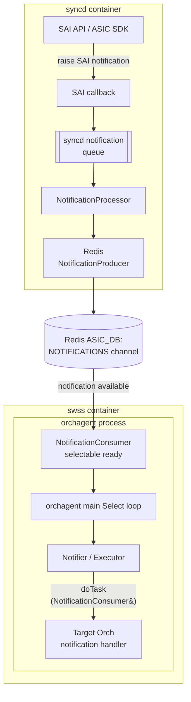
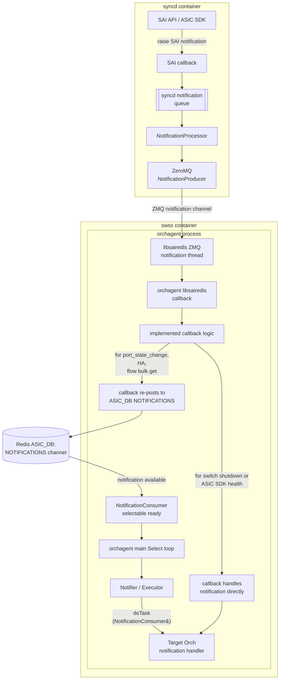
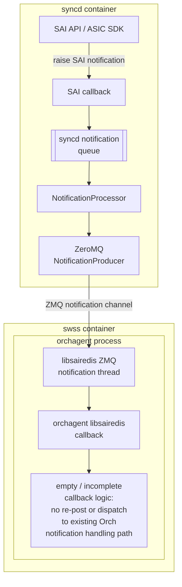
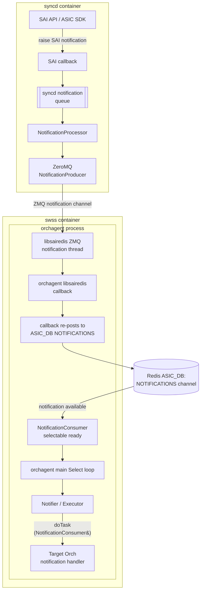
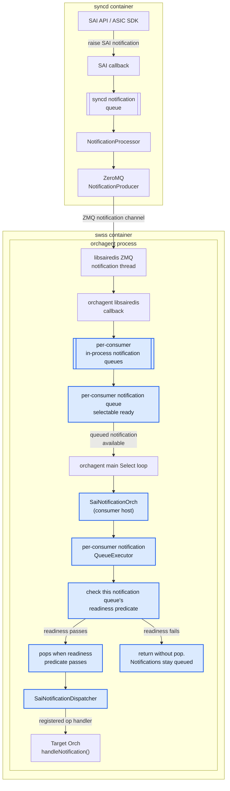
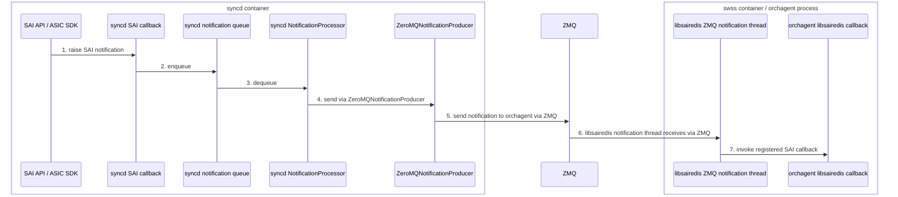
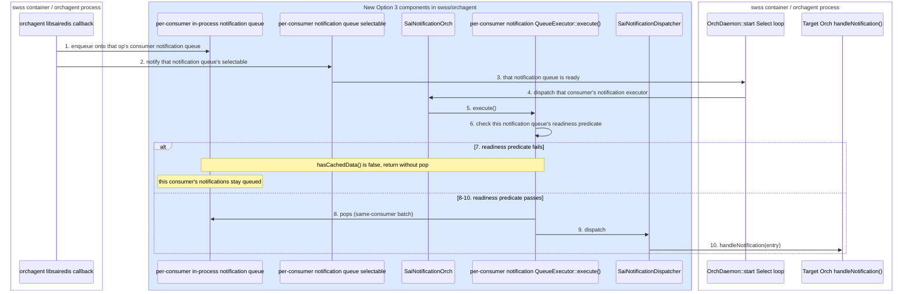
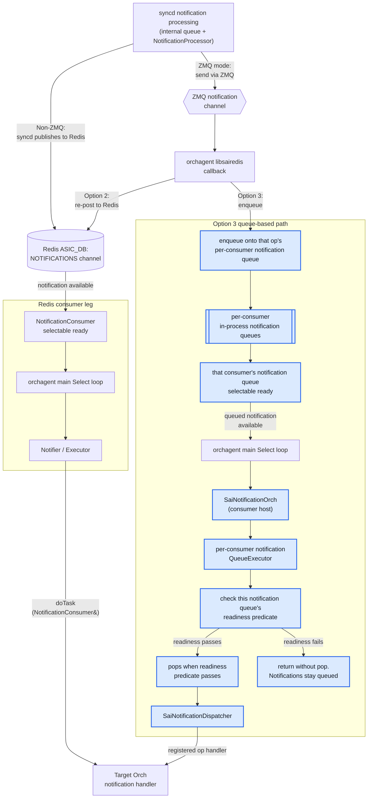
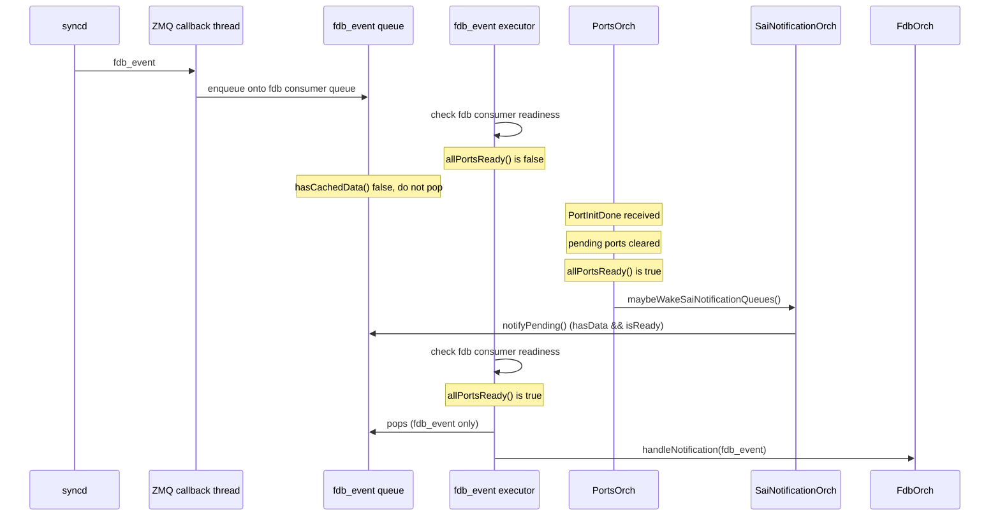
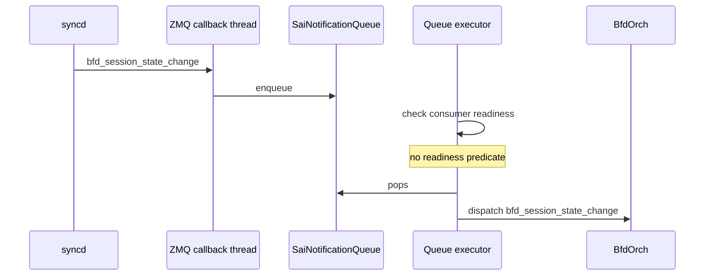

# HLD: SAI Notification Handling with ZMQ Southbound

## Table of Contents

- [1. Background](#1-background)
- [2. Problem Statement](#2-problem-statement)
- [3. Existing Notification Flows](#3-existing-notification-flows)
  - [3.1 Non-ZMQ Mode](#31-non-zmq-mode)
  - [3.2 ZMQ Mode Today](#32-zmq-mode-today)
    - [3.2.1 Notifications Already Handled](#321-notifications-already-handled)
    - [3.2.2 Notifications With Missing Callback Handling](#322-notifications-with-missing-callback-handling)
- [4. Design Goals](#4-design-goals)
- [5. Design Options](#5-design-options)
  - [5.1 Option 1: `syncd` Publishes Notifications via Redis in ZMQ Mode](#51-option-1-syncd-publishes-notifications-via-redis-in-zmq-mode)
    - [5.1.1 Description](#511-description)
    - [5.1.2 Notification Path](#512-notification-path)
    - [5.1.3 Implementation Notes](#513-implementation-notes)
    - [5.1.4 Pros](#514-pros)
    - [5.1.5 Cons](#515-cons)
  - [5.2 Option 2: `orchagent` Callback Re-posts to `ASIC_DB:NOTIFICATIONS`](#52-option-2-orchagent-callback-re-posts-to-asic_dbnotifications)
    - [5.2.1 Description](#521-description)
    - [5.2.2 Option 2 Flow](#522-option-2-flow)
    - [5.2.3 Implementation Notes](#523-implementation-notes)
    - [5.2.4 Pros](#524-pros)
    - [5.2.5 Cons](#525-cons)
  - [5.3 Option 3: In-process Notification Queue Drained by Orch Main Loop](#53-option-3-in-process-notification-queue-drained-by-orch-main-loop)
    - [5.3.1 Description](#531-description)
    - [5.3.2 Option 3 Flow](#532-option-3-flow)
    - [5.3.3 Option 3 Sequence](#533-option-3-sequence)
      - [5.3.3.1 ZMQ notification delivery to `orchagent` callback](#5331-zmq-notification-delivery-to-orchagent-callback)
      - [5.3.3.2 Callback to main-loop processing](#5332-callback-to-main-loop-processing)
    - [5.3.4 Notification Dispatch Path Comparison (Non-ZMQ, Option 2, and Option 3)](#534-notification-dispatch-path-comparison-non-zmq-option-2-and-option-3)
    - [5.3.5 Existing Code References](#535-existing-code-references)
    - [5.3.6 Implementation Notes](#536-implementation-notes)
    - [5.3.7 Main-loop Integration](#537-main-loop-integration)
    - [5.3.8 Readiness predicates and boot-time behavior](#538-readiness-predicates-and-boot-time-behavior)
      - [5.3.8.1 Readiness-gated boot-time sequence (example: port readiness)](#5381-readiness-gated-boot-time-sequence-example-port-readiness)
      - [5.3.8.2 Non-readiness-gated boot-time sequence](#5382-non-readiness-gated-boot-time-sequence)
      - [5.3.8.3 Readiness transition wake-up](#5383-readiness-transition-wake-up)
    - [5.3.9 Notification inventory](#539-notification-inventory)
    - [5.3.10 Priority, Fairness, Queue Policy, and Shared Handler](#5310-priority-fairness-queue-policy-and-shared-handler)
    - [5.3.11 Validation and Unit Test Coverage](#5311-validation-and-unit-test-coverage)
    - [5.3.12 Pros](#5312-pros)
    - [5.3.13 Cons](#5313-cons)
    - [5.3.14 Follow-on work](#5314-follow-on-work)
  - [5.4 Recommendation](#54-recommendation)
- [6. References](#6-references)

## 1. Background

SONiC recently added support for ZMQ southbound communication between `orchagent` and `syncd` for regular switches. This is controlled by the route-performance ZMQ setting:

```text
SYSTEM_DEFAULTS|swss_zmq.status = enabled
```

In non-ZMQ mode (Redis mode), SAI notifications are published by `syncd` into Redis `ASIC_DB:NOTIFICATIONS`. `orchagent` consumes those notifications from Redis in its normal main loop and dispatches them to the appropriate Orch components.

In ZMQ mode, `syncd` sends notifications to `orchagent` through ZMQ. These notifications arrive in `orchagent` libsairedis callback functions. Some callbacks already re-post notifications to Redis, such as `on_port_state_change()`, but several callbacks are currently empty or incomplete. As a result, some notifications are dropped when ZMQ southbound is enabled.

This gap is tracked in [sonic-buildimage issue #27541](https://github.com/sonic-net/sonic-buildimage/issues/27541). An initial short-term implementation is proposed in [sonic-swss PR #4619](https://github.com/sonic-net/sonic-swss/pull/4619).

## 2. Problem Statement

When ZMQ southbound is enabled, SAI notifications delivered over ZMQ may not reach their existing Orch consumers. The primary gaps called out in [sonic-buildimage issue #27541](https://github.com/sonic-net/sonic-buildimage/issues/27541) are:

- `fdb_event`
- `bfd_session_state_change`
- `port_host_tx_ready`
- `icmp_echo_session_state_change`

Additional `ASIC_DB:NOTIFICATIONS` types should be reviewed for ZMQ-mode parity with the existing non-ZMQ Redis path, including `port_state_change` (currently re-posted to Redis in ZMQ mode), `twamp_session_event`, and MACsec post-status notifications.

Expected consumers include `FdbOrch`, `BfdOrch`, `PortsOrch`, `IcmpOrch`, `TwampOrch`, and `MACsecOrch`, depending on platform and feature coverage.

Without a fix:

- Hardware-learned MAC entries may not propagate to `FdbOrch`.
- BFD session state transitions may not reach `BfdOrch`.
- Port host TX readiness may not reach `PortsOrch`.
- ICMP echo session monitoring may not reach `IcmpOrch`.
- Other `ASIC_DB:NOTIFICATIONS` types covered by this HLD (for example `twamp_session_event`, MACsec post-status, and HA/flow-bulk events; see [Section 5.3.9](#539-notification-inventory) for the full set) may be dropped or may not reach their owning orchs when ZMQ southbound is enabled.

This HLD does not change notification channels outside `ASIC_DB:NOTIFICATIONS` SAI delivery, such as `RESTARTCHECK` (`SwitchOrch`) or `APPL_DB` requests such as `WATERMARK_CLEAR_REQUEST` (`WatermarkOrch`). These are out of scope because they are not delivered via syncd SAI notifications over ZMQ; they continue to use their existing Redis consumers unchanged in ZMQ mode.

Notification prioritization and timely handling of high-priority notifications, such as port state changes and BFD session state changes, under high `orchagent` load is a broader concern for both ZMQ and non-ZMQ modes. This HLD considers that concern only in the context of the ZMQ notification handling [design options](#5-design-options); it does not propose changes to the existing non-ZMQ notification path.

## 3. Existing Notification Flows

The diagrams below show notification delivery paths at a high level. Where thread context affects the design, the text calls out the relevant execution contexts, such as the libsairedis notification thread and the `orchagent` main loop.

### 3.1 Non-ZMQ Mode


```mermaid
flowchart TD
    subgraph syncdContainer["syncd container"]
        saiApi["SAI API / ASIC SDK"]
        syncdCallback["SAI callback"]
        ntfQueue[["syncd notification<br/>queue"]]
        notificationProcessor["NotificationProcessor"]
        redisProducer["Redis<br/>NotificationProducer"]
    end

    redisNotifications[("Redis ASIC_DB:<br/>NOTIFICATIONS channel")]

    subgraph swssContainer["swss container"]
        subgraph orchagentProcess["orchagent process"]
            redisConsumerReady["NotificationConsumer<br/>selectable ready"]
            mainLoop["orchagent main Select loop"]
            notifier["Notifier / Executor"]
            orchHandler["Target Orch<br/>notification handler"]
        end
    end

    saiApi -->|"raise SAI notification"| syncdCallback
    syncdCallback --> ntfQueue
    ntfQueue --> notificationProcessor
    notificationProcessor --> redisProducer
    redisProducer --> redisNotifications
    redisNotifications -->|"notification available"| redisConsumerReady
    redisConsumerReady --> mainLoop
    mainLoop --> notifier
    notifier -->|"doTask<br/>(NotificationConsumer&)"| orchHandler
```

The non-ZMQ notification path has three main execution hops:

- `SAI API / ASIC SDK` invokes the registered notification callback in `syncd`.
- The `syncd` SAI callback enqueues the notification on the internal `syncd` notification queue; `NotificationProcessor` dequeues and publishes the notification to `ASIC_DB:NOTIFICATIONS`.
- `orchagent` main `Select` loop detects the ready `NotificationConsumer` selectable and dispatches the corresponding `Notifier` / executor. `Notifier::execute()` calls the corresponding Orch `doTask(NotificationConsumer&)`, which handles the notification through the existing Orch handler logic.

This is the existing proven notification path.

### 3.2 ZMQ Mode Today

ZMQ mode has existing notification handling gaps today. Some notifications already have callback handling logic, while the notifications covered by this HLD do not yet reach their existing Orch consumers.

### 3.2.1 Notifications Already Handled


```mermaid
flowchart TD
    subgraph syncdContainer["syncd container"]
        saiApi["SAI API / ASIC SDK"]
        syncdCallback["SAI callback"]
        ntfQueue[["syncd notification<br/>queue"]]
        notificationProcessor["NotificationProcessor"]
        zmqProducer["ZeroMQ<br/>NotificationProducer"]
    end

    redisNotifications[("Redis ASIC_DB:<br/>NOTIFICATIONS channel")]

    subgraph swssContainer["swss container"]
        subgraph orchagentProcess["orchagent process"]
            zmqThread["libsairedis ZMQ<br/>notification thread"]
            saiCallback["orchagent libsairedis<br/>callback"]
            callbackLogic["implemented callback logic"]
            redisRepost["callback re-posts to<br/>ASIC_DB NOTIFICATIONS"]
            directHandler["callback handles<br/>notification directly"]
            redisConsumerReady["NotificationConsumer<br/>selectable ready"]
            mainLoop["orchagent main Select loop"]
            notifier["Notifier / Executor"]
            orchHandler["Target Orch<br/>notification handler"]
        end
    end

    saiApi -->|"raise SAI notification"| syncdCallback
    syncdCallback --> ntfQueue
    ntfQueue --> notificationProcessor
    notificationProcessor --> zmqProducer
    zmqProducer -->|"ZMQ notification channel"| zmqThread
    zmqThread --> saiCallback
    saiCallback --> callbackLogic

    callbackLogic -->|"for port_state_change,<br/>HA,<br/>flow bulk get"| redisRepost
    redisRepost --> redisNotifications
    redisNotifications -->|"notification available"| redisConsumerReady
    redisConsumerReady --> mainLoop
    mainLoop --> notifier
    notifier -->|"doTask<br/>(NotificationConsumer&)"| orchHandler

    callbackLogic -->|"for switch shutdown or<br/>ASIC SDK health"| directHandler
    directHandler --> orchHandler
```

In ZMQ mode, notifications that already have callback handling follow one of the existing callback-specific paths:

- Some callbacks re-post the notification to `ASIC_DB:NOTIFICATIONS`. From there, the existing Redis notification consumer path is used: the `orchagent` main `Select` loop detects the ready `NotificationConsumer` selectable and dispatches the corresponding `Notifier` / executor. `Notifier::execute()` calls the corresponding Orch `doTask(NotificationConsumer&)`, which handles the notification through the existing Orch handler logic.
- Other callbacks, such as switch shutdown or ASIC SDK health handling, are handled directly by callback-specific logic.

### 3.2.2 Notifications With Missing Callback Handling


```mermaid
flowchart TD
    subgraph syncdContainer["syncd container"]
        saiApi["SAI API / ASIC SDK"]
        syncdCallback["SAI callback"]
        ntfQueue[["syncd notification<br/>queue"]]
        notificationProcessor["NotificationProcessor"]
        zmqProducer["ZeroMQ<br/>NotificationProducer"]
    end

    subgraph swssContainer["swss container"]
        subgraph orchagentProcess["orchagent process"]
            zmqThread["libsairedis ZMQ<br/>notification thread"]
            saiCallback["orchagent libsairedis<br/>callback"]
            callbackLogic["empty / incomplete<br/>callback logic:<br/>no re-post or dispatch<br/>to existing Orch<br/>notification handling path"]
        end
    end

    saiApi -->|"raise SAI notification"| syncdCallback
    syncdCallback --> ntfQueue
    ntfQueue --> notificationProcessor
    notificationProcessor --> zmqProducer
    zmqProducer -->|"ZMQ notification channel"| zmqThread
    zmqThread --> saiCallback
    saiCallback --> callbackLogic
```

In this case, ZMQ transport delivers the notification to the `orchagent` libsairedis notification thread, which invokes the registered `orchagent` libsairedis callback. The callback does not re-post or dispatch the notification to the existing Orch notification handling path. Because that re-post/dispatch is missing today, the notification is dropped.

## 4. Design Goals

- Preserve existing non-ZMQ behavior.
- Restore missing notifications in ZMQ mode for the covered `ASIC_DB:NOTIFICATIONS` SAI notification types, while leaving notifications that already use direct callback handling unchanged.
- Avoid duplicate notification delivery.
- Preserve existing Orch handler behavior, including per-orch readiness rules in `doTask(NotificationConsumer&)`.
- Keep Orch state updates on the `orchagent` main-loop path.
- Preserve Redis `NotificationConsumer` behavior where notification dispatch is reused or replaced: consumer isolation, coalescing policy (LruDedup vs FIFO), Select scheduling semantics, `hasCachedData()` behavior, and `COUNTERS_DB:NOTIFICATION_CONSUMER_STATS` field schema.

## 5. Design Options

This section compares three alternative ways to deliver `ASIC_DB:NOTIFICATIONS` SAI notifications when **ZMQ southbound is enabled** (`swss_zmq.status = enabled`). Throughout this document, **Option 1**, **Option 2**, and **Option 3** mean these ZMQ-mode notification delivery alternatives only.

The existing **non-ZMQ** notification path ([Section 3.1](#31-non-zmq-mode)) is unchanged by this HLD and is not an Option in this comparison. [Section 5.3.4](#534-notification-dispatch-path-comparison-non-zmq-option-2-and-option-3) shows how non-ZMQ delivery relates to Option 2 and Option 3.

| Option | Summary |
|--------|---------|
| **Option 1** | `syncd` publishes notifications to Redis while request/response stays on ZMQ |
| **Option 2** | ZMQ transport + `orchagent` callback re-post to Redis ([sonic-swss PR #4619](https://github.com/sonic-net/sonic-swss/pull/4619)) |
| **Option 3** | ZMQ transport + `orchagent` callback enqueue to in-process notification queues (main-loop drain) |

See [Section 5.4](#54-recommendation) for the proposed path.

### 5.1 Option 1: `syncd` Publishes Notifications via Redis in ZMQ Mode

#### 5.1.1 Description

Under this option, when ZMQ southbound is enabled, regular SAI operations continue to use the existing ZMQ request/response channel between `orchagent` and `syncd` through `ZeroMQSelectableChannel`, while SAI notifications are published by `syncd` through Redis.

This option reuses the existing `RedisNotificationProducer` used in non-ZMQ mode; the change is only to select it for SAI notifications when ZMQ southbound is enabled.

#### 5.1.2 Notification Path

SAI notifications follow the same Redis notification path described in [Section 3.1](#31-non-zmq-mode). The difference is that this path is selected even when ZMQ southbound is enabled; regular SAI request/response operations still use ZMQ.

#### 5.1.3 Implementation Notes

Option 1 would change the ZMQ-mode notification producer selection in `syncd` from:

```cpp
m_notifications = std::make_shared<ZeroMQNotificationProducer>(m_contextConfig->m_zmqNtfEndpoint);
```

to:

```cpp
m_notifications = std::make_shared<RedisNotificationProducer>(m_contextConfig->m_dbAsic);
```

`orchagent` libsairedis notification callbacks remain no-op for these notifications in this option, because `syncd` publishes the notifications directly to Redis. If a callback re-publishes a Redis-delivered notification back to Redis, duplicate or looping notifications can occur.

#### 5.1.4 Pros

- Uses the existing Redis notification path.
- Existing Orch consumers continue unchanged.

#### 5.1.5 Cons

- Makes ZMQ mode asymmetric:
  - request/response operations use ZMQ.
  - SAI notifications use Redis.

### 5.2 Option 2: `orchagent` Callback Re-posts to `ASIC_DB:NOTIFICATIONS`

#### 5.2.1 Description

In this option, `syncd` continues to send notifications to `orchagent` through ZMQ. The `libsairedis` ZMQ notification path invokes the registered SAI notification callback in `orchagent`, and that callback re-publishes the notification to `ASIC_DB:NOTIFICATIONS` only when ZMQ mode is enabled.

This follows the existing `on_port_state_change()` model and is the approach used by the initial fix in [sonic-swss PR #4619](https://github.com/sonic-net/sonic-swss/pull/4619). The same re-post behavior would be added to each missing notification callback covered by this HLD.

#### 5.2.2 Option 2 Flow


```mermaid
flowchart TD
    subgraph syncdContainer["syncd container"]
        saiApi["SAI API / ASIC SDK"]
        syncdCallback["SAI callback"]
        ntfQueue[["syncd notification<br/>queue"]]
        notificationProcessor["NotificationProcessor"]
        zmqProducer["ZeroMQ<br/>NotificationProducer"]
    end

    redisNotifications[("Redis ASIC_DB:<br/>NOTIFICATIONS channel")]

    subgraph swssContainer["swss container"]
        subgraph orchagentProcess["orchagent process"]
            zmqThread["libsairedis ZMQ<br/>notification thread"]
            saiCallback["orchagent libsairedis<br/>callback"]
            redisRepost["callback re-posts to<br/>ASIC_DB NOTIFICATIONS"]
            redisConsumerReady["NotificationConsumer<br/>selectable ready"]
            mainLoop["orchagent main Select loop"]
            notifier["Notifier / Executor"]
            orchHandler["Target Orch<br/>notification handler"]
        end
    end

    saiApi -->|"raise SAI notification"| syncdCallback
    syncdCallback --> ntfQueue
    ntfQueue --> notificationProcessor
    notificationProcessor --> zmqProducer
    zmqProducer -->|"ZMQ notification channel"| zmqThread
    zmqThread --> saiCallback
    saiCallback --> redisRepost
    redisRepost --> redisNotifications
    redisNotifications -->|"notification available"| redisConsumerReady
    redisConsumerReady --> mainLoop
    mainLoop --> notifier
    notifier -->|"doTask<br/>(NotificationConsumer&)"| orchHandler
```

In Option 2, ZMQ transport delivers the notification to the `orchagent` libsairedis notification thread, which invokes the registered `orchagent` libsairedis callback. The callback re-posts the notification to `ASIC_DB:NOTIFICATIONS` only when ZMQ mode is enabled. After the re-post, the existing Redis notification consumer path is used: the `orchagent` main `Select` loop detects the ready `NotificationConsumer` selectable and dispatches the corresponding `Notifier` / executor. `Notifier::execute()` calls the corresponding Orch `doTask(NotificationConsumer&)`, which handles the notification through the existing Orch handler logic.

#### 5.2.3 Implementation Notes

The following snippet is high-level pseudo-code for the callback re-post model.

```cpp
void on_fdb_event(uint32_t count, const sai_fdb_event_notification_data_t *data)
{
    if (gRedisCommunicationMode != SAI_REDIS_COMMUNICATION_MODE_ZMQ_SYNC)
    {
        return;
    }

    static thread_local swss::DBConnector db("ASIC_DB", 0);
    static thread_local swss::NotificationProducer producer(&db, "NOTIFICATIONS");

    std::string payload = sai_serialize_fdb_event_ntf(count, data);
    std::vector<swss::FieldValueTuple> values;

    producer.send(SAI_SWITCH_NOTIFICATION_NAME_FDB_EVENT, payload, values);
}
```

Note: The callback must check whether ZMQ mode is enabled before re-publishing to Redis. In non-ZMQ mode, `syncd` already publishes the notification to `ASIC_DB:NOTIFICATIONS`, and the normal `orchagent` `NotificationConsumer` path handles it in the main loop. The libsairedis notification path can still deserialize Redis notifications and invoke the registered `orchagent` libsairedis callback in non-ZMQ mode. If the callback re-publishes the notification to Redis in that mode, duplicate or looping notifications can occur. Therefore, the callback only re-publishes when `gRedisCommunicationMode == SAI_REDIS_COMMUNICATION_MODE_ZMQ_SYNC`.

#### 5.2.4 Pros

- Low-risk short-term fix.
- No `syncd` change.
- Keeps ZMQ transport between `syncd` and `orchagent`.
- Reuses existing Orch Redis notification processing path.
- Can be implemented and validated event-by-event.

#### 5.2.5 Cons

- Compared with Option 1, notifications first travel over ZMQ before being re-posted to Redis for Orch processing, which can add latency.
- Uses Redis for final notification dispatch.

### 5.3 Option 3: In-process Notification Queue Drained by Orch Main Loop

#### 5.3.1 Description

In this option, the `orchagent` libsairedis callback packages the notification as an operation name, serialized payload, and optional field-value list, then enqueues it on an **in-process per-consumer notification queue**. Notification queue topology matches today's Redis `NotificationConsumer` layout on `ASIC_DB:NOTIFICATIONS`: one in-process notification queue and one `SaiNotificationQueueExecutor` per existing consumer (typically one op per consumer; `MACsecOrch` keeps a single shared notification queue for both POST-status ops). The `orchagent` main `Select` loop drains each ready notification queue and dispatches to the owning orch's existing `handleNotification()` path.

Each queue uses the same coalescing policy as its Redis twin:

- **LruDedup** for `fdb_event`, `port_state_change`, and `port_host_tx_ready` (end-state-idempotent; last-seen unique payload wins).
- **FIFO** for the remaining migrated ops (`bfd_session_state_change`, `icmp_echo_session_state_change`, `twamp_session_event`, MACsec POST-status, HA/flow-bulk, `tam_tel_type_config_change`).

This model is similar in spirit to existing selectable-based processing such as `ZmqConsumerStateTable`, where data availability wakes the main loop and processing happens through an executor path.

#### 5.3.2 Option 3 Flow

Note: Blue-highlighted boxes identify new Option 3 components and executor processing steps introduced by this design.


```mermaid
flowchart TD
    subgraph syncdContainer["syncd container"]
        saiApi["SAI API / ASIC SDK"]
        syncdCallback["SAI callback"]
        ntfQueue[["syncd notification<br/>queue"]]
        notificationProcessor["NotificationProcessor"]
        zmqProducer["ZeroMQ<br/>NotificationProducer"]
    end

    subgraph swssContainer["swss container"]
        subgraph orchagentProcess["orchagent process"]
            zmqThread["libsairedis ZMQ<br/>notification thread"]
            saiCallback["orchagent libsairedis<br/>callback"]
            notificationQueue[["per-consumer<br/>in-process notification queues"]]
            queueSelectableReady["per-consumer notification queue<br/>selectable ready"]
            mainLoop["orchagent main Select loop"]
            saiNotificationOrch["SaiNotificationOrch<br/>(consumer host)"]
            queueExecutor["per-consumer notification<br/>QueueExecutor"]
            headPredicate["check this notification queue's<br/>readiness predicate"]
            queueDrain["pops when readiness<br/>predicate passes"]
            stayQueued["return without pop.<br/>Notifications stay queued"]
            dispatcher["SaiNotificationDispatcher"]
            orchHandler["Target Orch<br/>handleNotification()"]
        end
    end

    saiApi -->|"raise SAI notification"| syncdCallback
    syncdCallback --> ntfQueue
    ntfQueue --> notificationProcessor
    notificationProcessor --> zmqProducer
    zmqProducer -->|"ZMQ notification channel"| zmqThread
    zmqThread --> saiCallback

    saiCallback --> notificationQueue
    notificationQueue --> queueSelectableReady
    queueSelectableReady -->|"queued notification<br/>available"| mainLoop
    mainLoop --> saiNotificationOrch
    saiNotificationOrch --> queueExecutor
    queueExecutor --> headPredicate
    headPredicate -->|"readiness passes"| queueDrain
    headPredicate -->|"readiness fails"| stayQueued
    queueDrain --> dispatcher
    dispatcher -->|"registered op handler"| orchHandler

    classDef option3New fill:#dbeafe,stroke:#2563eb,stroke-width:2px,color:#111827
    class notificationQueue,queueSelectableReady,saiNotificationOrch,queueExecutor,headPredicate,queueDrain,stayQueued,dispatcher option3New
```

#### 5.3.3 Option 3 Sequence

The flow diagram above shows the components involved. The sequence diagrams below show the expected ordering and execution-context handoff for Option 3.

Option 3 does not change notification delivery up to the `orchagent` libsairedis callback; its changes start after the callback receives the notification.

##### 5.3.3.1 ZMQ notification delivery to `orchagent` callback


```mermaid
sequenceDiagram
    box syncd container
        participant SaiApi as SAI API / ASIC SDK
        participant SyncdCb as syncd SAI callback
        participant NtfQueue as syncd notification queue
        participant Processor as syncd NotificationProcessor
        participant ZmqProducer as ZeroMQNotificationProducer
    end

    participant ZMQ as ZMQ

    box swss container / orchagent process
        participant ZmqThread as libsairedis ZMQ notification thread
        participant Callback as orchagent libsairedis callback
    end

    SaiApi->>SyncdCb: 1. raise SAI notification
    SyncdCb->>NtfQueue: 2. enqueue
    NtfQueue->>Processor: 3. dequeue
    Processor->>ZmqProducer: 4. send via ZeroMQNotificationProducer
    ZmqProducer->>ZMQ: 5. send notification to orchagent via ZMQ
    ZMQ->>ZmqThread: 6. libsairedis notification thread receives via ZMQ
    ZmqThread->>Callback: 7. invoke registered SAI callback
```

The notification delivery sequence is:

1. `SAI API / ASIC SDK` raises a notification and invokes the registered `syncd` SAI callback.
2. The `syncd` SAI callback performs minimal work and enqueues the notification on the internal `syncd` notification queue (same pattern as non-ZMQ mode).
3. The `syncd` `NotificationProcessor` thread dequeues the notification from the queue.
4. `NotificationProcessor` sends the notification through `ZeroMQNotificationProducer`.
5. `ZeroMQNotificationProducer` sends the notification to `orchagent` via ZMQ.
6. The libsairedis ZMQ notification thread in `orchagent` receives the notification via ZMQ.
7. The libsairedis ZMQ notification thread invokes the registered `orchagent` libsairedis callback.

Steps 1–2 run on the SAI callback thread; steps 3–4 run on the `NotificationProcessor` thread; steps 5–7 run on the libsairedis ZMQ notification thread.

##### 5.3.3.2 Callback to main-loop processing

The main-loop processing sequence is: steps 1–2 run on the libsairedis ZMQ notification thread; steps 3–10 run on the `orchagent` main-loop thread.


```mermaid
sequenceDiagram
    box swss container / orchagent process
        participant Callback as orchagent libsairedis callback
    end

    box rgb(219, 234, 254) New Option 3 components in swss/orchagent
        participant Queue as per-consumer in-process notification queue
        participant Wakeup as per-consumer notification queue selectable
        participant SaiNotificationOrch as SaiNotificationOrch
        participant Executor as per-consumer notification QueueExecutor::execute()
        participant Dispatcher as SaiNotificationDispatcher
    end

    box swss container / orchagent process
        participant MainLoop as OrchDaemon::start Select loop
        participant Orch as Target Orch handleNotification()
    end

    Callback->>Queue: 1. enqueue onto that op's consumer notification queue
    Callback->>Wakeup: 2. notify that notification queue's selectable
    Wakeup->>MainLoop: 3. that notification queue is ready
    MainLoop->>SaiNotificationOrch: 4. dispatch that consumer's notification executor
    SaiNotificationOrch->>Executor: 5. execute()
    Executor->>Executor: 6. check this notification queue's readiness predicate
    alt 7. readiness predicate fails
        Note over Executor,Queue: hasCachedData() is false, return without pop
        Note over Queue: this consumer's notifications stay queued
    else 8-10. readiness predicate passes
        Executor->>Queue: 8. pops (same-consumer batch)
        Executor->>Dispatcher: 9. dispatch
        Dispatcher->>Orch: 10. handleNotification(entry)
    end
```

1. The callback serializes/packages the notification as a `KeyOpFieldsValuesTuple`-compatible entry and enqueues it onto the **per-consumer** in-process notification queue for that op (same consumer layout as Redis `NotificationConsumer` on `ASIC_DB:NOTIFICATIONS`).
2. The callback notifies that notification queue's selectable.
3. The current `OrchDaemon::start()` `Select` loop is notified that this consumer's queued notifications are available.
4. The main loop dispatches the notification executor owned by `SaiNotificationOrch` for that consumer.
5. That `SaiNotificationQueueExecutor::execute()` is invoked on the main-loop path.
6. The executor checks the **readiness predicate registered for this consumer/op**. See [Section 5.3.8](#538-readiness-predicates-and-boot-time-behavior) for the per-consumer isolation rules that prevent mixed-readiness batch pops.
7. If the readiness predicate fails, the executor returns without popping and this consumer's notifications stay queued; `hasCachedData()` is false to avoid main-loop spin. Retry behavior is described in [Section 5.3.8](#538-readiness-predicates-and-boot-time-behavior).
8. If the readiness predicate passes, the executor pops a batch from **this** queue (`DEFAULT_NC_POP_BATCH_SIZE`). If more entries remain, `hasCachedData()` follows Redis (`size() > 1`) so the next drain happens on a later Select iteration. Remaining depth of 1 waits for the next fd-ready `select()` or an explicit readiness-transition wake-up ([Section 5.3.8.3](#5383-readiness-transition-wake-up)).
9. The executor dispatches each popped entry through `SaiNotificationDispatcher`.
10. The dispatcher invokes the target Orch `handleNotification(entry)` registered for that op on the `orchagent` main-loop path.

#### 5.3.4 Notification Dispatch Path Comparison (Non-ZMQ, Option 2, and Option 3)

This section compares how `ASIC_DB:NOTIFICATIONS` SAI notifications reach target Orch handlers under non-ZMQ mode, ZMQ Option 2, and ZMQ Option 3.

The diagram below shows three entry paths:

- **Non-ZMQ mode** — `syncd` SAI callback enqueues on the internal notification queue; `NotificationProcessor` publishes to `ASIC_DB:NOTIFICATIONS`. The `orchagent` libsairedis callback is not part of notification delivery. The Redis consumer leg ([Section 3.1](#31-non-zmq-mode)) dispatches to the target Orch handler.
- **Option 2** — ZMQ-mode interim fix ([sonic-swss PR #4619](https://github.com/sonic-net/sonic-swss/pull/4619)): the callback re-posts to `ASIC_DB:NOTIFICATIONS`, then uses the same Redis consumer leg as non-ZMQ mode.
- **Option 3** — ZMQ-mode target design: the callback enqueues to the **per-consumer** in-process notification queue for that op; the main loop drains each consumer through its own notification queue executor and `SaiNotificationDispatcher`. Option 3 does not send notifications back through `ASIC_DB:NOTIFICATIONS`.

**Option 3 scope.** In ZMQ mode, Option 3 migrates every notification op listed in [Section 5.3.9](#539-notification-inventory) except **Unchanged** to the in-process notification queue path. There is **no hybrid Option 2 + Option 3 coexistence** for the same notification type: notification queue-path ops enqueue only; they do not also re-post to Redis. Non-ZMQ mode continues to use the existing Redis notification path ([Section 3.1](#31-non-zmq-mode)).


```mermaid
flowchart TD
    syncd["syncd notification processing<br/>(internal queue + NotificationProcessor)"]
    zmq{{"ZMQ notification<br/>channel"}}
    libsairedisCallback["orchagent libsairedis<br/>callback"]

    redisNotifications[("Redis ASIC_DB:<br/>NOTIFICATIONS channel")]

    subgraph redisPath["Redis consumer leg"]
        redisConsumerReady["NotificationConsumer<br/>selectable ready"]
        redisMainLoop["orchagent main Select loop"]
        notifier["Notifier / Executor"]
    end

    subgraph option3Path["Option 3 queue-based path"]
        enqueueNotify["enqueue onto that op's<br/>per-consumer notification queue"]
        notificationQueue[["per-consumer<br/>in-process notification queues"]]
        queueSelectableReady["that consumer's notification queue<br/>selectable ready"]
        option3MainLoop["orchagent main Select loop"]
        saiNotificationOrch["SaiNotificationOrch<br/>(consumer host)"]
        queueExecutor["per-consumer notification<br/>QueueExecutor"]
        headPredicate["check this notification queue's<br/>readiness predicate"]
        queueDrain["pops when readiness<br/>predicate passes"]
        stayQueued["return without pop.<br/>Notifications stay queued"]
        dispatcher["SaiNotificationDispatcher"]
    end

    targetHandler["Target Orch<br/>notification handler"]

    syncd -->|"Non-ZMQ:<br/>syncd publishes to Redis"| redisNotifications
    syncd -->|"ZMQ mode:<br/>send via ZMQ"| zmq
    zmq --> libsairedisCallback
    libsairedisCallback -->|"Option 2:<br/>re-post to Redis"| redisNotifications
    libsairedisCallback -->|"Option 3:<br/>enqueue"| enqueueNotify

    redisNotifications -->|"notification available"| redisConsumerReady
    redisConsumerReady --> redisMainLoop
    redisMainLoop --> notifier
    notifier -->|"doTask<br/>(NotificationConsumer&)"| targetHandler

    enqueueNotify --> notificationQueue
    notificationQueue --> queueSelectableReady
    queueSelectableReady -->|"queued notification<br/>available"| option3MainLoop
    option3MainLoop --> saiNotificationOrch
    saiNotificationOrch --> queueExecutor
    queueExecutor --> headPredicate
    headPredicate -->|"readiness passes"| queueDrain
    headPredicate -->|"readiness fails"| stayQueued
    queueDrain --> dispatcher
    dispatcher -->|"registered op handler"| targetHandler

    classDef option3New fill:#dbeafe,stroke:#2563eb,stroke-width:2px,color:#111827
    class enqueueNotify,notificationQueue,queueSelectableReady,saiNotificationOrch,queueExecutor,headPredicate,queueDrain,stayQueued,dispatcher option3New
```

All three paths preserve the same target Orch handler behavior. In non-ZMQ mode, `syncd` publishes directly to `ASIC_DB:NOTIFICATIONS` and the `orchagent` libsairedis callback is not part of notification delivery; the Redis consumer leg (`NotificationConsumer` / `Notifier` / Orch `doTask(NotificationConsumer&)`) handles it. Option 2 reuses that same Redis consumer leg, but reaches it by re-posting from the ZMQ-mode callback. Option 3 replaces the Redis leg with **per-consumer in-process notification queues** (same consumer layout and LruDedup/FIFO policy as Redis) and dispatches to registered target Orch `handleNotification()` handlers. The Redis and notification queue paths share the same notification-specific handler logic.

#### 5.3.5 Existing Code References

Option 3 is expected to build on the following existing infrastructure.

Current notification callbacks and consumers:

- Callback implementations: some existing `orchagent` SAI notification callbacks are currently no-op or incomplete for ZMQ mode and need re-post (Option 2) or enqueue (Option 3) behavior. Examples include `on_fdb_event()`, `on_bfd_session_state_change()`, and `on_port_host_tx_ready()` in `src/sonic-swss/orchagent/notifications.cpp`, and `IcmpSaiSessionHandler::on_state_change()` in `src/sonic-swss/orchagent/icmporch.cpp`. Under Option 3, these callbacks enqueue notifications for main-loop processing.
- Callback registration: notification callbacks are registered through existing Orch initialization and feature-specific setup paths. Examples include switch notification setup in `src/sonic-swss/orchagent/main.cpp`, `src/sonic-swss/orchagent/portsorch.cpp`, and `src/sonic-swss/orchagent/bfdorch.cpp`, and ICMP offload-session callback registration through `SaiOffloadSessionHandler`.
- Existing Orch notification consumers: in the existing non-ZMQ notification path, these notification types are consumed from `ASIC_DB:NOTIFICATIONS` by target Orch consumers such as `FdbOrch`, `BfdOrch`, `PortsOrch`, and `IcmpOrch`. Option 3 should preserve the same Orch handler behavior without sending migrated ZMQ notifications through Redis.
- Existing Redis notification dispatch: Redis-delivered SAI notifications are consumed through `NotificationConsumer` instances wrapped by `Notifier`. `Notifier::execute()` calls the corresponding Orch `doTask(NotificationConsumer&)`, preserving the existing per-Orch notification handling model for non-ZMQ mode and Option 2.

Selectable/executor integration:

- Selectable-based ZMQ consumers: `src/sonic-swss-common/common/zmqconsumerstatetable.h` defines `ZmqConsumerStateTable`, an existing selectable-based ZMQ consumer that wakes the main loop when data is available and processes data through the executor path. Option 3 can follow a similar integration pattern for SAI notifications.
- `ZmqConsumerStateTable` processing model: the referenced SONiC ZMQ producer/consumer state table design describes a receive-thread-to-main-loop pattern where `ZmqServer` receives and deserializes ZMQ messages, dispatches them to `ZmqConsumerStateTable`, `ZmqConsumerStateTable` notifies `Select`, and the main loop later pops operations through `ZmqConsumerStateTable::pops()`. Option 3 follows the same general pattern for SAI notifications: the `orchagent` libsairedis callback enqueues the notification, notifies the main loop, and processing happens through the executor path.
- Select priority: `swss::Selectable` carries a priority value used by `Select`; higher priority values are selected ahead of lower-priority ready selectables. Option 3 should use this existing priority model where practical.
- Main-loop infrastructure: `src/sonic-swss/orchagent/orchdaemon.cpp` contains the main `OrchDaemon::start()` `Select` loop that waits on registered selectables and dispatches `Executor::execute()` when a selectable becomes ready. The Option 3 integration approach is described in [Section 5.3.7](#537-main-loop-integration).
- `SaiNotificationOrch`: SAI notification consumer host; see [Section 5.3.7](#537-main-loop-integration) for construction order, per-consumer notification queue/executor ownership, ZMQ vs non-ZMQ registration, and `SaiNotificationDispatcher` handler registry.
- `NotificationConsumerStatsOrch`: `src/sonic-swss/orchagent/notificationconsumerstatsorch.cpp` periodically publishes registered non-ZMQ `NotificationConsumer` stats to `COUNTERS_DB:NOTIFICATION_CONSUMER_STATS`. Option 3 extends this path for per-consumer in-process notification queues in ZMQ mode (see [Section 5.3.6](#536-implementation-notes)).

#### 5.3.6 Implementation Notes

The following snippets are high-level pseudo-code aligned with the proposed implementation. The queue stores the same shape used by existing swss notification consumers: operation name, serialized data, and optional field-value list.

The notification queue and executor pattern is generic and **per-consumer**. Migrated callbacks enqueue onto the in-process notification queue that corresponds to the Redis `NotificationConsumer` for that op. `SaiNotificationOrch` owns one `SaiNotificationQueue` plus one `SaiNotificationQueueExecutor` per consumer. Each executor drains only that notification queue and dispatches to the registered `handleNotification()` handler. Per-consumer isolation and multi-op readiness rules are described in [Section 5.3.8](#538-readiness-predicates-and-boot-time-behavior).

**Queue policy (Redis parity).** Each in-process notification queue uses the same `NotificationQueuePolicy` as its Redis twin:

| Queue policy | Ops |
|---|---|
| `LruDedup` | `fdb_event`, `port_state_change`, `port_host_tx_ready` |
| `Fifo` | `bfd_session_state_change`, `icmp_echo_session_state_change`, `twamp_session_event`, `switch_macsec_post_status` + `macsec_post_status` (one MACsec consumer), `ha_set_event`, `ha_scope_event`, `flow_bulk_get_session_event`, `tam_tel_type_config_change` |

`LruDedup` is byte-identical payload coalescing (last-seen unique payload at the tail), as in `swss-common` `LruDedupNotificationQueue`. It is used only for consumers already audited as end-state-idempotent on Redis. FIFO consumers keep strict arrival order.

Option 3 intentionally keeps notification-message queue semantics rather than replacing the queue with a per-key last-value cache. The existing Redis path delivers serialized notification messages, not state-table updates. Some notification types represent ordered transitions, and different notifications for the same object can carry different event state or fields that the owning orch must observe. A per-key last-writer-wins structure would introduce new coalescing semantics and could drop distinct transitions. Option 3 therefore matches Redis behavior: FIFO consumers preserve every admitted notification in arrival order, while LruDedup consumers collapse only byte-identical payloads for the audited idempotent cases listed above.

The examples below use `FdbOrch` / `fdb_event`, but the same registry pattern applies to every migrated consumer.

```cpp
// Pseudo-type representing the selected FIFO or LruDedup queue backend.
class NotificationQueueBackend;

class SaiNotificationQueue
{
public:
    using ReadinessPredicate = std::function<bool()>;

    SaiNotificationQueue(const std::string &consumerName,
                         int pri = 100,
                         size_t popBatchSize = swss::DEFAULT_NC_POP_BATCH_SIZE,
                         swss::NotificationQueuePolicy policy = swss::NotificationQueuePolicy::Fifo)
        : m_queue(consumerName, policy)
        , m_pri(pri)
        , m_popBatchSize(popBatchSize)
    {
    }

    // ... enqueue routes into m_queue using Fifo or LruDedup, then notifies
    // m_selectableEvent so the main Select loop sees queued work ...

    int getPri() const
    {
        return m_pri;
    }

    int getFd()
    {
        return m_selectableEvent.getFd();
    }

    uint64_t readData()
    {
        return m_selectableEvent.readData();
    }

    void registerReadiness(ReadinessPredicate ready = nullptr)
    {
        m_ready = std::move(ready);
        m_handlerRegistered = true;
    }

    bool isReady() const
    {
        return m_handlerRegistered && (!m_ready || m_ready());
    }

    bool hasData()
    {
        std::lock_guard<std::mutex> lock(m_mutex);
        return !m_queue.empty();
    }

    // Redis NotificationConsumer::hasCachedData() is size() > 1, not "any
    // non-empty". Returning hasData() here would reinsert the selectable
    // immediately from Select::select() and can busy-spin when the
    // consumer is not ready (queue non-empty, execute() returns).
    // A single ready entry is still processed by the current execute();
    // hasCachedData() only controls immediate reinsertion for another pass.
    bool hasCachedData()
    {
        if (!isReady())
        {
            return false;
        }
        std::lock_guard<std::mutex> lock(m_mutex);
        return m_queue.size() > 1;
    }

    bool peekFrontOp(std::string &op) const
    {
        std::lock_guard<std::mutex> lock(m_mutex);
        if (m_queue.empty())
        {
            return false;
        }
        op = kfvOp(m_queue.front());
        return true;
    }

    void pops(std::deque<swss::KeyOpFieldsValuesTuple> &entries)
    {
        entries.clear();

        std::lock_guard<std::mutex> lock(m_mutex);
        // Limit each drain to preserve main-loop fairness across ready executors.
        const auto count = std::min(m_queue.size(), m_popBatchSize);
        for (size_t i = 0; i < count; ++i)
        {
            entries.push_back(std::move(m_queue.front()));
            m_queue.pop();
        }

        // Do not notify here. Cached-work reinsertion is controlled by
        // hasCachedData() so Option 3 matches Redis NotificationConsumer.
    }

private:
    std::mutex m_mutex;
    NotificationQueueBackend m_queue;  // FIFO or LruDedup, selected by policy
    swss::SelectableEvent m_selectableEvent;
    int m_pri;
    size_t m_popBatchSize;
    ReadinessPredicate m_ready;
    bool m_handlerRegistered = false;
};
```

`m_selectableEvent.notify()` wakes the new SAI notification queue selectable. The implementation should reuse the existing swss selectable/executor model rather than introducing a separate main-loop mechanism. `ZmqConsumerStateTable` is one existing example of this wake-up pattern: data availability is represented through a selectable, and the main `Select` loop later dispatches an executor. The important requirement is that enqueueing a notification makes queued notification work visible to the current `OrchDaemon::start()` loop so it can dispatch the notification queue executor like other selectable executors.

`SaiNotificationOrch` owns the static metadata for the [Section 5.3.9](#539-notification-inventory) notification queue-path ops: operation name, consumer/stats name, queue policy, and default readiness behavior. A notification queue is created when `SaiNotificationOrch` registers the consumer (or lazily on first enqueue for that op) using this metadata, so early notifications that arrive before the target Orch registers its notification queue-path handler can still be enqueued with the correct policy instead of being dropped. A notification queue that has not yet registered its handler must not pop entries; `dispatch()` warning on a missing handler is a last-resort guard, not the normal early-registration path. Each `SaiNotificationQueueExecutor` is owned by `SaiNotificationOrch`; feature orchs register per-op handlers, not separate executors.

**Select priority.** Each per-consumer notification queue and its `SaiNotificationQueueSelectable` wrapper use Select priority **100**, matching `NotificationConsumer(..., pri = 100)`. The wrapper must forward that priority into `swss::Selectable` (the default constructor is `pri = 0`). Option 3 does **not** assign different priorities per notification op: Redis `NotificationConsumer`s on `ASIC_DB:NOTIFICATIONS` are all priority 100. Changing relative scheduling among SAI notification types would be new behavior, not Redis parity.

**Backpressure and watermarks.**

- **LruDedup** queues are bounded by count of distinct in-flight payloads (same as Redis). Reuse `LruDedupNotificationQueue` high-watermark logging (`SWSS_LOG_NOTICE` on a new max, rate-limited stats).
- **FIFO** queues must not grow without bound. Each FIFO consumer has a maximum depth and an explicit overflow policy, plus a rate-limited `SWSS_LOG_WARN` when depth crosses the watermark, a new high-watermark is reached, or overflow occurs. A notification burst against a not-ready consumer must not be allowed to grow the FIFO without limit.

Any FIFO overflow is notification loss and is not correctness-preserving, whether the implementation drops the newest entry, drops the oldest entry, or rejects admission in another way. The bound exists as a last-resort memory-protection guard under stall or fault conditions, not as normal flow control. The implementation must account for overflow with counters/logs so operators can distinguish overflow loss from normal LruDedup coalescing. If a consumer can safely keep only the latest state, it should use an audited coalescing policy such as LruDedup instead of FIFO.

Implementation note: unless a consumer-specific design decision chooses otherwise, FIFO overflow should reject the new admission: keep already-admitted entries in FIFO order, do not enqueue the incoming notification, increment an overflow/drop counter, and emit a rate-limited log. This avoids blocking the libsairedis callback thread and preserves ordering for admitted entries, but it is still notification loss and must be treated as an operational fault.

**COUNTERS_DB telemetry (Redis parity).** Registered non-ZMQ notification consumers publish stats through `NotificationConsumerStatsOrch` to `COUNTERS_DB:NOTIFICATION_CONSUMER_STATS` (approximately every 10 seconds). Each registered consumer gets one hash key (for example `PortsOrch:port_state_change`). Option 3 must publish the **same field schema** for each per-consumer in-process notification queue when ZMQ mode is enabled:

| Field group | LruDedup consumers | FIFO consumers |
|---|---|---|
| Admission | `channel`, `received`, `dropped_allowlist`, `admitted`, `admit_ratio_pct` | Same |
| Queue policy | `queue_policy=LruDedup` | `queue_policy=Fifo` |
| LruDedup queue depth | `lru_pushed`, `lru_dedup_hits`, `lru_dedup_ratio_pct`, `lru_current_depth`, `lru_high_watermark` | Not published (non-ZMQ FIFO has no equivalent today) |

Registration happens when a feature orch calls `gSaiNotificationOrch->registerHandler()` (or when `SaiNotificationOrch` creates the per-consumer notification queue): each notification queue is registered with `NotificationConsumerStatsOrch` under the stable consumer name from the Option 3 metadata table. Where the corresponding Redis consumer already has a stats label (for example `FdbOrch:fdb_event`), Option 3 uses the same name. Where the corresponding Redis consumer has not opted into stats yet, the implementation should add the matching non-ZMQ `NotificationConsumerStatsOrch` registration with the same stable name and field schema as part of the same telemetry-parity work. Option 3 should not introduce ZMQ-only `COUNTERS_DB:NOTIFICATION_CONSUMER_STATS` coverage for a consumer unless the Redis path gets the same registration. The publish loop reuses the existing `NotificationConsumerStatsOrch` timer and table; Option 3 notification queues expose a `getStats()` surface compatible with that orch (LruDedup stats from the underlying `LruDedupNotificationQueue`; FIFO consumers publish admission counters and `queue_policy=Fifo` only, matching non-ZMQ).

FIFO notification queue depth / high-watermark in `COUNTERS_DB` is **not** part of this HLD. Non-ZMQ FIFO `NotificationConsumer`s do not publish depth or HWM to `COUNTERS_DB` today (only `queue_policy=Fifo` plus admission counters). Adding FIFO depth/HWM fields would be new telemetry for **both** non-ZMQ and Option 3; see [Section 5.3.14](#5314-follow-on-work).

```cpp
SaiNotificationQueue *SaiNotificationOrch::getSaiNotificationQueue(const std::string &op)
{
    const auto &meta = m_metadataByOp.at(op);
    auto &entry = m_consumersByName[meta.consumerName];

    if (!entry.queue)
    {
        entry.queue = std::make_unique<SaiNotificationQueue>(
            meta.consumerName,
            100,
            swss::DEFAULT_NC_POP_BATCH_SIZE,
            meta.policy);

        entry.executor = std::make_unique<SaiNotificationQueueExecutor>(
            entry.queue.get(), this, &m_dispatcher, meta.consumerName);

        Orch::addExecutor(entry.executor.get());

        if (gNotifConsumerStatsOrch)
        {
            gNotifConsumerStatsOrch->registerConsumer(
                meta.consumerName, entry.queue.get());
        }
    }

    return entry.queue.get();
}

void SaiNotificationOrch::registerHandler(
        const std::string &op,
        SaiNotificationDispatcher::Handler handler,
        SaiNotificationQueue::ReadinessPredicate ready)
{
    auto *queue = getSaiNotificationQueue(op);

    m_dispatcher.registerHandler(op, std::move(handler));
    queue->registerReadiness(std::move(ready));
}

void enqueueSaiNotification(const std::string &op,
                            std::string data,
                            std::vector<swss::FieldValueTuple> values)
{
    gSaiNotificationOrch->getSaiNotificationQueue(op)
        ->enqueue(op, std::move(data), std::move(values));
}
```

Callback:

```cpp
void on_fdb_event(uint32_t count, sai_fdb_event_notification_data_t *data)
{
    if (gRedisCommunicationMode == SAI_REDIS_COMMUNICATION_MODE_ZMQ_SYNC)
    {
        std::string sdata = sai_serialize_fdb_event_ntf(count, data);
        std::vector<swss::FieldValueTuple> values;

        enqueueSaiNotification("fdb_event", std::move(sdata), std::move(values));
    }
}
```

`fdb_event` is used here as an example because it is one of the notification types with missing ZMQ callback handling and is owned by `FdbOrch`. Other migrated callbacks enqueue onto **their own** per-consumer notification queue with their own operation names. See [Section 5.3.9](#539-notification-inventory) for the full set.

For a notification type migrated to Option 3, the ZMQ-mode callback should enqueue to the in-process notification queue and should not re-post the same notification to `ASIC_DB:NOTIFICATIONS` as a fallback. Non-ZMQ mode continues to use the existing Redis notification path.

#### 5.3.7 Main-loop Integration

Option 3 should expose the notification queue through an existing-style selectable/executor so the current `OrchDaemon::start()` `Select` loop can dispatch it like other selectables.

For end-to-end flow and diagrams, see [Section 5.3.2](#532-option-3-flow), [Section 5.3.3](#533-option-3-sequence), and [Section 5.3.4](#534-notification-dispatch-path-comparison-non-zmq-option-2-and-option-3). This section focuses on how Option 3 wires into the existing main loop and the implementation details behind that wiring.

**Thread handoff.** In ZMQ mode, the `orchagent` libsairedis callback runs on the libsairedis ZMQ notification thread. That callback must not call Orch handler logic directly. Instead, it enqueues the notification into the **per-consumer notification** `SaiNotificationQueue` for that op and calls `SelectableEvent::notify()` so the main loop can process the entry later. The enqueue path is defined in [Section 5.3.6](#536-implementation-notes). After enqueue, predicate gating, notification queue pop, and handler dispatch all run on the `orchagent` main thread.

**Main-loop wiring.** `SaiNotificationOrch` is a thin **infrastructure** orch — a SAI notification consumer host, not a feature orch. This pattern plugs into the existing `Orch` / `Executor` / `Orch::addExecutor()` model. `SaiNotificationOrch` does not own feature state, has no `APP_DB` tables, and does not implement `doTask(Consumer&)`. This remains true even though it owns multiple notification queue executors: those executors represent Redis `NotificationConsumer` twins, not new feature consumers. Functionally it acts as the host for **one executor per Redis `NotificationConsumer` twin**: it owns those `SaiNotificationQueueExecutor`s and exposes `registerHandler()` so feature orchs attach per-op callbacks through `SaiNotificationDispatcher`.

`SaiNotificationOrch` is created by `OrchDaemon` in ZMQ mode before orchs that register notification queue-path handlers, similar to how `NotificationConsumerStatsOrch` is constructed before orchs that register `NotificationConsumer` stats. When ZMQ mode is enabled, feature orchs such as `FdbOrch` and `PortsOrch` register per-operation handlers and optional readiness predicates for the notification operations they own through `gSaiNotificationOrch->registerHandler()` once `gSaiNotificationOrch` is constructed. Each registered per-consumer notification queue is also registered with `gNotifConsumerStatsOrch` so ZMQ-mode notification queue stats appear in `COUNTERS_DB:NOTIFICATION_CONSUMER_STATS` using the field schema described in [Section 5.3.6](#536-implementation-notes). In non-ZMQ mode, notifications continue to use the existing Redis `NotificationConsumer` path, Redis consumers that opt into stats register with `NotificationConsumerStatsOrch`, and no queue handlers are registered on `SaiNotificationOrch`.

When a consumer's notification queue selectable becomes ready, the existing `OrchDaemon::start()` `Select` loop dispatches that consumer's `SaiNotificationQueueExecutor::execute()` like any other executor. Per-notification-queue readiness, pop, and dispatch behavior are described in [Section 5.3.8](#538-readiness-predicates-and-boot-time-behavior).

**Lifecycle.** Per-consumer `SaiNotificationQueue`s and `gSaiNotificationOrch` live for the `orchagent` process lifetime, consistent with other global orch infrastructure. Each `SaiNotificationQueueSelectable` is owned by its executor and destroyed with the executor; the notification queue objects outlive the adapters. Once graceful shutdown begins, libsairedis ZMQ callbacks must not enqueue new notifications (for example by checking the same `gOrchShutdownRequested` flag used by `OrchDaemon::start()`), because the main loop will no longer dispatch the notification queue executors. Drops at shutdown should increment a counter and log at notice/warning so they are not silent.

**Selectable ownership.** Each real `SaiNotificationQueue` is process-lifetime. `Executor` owns and deletes the `Selectable` object passed to it. To avoid giving ownership of the notification queue to the executor, the design passes a small `Selectable` adapter, `SaiNotificationQueueSelectable`, to `Executor`. The adapter is owned by the executor, **forwards Select priority 100**, and forwards readiness checks (`hasData` / `hasCachedData`) to the notification queue.

The existing main loop already waits on selectable executors:

```cpp
void OrchDaemon::start(long heartBeatInterval)
{
    for (Orch *o : m_orchList)
    {
        m_select->addSelectables(o->getSelectables());
    }

    while (true)
    {
        Selectable *s;
        int ret = m_select->select(&s, SELECT_TIMEOUT);

        if (ret == Select::OBJECT)
        {
            auto *executor = static_cast<Executor *>(s);
            executor->execute();
        }
    }
}
```

**Executor and dispatcher pseudo-code.** The snippets below show how the notification queue executor plugs into the existing `Executor` model, how `SaiNotificationDispatcher` handler registration and per-op readiness predicates work, and how `SaiNotificationOrch` is constructed and wired into `OrchDaemon`. Predicate evaluation, pop, and dispatch semantics are covered in [Section 5.3.8](#538-readiness-predicates-and-boot-time-behavior).

```cpp
class SaiNotificationQueueSelectable : public swss::Selectable
{
public:
    explicit SaiNotificationQueueSelectable(SaiNotificationQueue *queue)
        : Selectable(queue->getPri())  // forward pri 100; default Selectable() is 0
        , m_queue(queue)
    {
    }

    int getFd() override
    {
        return m_queue->getFd();
    }

    uint64_t readData() override
    {
        return m_queue->readData();
    }

    bool hasData() override
    {
        return m_queue->hasData();
    }

    bool hasCachedData() override
    {
        return m_queue->hasCachedData();
    }

private:
    SaiNotificationQueue *m_queue;
};

class SaiNotificationDispatcher
{
public:
    using Handler = std::function<void(swss::KeyOpFieldsValuesTuple &)>;

    // Readiness is owned by SaiNotificationQueue because hasCachedData()
    // must evaluate readiness before dispatch runs. The dispatcher only
    // owns op-to-handler lookup.
    void registerHandler(const std::string &op, Handler handler)
    {
        std::lock_guard<std::mutex> lock(m_mutex);
        if (m_handlers.find(op) != m_handlers.end())
        {
            SWSS_LOG_WARN("Replacing SAI notification handler for op %s",
                          op.c_str());
        }
        m_handlers[op] = std::move(handler);
    }

    void dispatch(swss::KeyOpFieldsValuesTuple &entry)
    {
        Handler handler;
        auto op = kfvOp(entry);

        {
            std::lock_guard<std::mutex> lock(m_mutex);
            auto handlerIt = m_handlers.find(op);
            if (handlerIt != m_handlers.end())
            {
                handler = handlerIt->second;
            }
        }

        if (handler)
        {
            handler(entry);
        }
        else
        {
            SWSS_LOG_WARN("No SAI notification handler registered for op %s",
                          op.c_str());
        }
    }

private:
    std::mutex m_mutex;
    std::unordered_map<std::string, Handler> m_handlers;
};

class SaiNotificationQueueExecutor : public Executor
{
public:
    SaiNotificationQueueExecutor(SaiNotificationQueue *queue,
                                 Orch *orch,
                                 SaiNotificationDispatcher *dispatcher,
                                 const std::string &name)
        : Executor(new SaiNotificationQueueSelectable(queue), orch, name)
        , m_queue(queue)
        , m_dispatcher(dispatcher)
    {
    }

    void execute() override
    {
        // Per-consumer queue: every entry is this consumer's op(s).
        // Do not pop while this consumer is not ready.
        if (!m_queue->isReady() || !m_queue->hasData())
        {
            return;
        }

        std::deque<swss::KeyOpFieldsValuesTuple> entries;
        m_queue->pops(entries);

        for (auto &entry : entries)
        {
            m_dispatcher->dispatch(entry);
        }
    }

private:
    SaiNotificationQueue *m_queue;
    SaiNotificationDispatcher *m_dispatcher;
};
```

`SaiNotificationOrch` registers **one notification queue executor per consumer** during handler registration (or construction):

```cpp
class SaiNotificationOrch : public Orch
{
public:
    SaiNotificationOrch();

    void registerHandler(const std::string &op,
                         SaiNotificationDispatcher::Handler handler,
                         SaiNotificationQueue::ReadinessPredicate ready = nullptr);

    SaiNotificationQueue *getSaiNotificationQueue(const std::string &op);

    // Re-arm queue executors when readiness predicates start passing.
    void wakeReadyQueues();

private:
    struct ConsumerMetadata
    {
        std::string consumerName;
        swss::NotificationQueuePolicy policy;
    };

    struct ConsumerEntry
    {
        std::unique_ptr<SaiNotificationQueue> queue;
        std::unique_ptr<SaiNotificationQueueExecutor> executor;
    };

    std::unordered_map<std::string, ConsumerEntry> m_consumersByName;
    std::unordered_map<std::string, ConsumerMetadata> m_metadataByOp;
    SaiNotificationDispatcher m_dispatcher;
};

extern SaiNotificationOrch *gSaiNotificationOrch;
```

`OrchDaemon` constructs `SaiNotificationOrch` in ZMQ mode before orchs that register notification queue-path handlers:

```cpp
if (gRedisCommunicationMode == SAI_REDIS_COMMUNICATION_MODE_ZMQ_SYNC)
{
    gSaiNotificationOrch = new SaiNotificationOrch();
}

gPortsOrch = new PortsOrch(...);
gFdbOrch = new FdbOrch(...);
// other orchs register handlers from their constructors
```

When `PortsOrch::allPortsReady()` becomes true, `PortsOrch` calls `maybeWakeSaiNotificationQueues()` so readiness-gated queues with pending entries are explicitly re-notified ([Section 5.3.8.3](#5383-readiness-transition-wake-up)):

```cpp
void PortsOrch::maybeWakeSaiNotificationQueues()
{
    if (gSaiNotificationOrch && allPortsReady())
    {
        gSaiNotificationOrch->wakeReadyQueues();
    }
}

void SaiNotificationOrch::wakeReadyQueues()
{
    for (const auto &entry : m_consumersByName)
    {
        auto *queue = entry.second.queue.get();
        if (queue && queue->hasData() && queue->isReady())
        {
            queue->notifyPending();
        }
    }
}
```

`maybeWakeSaiNotificationQueues()` is invoked from `PortsOrch::doPortTask()` when `PortInitDone` is processed and whenever a port is removed from `m_pendingPortSet` (including skipped/invalid port paths), matching the points where `allPortsReady()` may transition from false to true.

#### 5.3.8 Readiness predicates and boot-time behavior

**Why this is needed.** Option 3 must preserve the same boot-time behavior as the existing Redis `NotificationConsumer` path. In Redis, many orchs return from `doTask(NotificationConsumer&)` before `pop()` or `pops()` until their readiness conditions are met, so notifications stay in **that consumer's** notification queue instead of being dropped. Option 3 uses the same model **per consumer**: the notification queue executor checks that consumer's readiness predicate before `pops()`. If the consumer is not ready, the executor returns without popping.

**No main-loop spin.** Redis `NotificationConsumer::hasCachedData()` returns `size() > 1`, not "queue non-empty". `Select::select()` reinserts a selectable immediately only when `hasCachedData()` is true. Option 3 must match that:

- If this consumer is **not ready**, `hasCachedData()` is **false** even if the notification queue is non-empty. `execute()` returns without popping. The selectable is not immediately reinserted; if no other selectable is ready, the main loop waits normally. The notification queue is retried only after a later wake-up, such as a new notification enqueue or an explicit re-notify when the readiness-owning orch transitions to ready. This avoids a tight reinsert loop at boot when `allPortsReady()` is false.
- If this consumer **is ready**, `hasCachedData()` is `size() > 1`, same as Redis.

**How readiness is registered.** Each notification queue-path handler registers an optional readiness predicate alongside its handler through `gSaiNotificationOrch->registerHandler()` (see the [Section 5.3.9](#539-notification-inventory) table). `SaiNotificationOrch` installs that predicate on the corresponding per-consumer notification queue so both `execute()` and `hasCachedData()` use the same readiness decision. Do not use one shared `allPortsReady()` gate on `SaiNotificationOrch` for all notification types. The predicate must match the owning orch's Redis `doTask(NotificationConsumer&)` behavior for that consumer.

**Early enqueue and handler registration.** Notifications can be enqueued before the owning orch calls `registerHandler()` (see [Section 5.3.6](#536-implementation-notes)). The `OrchDaemon` construction order in [Section 5.3.7](#537-main-loop-integration) creates `gSaiNotificationOrch` before feature orchs so handlers are registered during orch construction. A not-ready consumer keeps its own entries queued until its predicate passes and the notification queue is retried by a later wake-up; other consumers drain independently.

**Missing handler at dispatch.** If `dispatch()` finds no registered handler for a popped entry, the implementation should log a warning rather than silently dropping the notification. `registerHandler()` should also warn on accidental double-registration for the same op.

**Readiness-gated notifications (example: port readiness).** Some consumers register `gPortsOrch->allPortsReady()` — for example `port_state_change`, `fdb_event`, `port_host_tx_ready`, and `twamp_session_event`:

- On boot, `PortsOrch::allPortsReady()` is false until `PortInitDone` is received and no ports remain in `m_pendingPortSet`.
- If that consumer is not ready, its executor returns without calling `pops()`; **only that consumer's** notifications stay queued. Other consumers (for example `bfd_session_state_change`) continue to drain.
- After `allPortsReady()` becomes true, `PortsOrch` calls `maybeWakeSaiNotificationQueues()` ([Section 5.3.8.3](#5383-readiness-transition-wake-up)). A later `execute()` for that consumer sees the predicate pass, pops, and dispatches to the registered handler.

**Non-readiness-gated notifications** (no readiness predicate — for example `bfd_session_state_change`, `icmp_echo_session_state_change`, MACsec post-status):

- No `allPortsReady()` predicate is registered; the predicate is treated as always true.
- That consumer's executor may pop and dispatch on the next `execute()` without waiting for port initialization.
- This matches Redis, where orchs such as `BfdOrch` call `consumer.pop()` without an `allPortsReady()` gate.

**Per-consumer isolation (no cross-op head-of-line blocking).** Each in-process notification queue is isolated the same way Redis isolates `NotificationConsumer` instances. A not-ready `fdb_event` notification queue cannot block `bfd_session_state_change`. `PortsOrch` `port_state_change` and `port_host_tx_ready` remain separate notification queues, matching their separate Redis consumers. A batch `pops()` on a consumer notification queue cannot dispatch a mixed-op set with different readiness behavior. `MACsecOrch` is the explicit multi-op exception that matches Redis: one consumer (one notification queue) for both POST-status ops, both with no readiness predicate.

##### 5.3.8.1 Readiness-gated boot-time sequence (example: port readiness)

The diagram below shows a **readiness-gated** `fdb_event` consumer. Other consumers (for example BFD) are not blocked by this predicate.


```mermaid
sequenceDiagram
    participant syncd
    participant Callback as ZMQ callback thread
    participant FdbQueue as fdb_event queue
    participant FdbExec as fdb_event executor
    participant PortsOrch
    participant SaiNotifOrch as SaiNotificationOrch
    participant FdbOrch

    syncd->>Callback: fdb_event
    Callback->>FdbQueue: enqueue onto fdb consumer queue
    FdbExec->>FdbExec: check fdb consumer readiness
    Note over FdbExec: allPortsReady() is false
    Note over FdbQueue: hasCachedData() false, do not pop

    Note over PortsOrch: PortInitDone received
    Note over PortsOrch: pending ports cleared
    Note over PortsOrch: allPortsReady() is true
    PortsOrch->>SaiNotifOrch: maybeWakeSaiNotificationQueues()
    SaiNotifOrch->>FdbQueue: notifyPending() (hasData && isReady)

    FdbExec->>FdbExec: check fdb consumer readiness
    Note over FdbExec: allPortsReady() is true
    FdbExec->>FdbQueue: pops (fdb_event only)
    FdbExec->>FdbOrch: handleNotification(fdb_event)
```

The final `pops()` step drains a batch from **this consumer's** queue (`DEFAULT_NC_POP_BATCH_SIZE`). It does not pop mixed ops from a shared FIFO.

##### 5.3.8.2 Non-readiness-gated boot-time sequence

The diagram below shows a consumer with **no** readiness predicate (for example `bfd_session_state_change`). That consumer drains even while `allPortsReady()` is still false:


```mermaid
sequenceDiagram
    participant syncd
    participant Callback as ZMQ callback thread
    participant Queue as SaiNotificationQueue
    participant Executor as Queue executor
    participant BfdOrch

    syncd->>Callback: bfd_session_state_change
    Callback->>Queue: enqueue
    Executor->>Executor: check consumer readiness
    Note over Executor: no readiness predicate
    Executor->>Queue: pops
    Executor->>BfdOrch: dispatch bfd_session_state_change
```

##### 5.3.8.3 Readiness transition wake-up

Redis parity requires `hasCachedData()` to stay **false** while a consumer is not ready, even when its queue is non-empty ([Section 5.3.8](#538-readiness-predicates-and-boot-time-behavior)). That prevents the Select loop from immediately reinserting the executor and spinning at boot. The trade-off is that a notification enqueued **before** readiness may remain at queue depth **1** after the predicate starts passing: `hasCachedData()` is still false (`size() > 1` is false), and the executor is not reselected until another wake-up.

Option 3 therefore requires an **explicit readiness-transition wake-up** when the owning readiness condition becomes true:

- `PortsOrch::maybeWakeSaiNotificationQueues()` runs when `allPortsReady()` may have just become true (`PortInitDone` and each `m_pendingPortSet.erase()` path in `doPortTask()`).
- `SaiNotificationOrch::wakeReadyQueues()` walks registered per-consumer queues and calls `notifyPending()` on each queue with `hasData() && isReady()`.
- That re-arms the queue's Selectable so the main loop runs `execute()` again and drains the previously blocked entry.

Without this wake-up, readiness-gated notifications can stall indefinitely after boot even though `allPortsReady()` is true. New enqueues still work because `enqueue()` also calls `notifyPending()`.

For example, an `FdbOrch` migration can register the `fdb_event` handler and a port-readiness predicate from the `FdbOrch` constructor:

```cpp
FdbOrch::FdbOrch(...)
{
    ...

    gSaiNotificationOrch->registerHandler(
        "fdb_event",
        [this](swss::KeyOpFieldsValuesTuple &entry)
        {
            handleNotification(entry);
        },
        []() { return gPortsOrch != nullptr && gPortsOrch->allPortsReady(); });
}
```

A notification type that does not gate in Redis, such as `bfd_session_state_change`, omits the readiness predicate. `BfdOrch::doTask(NotificationConsumer&)` processes BFD session state as notifications arrive and does not wait on `PortsOrch::allPortsReady()`, because BFD session state is independent of port initialization completion. Option 3 matches that behavior by registering no port-readiness predicate:

```cpp
gSaiNotificationOrch->registerHandler(
    "bfd_session_state_change",
    [this](swss::KeyOpFieldsValuesTuple &entry)
    {
        handleNotification(entry);
    });
```

For the `handleNotification()` shared-handler pattern, see [Section 5.3.10](#5310-priority-fairness-queue-policy-and-shared-handler).

#### 5.3.9 Notification inventory

The [Section 5.3.8](#538-readiness-predicates-and-boot-time-behavior) readiness model and registration examples above define the queue-path pattern; this section lists every notification op and how it maps to that pattern.

Option 3 targets parity with the existing non-ZMQ `ASIC_DB:NOTIFICATIONS` path. The table below lists notification operations, their ZMQ delivery path today, the Option 3 plan, the in-process notification queue policy (matching Redis), and the readiness predicate. Each notification queue-path handler matches the owning orch's Redis `NotificationConsumer` / `doTask(NotificationConsumer&)` behavior.

**Option 3 plan** values:

| Value | Meaning |
|---|---|
| **Enqueue (required)** | ZMQ callback is no-op or incomplete today. A notification queue path is required to restore non-ZMQ parity. |
| **Migrate to notification queue** | Already delivered via Option 2 Redis re-post today. Change to the in-process notification queue path (latency benefit, no Redis re-post). |
| **Unchanged** | ZMQ callback already handles the notification outside the notification queue / Redis-consumer path. Option 3 does not apply. |

| Notification op | Owning orch | ZMQ path today | Option 3 plan | Queue policy | Option 3 readiness predicate |
|---|---|---|---|---|---|
| `port_state_change` | `PortsOrch` | Option 2 Redis re-post | Migrate to notification queue | LruDedup | `gPortsOrch->allPortsReady()` |
| `port_host_tx_ready` | `PortsOrch` | No-op / incomplete callback | Enqueue (required) | LruDedup | `gPortsOrch->allPortsReady()` |
| `fdb_event` | `FdbOrch` | No-op / incomplete callback | Enqueue (required) | LruDedup | `gPortsOrch->allPortsReady()` |
| `bfd_session_state_change` | `BfdOrch` | No-op / incomplete callback | Enqueue (required) | FIFO | None |
| `icmp_echo_session_state_change` | `IcmpOrch` | No-op / incomplete callback | Enqueue (required) | FIFO | None |
| `twamp_session_event` | `TwampOrch` | No-op / incomplete callback | Enqueue (required) | FIFO | `gPortsOrch->allPortsReady()` |
| `switch_macsec_post_status` | `MACsecOrch` | Option 2 Redis re-post | Migrate to notification queue | FIFO (shared MACsec consumer) | None |
| `macsec_post_status` | `MACsecOrch` | Option 2 Redis re-post | Migrate to notification queue | FIFO (shared MACsec consumer) | None |
| `ha_set_event` | `DashHaOrch` | Option 2 Redis re-post | Migrate to notification queue | FIFO | None |
| `ha_scope_event` | `DashHaOrch` | Option 2 Redis re-post | Migrate to notification queue | FIFO | None |
| `flow_bulk_get_session_event` | `DashHaFlowOrch` | Option 2 Redis re-post | Migrate to notification queue | FIFO | None |
| `tam_tel_type_config_change` | `HFTelOrch` | No-op / incomplete callback | Enqueue (required) | FIFO | None |
| `switch_shutdown_request` | `SwitchOrch` | Direct callback handling | Unchanged | N/A | N/A |
| `switch_asic_sdk_health_event` | `SwitchOrch` | Direct callback handling | Unchanged | N/A | N/A |

Out of scope for the Option 3 SAI notification queue (not `ASIC_DB:NOTIFICATIONS` SAI delivery over ZMQ):

| Channel / request | Owning orch | Notes |
|---|---|---|
| `RESTARTCHECK` | `SwitchOrch` | Separate Redis channel, not `ASIC_DB:NOTIFICATIONS` |
| `WATERMARK_CLEAR_REQUEST` | `WatermarkOrch` | `APPL_DB` request, not a syncd SAI callback |
| `FLUSHFDBREQUEST` | `FdbOrch` | `APPL_DB` request |

Option 3 coverage is added by registering one handler (and optional readiness predicate) per **Migrate to notification queue** / **Enqueue** row. Each follows the same pattern: ZMQ callback enqueues (or already enqueues), owning orch `registerHandler()` calling `handleNotification(entry)`, and notification-specific helpers shared with the Redis consumer path. Rollout is summarized in [Section 5.4](#54-recommendation).

- `fdb_event`: `on_fdb_event()` enqueues the serialized FDB payload; `FdbOrch` registers the op, a readiness predicate that matches its Redis `doTask(NotificationConsumer&)` gate, and reuses its FDB event parsing/state-update helper.
- `bfd_session_state_change`: `on_bfd_session_state_change()` enqueues the serialized BFD session-state payload; `BfdOrch` registers the op with no port-readiness predicate and reuses its BFD notification helper.
- `port_host_tx_ready`: `on_port_host_tx_ready()` enqueues the serialized port host TX readiness payload; `PortsOrch` registers the op with a port-readiness predicate and reuses its port host TX readiness helper.
- `icmp_echo_session_state_change`: `IcmpSaiSessionHandler::on_state_change()` enqueues the serialized ICMP echo session-state payload; `IcmpOrch` registers the op with no port-readiness predicate and reuses its ICMP session-state helper.
- `port_state_change`: migrate `on_port_state_change()` from Redis re-posting to enqueueing; `PortsOrch` registers the op with a port-readiness predicate and calls `handlePortStateChangeNotification()`, the same helper used by the Redis `NotificationConsumer` path.
- `twamp_session_event`: enqueue from the libsairedis callback; `TwampOrch` registers the op with a port-readiness predicate matching its Redis `doTask(NotificationConsumer&)`.
- `switch_macsec_post_status` / `macsec_post_status`: migrate `on_switch_macsec_post_status_notify()` / `on_macsec_post_status_notify()` from Redis re-post to enqueue; `MACsecOrch` registers both ops and reuses `handleNotification()` POST-completion helpers.
- `ha_set_event` / `ha_scope_event`: migrate `on_ha_set_event()` / `on_ha_scope_event()` from Redis re-post to enqueue; `DashHaOrch` registers both ops and reuses existing `doTask(NotificationConsumer&)` parsing.
- `flow_bulk_get_session_event`: migrate `on_flow_bulk_get_session_event()` from Redis re-post to enqueue; `DashHaFlowOrch` registers the op and reuses existing notification handling.
- `tam_tel_type_config_change`: `on_tam_tel_type_config_change()` enqueues the serialized TAM telemetry-type payload; `HFTelOrch` registers the op with no readiness predicate and reuses `handleTamTelTypeConfigChangeNotification()`, the same helper used by the Redis `NotificationConsumer` path.

#### 5.3.10 Priority, Fairness, Queue Policy, and Shared Handler

**Executor model.** Migrated SAI notifications use **one in-process notification queue and one executor per Redis `NotificationConsumer` twin**, as illustrated in [Section 5.3.2](#532-option-3-flow) and [Section 5.3.4](#534-notification-dispatch-path-comparison-non-zmq-option-2-and-option-3), with implementation detail in [Sections 5.3.6](#536-implementation-notes) and [5.3.7](#537-main-loop-integration). `SaiNotificationOrch` hosts those executors; feature orchs do not register extra executors.

**Priority.** Every notification queue selectable uses Select priority **100**, matching the existing `NotificationConsumer` default on `ASIC_DB:NOTIFICATIONS`. The `SaiNotificationQueueSelectable` wrapper **must forward** that 100 into `swss::Selectable` (see [Section 5.3.7](#537-main-loop-integration)). Priority 100 ranks notification executors ahead of route consumers (priority 5), not ahead of other notification types. Per-consumer selectables could use different priorities (for example `port_state_change` above `fdb_event`), but Option 3 does not: Redis does not rank SAI notification consumers that way. Isolation and coalescing come from per-consumer notification queues and LruDedup/FIFO policy, not from different `m_priority` values. Per-op priority tiers are follow-on work ([Section 5.3.14](#5314-follow-on-work) item 1).

**Fairness.** Each per-consumer `SaiNotificationQueueExecutor::execute()` drains at most `DEFAULT_NC_POP_BATCH_SIZE` entries per main-loop iteration. If more notifications remain **and the consumer is ready**, `hasCachedData()` is true only when `size() > 1`, matching Redis, so other ready executors can run. This avoids the route-consumer pattern of draining an entire backlog in one `execute()` call (see `ZmqRouteConsumer`). **Priority** (Select `m_priority` = 100 vs route consumers at 5) determines which ready executor runs first among different orch classes; **fairness** (batch-limited drain + Redis-style `hasCachedData`) limits how long one notification consumer holds the main loop once selected. Among ready selectables with the same priority, `Select` uses `last_used_time`, so notification consumers at priority 100 are scheduled fairly with the same tie-breaker as Redis `NotificationConsumer` executors.

**Interaction with route consumers.** Notification executors use a higher Select priority than route table consumers (priority 100 vs priority 5 for `RouteOrch`). When both are ready, a notification executor is scheduled first. However, an in-progress `ZmqRouteConsumer::execute()` that drains route updates until empty can still delay notification processing on the main loop until that `execute()` completes. This is not specific to Option 3: it applies equally to the Redis `NotificationConsumer` path (non-ZMQ mode and Option 2 re-post), because all executors share the same `orchagent` main loop and Select priority does not preempt an executor already running.

**Queue policy.** See [Section 5.3.6](#536-implementation-notes) and the [Section 5.3.9](#539-notification-inventory) table. LruDedup is used for `fdb_event` / `port_state_change` / `port_host_tx_ready`; FIFO is used for the rest. The policy follows Redis behavior: coalesce only where the Redis consumer already coalesces, and preserve arrival order where Redis uses FIFO.

**Shared handler.** Each target Orch owns its notification handler logic. The Redis `NotificationConsumer` path (non-ZMQ mode and Option 2 re-post) and the Option 3 `gSaiNotificationOrch->registerHandler()` queue-path callback both call the same **`handleNotification(swss::KeyOpFieldsValuesTuple &entry)`** entry point. That function extracts `op`/`data` from the tuple and delegates to the notification-specific helper (for example `handleFdbEventNotification()`). `doTask(NotificationConsumer&)` retains consumer-specific routing (flush vs FDB notification, readiness gates) and prepares the tuple after `pop()`; `registerHandler()` passes the queued tuple directly. Handlers are not re-implemented for Option 3.

```cpp
void FdbOrch::doTask(NotificationConsumer &consumer)
{
    if (!m_portsOrch->allPortsReady())
    {
        return;
    }

    if (&consumer == m_flushNotificationsConsumer)
    {
        // ... flush handling unchanged ...
        return;
    }

    if (&consumer == m_fdbNotificationConsumer)
    {
        KeyOpFieldsValuesTuple entry;
        // populate entry from consumer.pop() — same op/key layout as notification queue path
        handleNotification(entry);
    }
}

void FdbOrch::handleNotification(swss::KeyOpFieldsValuesTuple &entry)
{
    auto op = kfvOp(entry);
    auto data = kfvKey(entry);

    if (op == "fdb_event")
    {
        handleFdbEventNotification(data);
    }
}

// Option 3 registration (FdbOrch constructor)
gSaiNotificationOrch->registerHandler(
    "fdb_event",
    [this](KeyOpFieldsValuesTuple &entry) { handleNotification(entry); },
    [this]() { return m_portsOrch->allPortsReady(); });
```

The Redis path calls `handleNotification(entry)` from `doTask(NotificationConsumer&)` after consumer routing and `pop()`. The Option 3 path calls the same function from `registerHandler()`. Both delegate to `handleFdbEventNotification()` for the deserialize/parse logic. Other notification types follow the same pattern in their owning Orch.

#### 5.3.11 Validation and Unit Test Coverage

The implementation should include focused unit coverage for the new queue mechanics:

- Queue tests should verify per-consumer enqueue routing, LruDedup coalescing vs FIFO order, `hasCachedData()` (`false` when not ready; `size() > 1` when ready), batch-limited `pops()`, watermark / max-depth drop on FIFO, and empty-queue state.
- Executor and dispatcher tests should verify that a registered operation handler is invoked with the queued entry, that a not-ready consumer does not spin (`hasCachedData()` false), that queued notifications are retried after a later wake-up when readiness becomes true (including explicit `notifyPending()` on the readiness transition — see `WakeOnReadinessTransition` in `notifications_ut.cpp`), that a not-ready consumer does not block a different ready consumer, and that `dispatch()` logs a warning when no handler is registered. Mock tests in `notifications_ut.cpp` should cover per-consumer isolation (not shared-FIFO head-of-line blocking).
- Callback tests should verify that each migrated ZMQ-mode callback enqueues the expected operation onto the correct consumer queue and preserves the serialized notification payload.
- Selectable tests should verify the wrapper forwards priority 100.
- `COUNTERS_DB` tests should verify that registered Option 3 per-consumer notification queues publish to `COUNTERS_DB:NOTIFICATION_CONSUMER_STATS` with the same fields as their Redis twins: admission counters for all consumers; LruDedup depth/HWM fields for `fdb_event`, `port_state_change`, and `port_host_tx_ready`; `queue_policy=Fifo` only (no depth/HWM) for FIFO consumers.

Existing Redis-path tests should continue to cover the established `NotificationConsumer` handler behavior and `NotificationConsumerStatsOrch` publish for non-ZMQ consumers. Callback-specific Option 3 coverage should target each notification type selected for queue-based migration.

DUT validation for a migrated notification should confirm both expected Orch behavior and Redis bypass. For example, a `port_state_change` validation can flap a port in southbound ZMQ mode, confirm `PortsOrch` logs and operational state updates, and confirm `ASIC_DB:NOTIFICATIONS` does not receive a re-posted `port_state_change` notification.

#### 5.3.12 Pros

- Compared with Option 2, avoids the Redis re-post for migrated notifications and can reduce notification latency.
- Keeps Orch state updates on the `orchagent` main-loop path.
- Uses the existing selectable/executor model and `Select` priority 100, matching Redis `NotificationConsumer`.
- Matches Redis consumer topology (per-consumer notification queues) and coalescing policy (LruDedup vs FIFO).
- Reuses existing `handleNotification()` handlers; no handler-layer rewrite.

#### 5.3.13 Cons

- Requires implementation and validation of a new selectable/executor path for SAI notifications.
- More implementation and test effort than Option 2.
- FIFO in-process notification queues need an explicit max-depth / drop policy; Redis had implicit pub/sub backpressure. LruDedup remains bounded by distinct in-flight payloads.

#### 5.3.14 Follow-on work

The following items are **out of scope** for this HLD and left for follow-on work:

1. **Per-op Select priority tiers.** Notification consumers stay at priority 100. Ranking `port_state_change` ahead of `fdb_event` (or similar) would be new behavior, not Redis parity.
2. **FIFO notification queue depth / HWM in `COUNTERS_DB` (both paths).** Non-ZMQ FIFO `NotificationConsumer`s publish only `queue_policy=Fifo` and admission counters to `COUNTERS_DB:NOTIFICATION_CONSUMER_STATS`; LruDedup consumers publish depth and HWM. Option 3 matches that split in this HLD ([Section 5.3.6](#536-implementation-notes)). Publishing FIFO `current_depth` / `high_watermark` to `COUNTERS_DB` would be **new** telemetry—not present on the non-ZMQ path today—and would be a future enhancement for **both** non-ZMQ and Option 3, not Option-3-only observability.
3. **Operator alarms on notification queue depth / drops.** High-watermark and max-depth **syslog** for in-process notification queues is in scope ([Section 5.3.6](#536-implementation-notes)). Threshold-based operator alarms (distinct from periodic `COUNTERS_DB` stats and syslog) are follow-on.

### 5.4 Recommendation

- **Near-term:** Use **Option 2** ([sonic-swss PR #4619](https://github.com/sonic-net/sonic-swss/pull/4619)) to restore missing ZMQ-mode notification delivery quickly with minimal risk. Callbacks re-post to `ASIC_DB:NOTIFICATIONS` and existing Orch `NotificationConsumer` handlers remain unchanged.
- **Long-term:** Adopt **Option 3** as the target design for migrated `ASIC_DB:NOTIFICATIONS` types: enqueue on the libsairedis ZMQ callback thread onto **per-consumer in-process notification queues** (LruDedup/FIFO matching Redis), drain through `SaiNotificationOrch`, and preserve per-consumer readiness predicates and `handleNotification()` behavior.
- **Option 3 rollout:** Migrate every [Section 5.3.9](#539-notification-inventory) op to the in-process per-consumer notification queues except **Unchanged** (`switch_shutdown_request`, `switch_asic_sdk_health_event`). Notification-queue-layer Redis parity (topology, coalescing, `hasCachedData`, Select priority 100, syslog watermarks, `COUNTERS_DB:NOTIFICATION_CONSUMER_STATS` with the same fields as non-ZMQ) is in this HLD, not a later phase. Follow-on work is listed in [Section 5.3.14](#5314-follow-on-work).
- **Not recommended:** **Option 1** (Redis notification producer in `syncd` while request/response stays on ZMQ) is not proposed because it makes ZMQ mode asymmetric and reintroduces duplicate-delivery risk if callbacks also re-post.

## 6. References

- [sonic-buildimage issue #27541](https://github.com/sonic-net/sonic-buildimage/issues/27541): Missing notification delivery for FDB/BFD when ZMQ southbound is enabled (GitHub issue title uses "forwarding"; this HLD uses re-post terminology in [Section 5.2](#52-option-2-orchagent-callback-re-posts-to-asic_dbnotifications))
- [sonic-swss PR #4619](https://github.com/sonic-net/sonic-swss/pull/4619): Forward SAI notifications to Redis in ZMQ southbound mode
