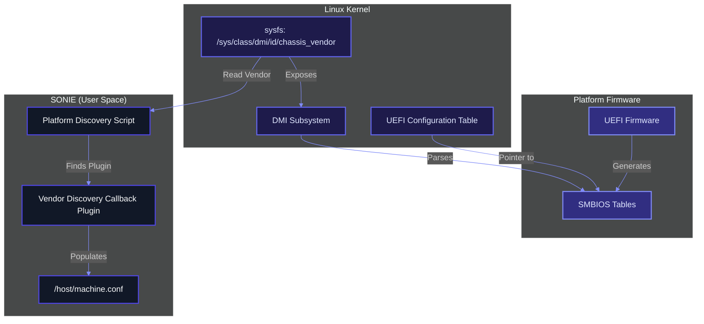
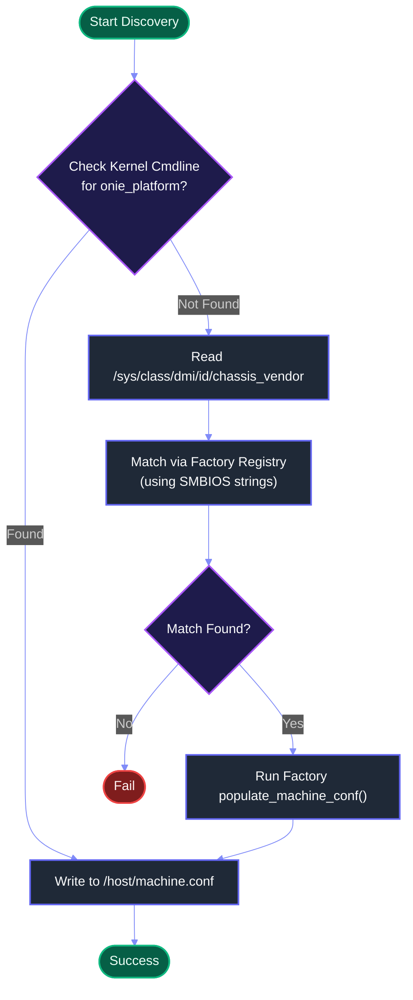

# HLD - Populating machine.conf via UEFI SMBIOS

## 1. Scope
This document describes the High-Level Design for populating the `/host/machine.conf` file in SONIE using UEFI SMBIOS tables. This mechanism provides a standardized way to identify hardware platforms without relying on hardcoded configurations or external database lookups during early boot or installation. Additionally, it provides a recovery mechanism to reconstruct `/host/machine.conf` in SONiC if the file becomes missing or corrupted.

## 2. Definitions/Abbreviations
*   **SMBIOS**: System Management BIOS
*   **DMI**: Desktop Management Interface (often used interchangeably with SMBIOS)
*   **sysfs**: Linux virtual filesystem providing kernel object interfaces
*   **SONIE**: SONiC Install Environment (Recovery OS)

## 3. Overview & Background

Traditionally, SONiC relies on hardcoded static configurations or platform-specific image builds. By reading UEFI SMBIOS tables, a generic SONIE image can discover its platform identity dynamically and populate `/host/machine.conf`. This enables a single image to support multiple platforms from various vendors.

### 3.1 UEFI SMBIOS Background
The Unified Extensible Firmware Interface (UEFI) specification defines a standard interface between platform firmware and the operating system. One of the key structures it provides is the **System Management BIOS (SMBIOS)** table.

SMBIOS tables describe the hardware configuration of the platform. Key types include:
*   **Type 1 (System Information)**: Product Name, SKU, Serial Number, UUID.
*   **Type 2 (Baseboard/Module Information)**: Manufacturer, Product Name (often for the motherboard).
*   **Type 3 (Chassis Information)**: Enclosure Type, Vendor.
*   **Type 11 (OEM Strings)**: Custom strings defined by the vendor/OEM.

For reference, the outdated ONIE specification is located [here](https://opencomputeproject.github.io/onie/design-spec/x86_hw_requirements.html#system-bios-and-the-smbios-dmi-standard).
### 3.2 Interaction with the Operating System
1.  **UEFI Handoff**: During boot, the UEFI firmware creates SMBIOS tables in RAM. It passes a pointer to these tables via the UEFI Configuration Table.
2.  **Kernel Parsing**: The Linux kernel locates the tables and parses them into the DMI (Desktop Management Interface) subsystem.
3.  **Sysfs Exposure**: The kernel exposes these parsed values via `sysfs` at `/sys/class/dmi/id/` and `/sys/firmware/dmi/entries/`.
4.  **User Space Consumption**: SONIE scripts and installers read these sysfs files to identify the platform.

### 3.3 Functional Architecture Diagram



### 3.4 Platform Discovery Flow Chart



## 4. Requirements
*   **Command Line Override**: Allow overriding discovery via kernel command line parameters (e.g., `onie_platform=...`).
*   **Lightweight Extraction**: Read `/sys/class/dmi/id/chassis_vendor` (sysfs) to identify the vendor if no override is present.
*   **Vendor Delegation**: Delegate platform-specific discovery (like `onie_platform`) to vendor-provided callbacks.

## 5. High-Level Design

### 5.1 Proposed Mapping

The discovery process will read the Chassis Vendor to identify the vendor, and then delegate to a vendor callback to resolve platform-specific variables.

| Variable | Source | Note |
| :--- | :--- | :--- |
| `onie_vendor` | SMBIOS Type 3 | Read from `/sys/class/dmi/id/chassis_vendor` |
| `onie_platform` | Vendor Callback | Provided by vendor-specific plugin |
| `onie_machine` | Vendor Callback (Optional) | Can be provided by plugin or calculated |
| `onie_machine_rev` | Vendor Callback (Optional) | Can be provided by plugin |

#### 5.1.1 Command Line Overrides
If the kernel command line contains variables like `onie_platform=...` or `aboot_platform=...`, the discovery mechanism should honor these values over SMBIOS discovery. This is critical for emulation (VS platforms) and debugging image builds where the target hardware is not available.

### 5.2 Vendor Callback Mechanism

Once the `onie_vendor` is identified from SMBIOS Type 3 (`chassis_vendor`), the discovery service will look for a vendor-specific Python plugin to resolve the platform variables.

#### 5.2.1 Plugin Location & Installation
Plugins should be located in the vendor's platform directory:
`/usr/share/sonic/platform/${vendor}/machine_conf_plugin.py`

**Installation Requirements**:
-   **Pre-installed**: Plugins must be pre-installed in the generic image to enable out-of-the-box discovery without internet or runtime package installation dependencies.
-   **Source Origin**: Provided by the appropriate platform module source (either directly in the `sonic-buildimage` source tree or from a git submodule in the platform directory).
-   **Build Integration**: The build system must ensure these files are copied to the target path `/usr/share/sonic/platform/...` during image assembly.

#### 5.2.2 Plugin Interface
The plugin must implement a standard interface. It must inherit from an abstract base class:

```python
from abc import ABC, abstractmethod

class MachineConfPlugin(ABC):
    """
    Abstract base class for vendor-specific platform discovery plugins.
    """

    @abstractmethod
    def get_onie_platform(self) -> str:
        """Returns the onie_platform string (e.g., 'x86_64-google-toggle')."""
        pass

    @abstractmethod
    def get_onie_vendor(self) -> str:
        """Returns the onie_vendor string (e.g., 'google')."""
        pass

    @abstractmethod
    def get_onie_machine(self) -> str:
        """Returns the onie_machine string (e.g., 'toggle')."""
        pass

    @abstractmethod
    def get_onie_arch(self) -> str:
        """Returns the onie_arch string (e.g., 'x86_64')."""
        pass

    @abstractmethod
    def get_onie_machine_rev(self) -> str:
        """Returns the onie_machine_rev string (e.g., '0')."""
        pass

    @abstractmethod
    def get_onie_switch_asic(self) -> str:
        """Returns the onie_switch_asic string (e.g., 'vs')."""
        pass

    @abstractmethod
    def get_onie_version(self) -> str:
        """Returns the onie_version string (e.g., '2021.11')."""
        pass

    @abstractmethod
    def get_match_strings(self) -> list:
        """Returns a list of SMBIOS strings this plugin matches against."""
        pass

    def get_onie_base_mac(self) -> str:
        """
        Optionally returns the base MAC address.
        Returns None if not available.
        """
        return None

    def get_optional_properties(self) -> dict:
        """
        Optionally returns a dictionary of additional key-value pairs
        to be populated in machine.conf.
        """
        return {}
```

#### 5.2.3 Factory Class & Registration
To centralize the writing of `/host/machine.conf`, a Factory class extracts the parameters from the registered vendor plugins.

```python
class MachineConfPluginFactory:
    _plugins = {}
    _string_to_vendor = {}  # Maps SMBIOS strings to vendor keys

    @classmethod
    def register_plugin(cls, vendor_name: str, plugin_cls):
        """
        Registers a plugin class for a specific vendor, mapped to one
        or more SMBIOS matching strings provided by the plugin.
        """
        vendor_key = vendor_name.lower()
        cls._plugins[vendor_key] = plugin_cls
        
        plugin_instance = plugin_cls()
        match_strings = plugin_instance.get_match_strings()
        if isinstance(match_strings, str):
            match_strings = [match_strings]
            
        # Check for conflicts and populate reverse mapping
        for s in match_strings:
            val = s.strip().lower()
            if val in cls._string_to_vendor and cls._string_to_vendor[val] != vendor_key:
                raise ValueError(f"Conflict: String '{s}' is already registered by vendor '{cls._string_to_vendor[val]}'")
            cls._string_to_vendor[val] = vendor_key

    @classmethod
    def get_plugin(cls, vendor_name: str) -> MachineConfPlugin:
        """Retrieves a plugin instance for the given vendor."""
        plugin_cls = cls._plugins.get(vendor_name.lower())
        if not plugin_cls:
            raise ValueError(f"No plugin registered for vendor: {vendor_name}")
        return plugin_cls()

    @classmethod
    def get_plugin_for_smbios_string(cls, smbios_val: str) -> MachineConfPlugin:
        """
        Locates and instantiates the plugin matching a given SMBIOS string.
        """
        val = smbios_val.strip().lower()
        vendor_key = cls._string_to_vendor.get(val)
        if vendor_key:
            return cls.get_plugin(vendor_key)
        raise ValueError(f"No plugin matches SMBIOS value: {smbios_val}")

    @classmethod
    def populate_machine_conf(cls, vendor_name: str, target_path: str = "/") -> bool:
        """
        Retrieves the registered plugin for the vendor and writes its 
        ONIE parameters to /host/machine.conf.
        """
        try:
            plugin = cls.get_plugin(vendor_name)
            conf_file = os.path.join(target_path, "host", "machine.conf")
            os.makedirs(os.path.dirname(conf_file), exist_ok=True)
            with open(conf_file, "w") as f:
                f.write(
                    f"onie_platform={plugin.get_onie_platform()}\n"
                    f"onie_vendor={plugin.get_onie_vendor()}\n"
                    f"onie_machine={plugin.get_onie_machine()}\n"
                    f"onie_arch={plugin.get_onie_arch()}\n"
                    f"onie_machine_rev={plugin.get_onie_machine_rev()}\n"
                    f"onie_switch_asic={plugin.get_onie_switch_asic()}\n"
                    f"onie_version={plugin.get_onie_version()}\n"
                )
                base_mac = plugin.get_onie_base_mac()
                if base_mac:
                    f.write(f"onie_base_mac={base_mac}\n")
                
                # Write optional properties
                optional_props = plugin.get_optional_properties()
                for key, value in optional_props.items():
                    f.write(f"{key}={value}\n")
            return True
        except Exception as e:
            import sys
            print(f"Error writing machine.conf: {e}", file=sys.stderr)
            return False
```

#### 5.2.4 Fallback Mechanism
If no vendor plugin is found, or if the plugin fails, the system will fail to load the platform drivers. Out-of-band communication with the device via the CPU complex *should* be supported.

#### 5.2.5 Example: VS Platform Plugin

Here is an example of what a plugin for the `vs` platform might look like:

```python
# /usr/share/sonic/platform/vs/machine_conf_plugin.py
from sonic_platform_base.machine_conf_plugin_base import MachineConfPlugin, MachineConfPluginFactory

class VsMachineConfPlugin(MachineConfPlugin):
    def get_onie_platform(self) -> str:
        return "x86_64-kvm_x86_64-r0"

    def get_onie_vendor(self) -> str:
        return "vs"

    def get_onie_machine(self) -> str:
        return "kvm_x86_64"

    def get_onie_arch(self) -> str:
        return "x86_64"

    def get_onie_machine_rev(self) -> str:
        return "0"

    def get_onie_switch_asic(self) -> str:
        return "kvm"

    def get_onie_version(self) -> str:
        return "2021.11"

    def get_match_strings(self) -> list:
        return ["KVM", "Virtual Switch", "QEMU", "OVMF"]

    def get_optional_properties(self) -> dict:
        return {"optional_key": "optional_value"}

# Register the plugin at build time
MachineConfPluginFactory.register_plugin("vs", VsMachineConfPlugin)
```

### 5.3 Integration Point
The population mechanism can run in two primary modes:

In environments where ONIE is present (traditional ONIE installations), discovery via SMBIOS is unnecessary. ONIE already supplies the relevant platform identifiers via the environment (e.g., `$onie_platform`) or through `/etc/machine.conf`.

Discovery via SMBIOS during installation is only used if installation is launched from a generic/bare recovery environment (like SONIE) where ONIE is not running.

#### 5.4.2 During OS Boot
A script (e.g., `populate_machine_conf.py`) runs early in the boot sequence via systemd to ensure `/host/machine.conf` exists:

```python
#!/usr/bin/env python3
# populate_machine_conf.py - Runs early in the boot sequence to ensure /host/machine.conf exists

import glob
import importlib.util
import os
import sys

from sonic_platform_base.machine_conf_plugin_base import MachineConfPluginFactory

CONF_FILE = "/host/machine.conf"
DMI_VENDOR_FILE = "/sys/class/dmi/id/chassis_vendor"

def main():
    if os.path.exists(CONF_FILE):
        print(f"{CONF_FILE} already exists. Skipping creation.")
        sys.exit(0)

    if not os.path.exists(DMI_VENDOR_FILE):
        print(f"Error: {DMI_VENDOR_FILE} not found. Platform discovery failed.", file=sys.stderr)
        sys.exit(1)

    with open(DMI_VENDOR_FILE) as f:
        smbios_vendor = f.read().strip()

    # Programmatically import all registered vendor plugins with unique module names
    for plugin_path in glob.glob('/usr/share/sonic/platform/*/machine_conf_plugin.py'):
        try:
            vendor_dir = os.path.basename(os.path.dirname(plugin_path))
            module_name = f"machine_conf_plugin_{vendor_dir}"
            spec = importlib.util.spec_from_file_location(module_name, plugin_path)
            module = importlib.util.module_from_spec(spec)
            spec.loader.exec_module(module)
        except Exception as e:
            print(f"Failed to load plugin {plugin_path}: {e}", file=sys.stderr)

    # Populate machine.conf via the Factory
    try:
        plugin = MachineConfPluginFactory.get_plugin_for_smbios_string(smbios_vendor)
        success = MachineConfPluginFactory.populate_machine_conf(plugin.get_onie_vendor(), '/')
        if success:
            print(f"Successfully populated {CONF_FILE} via SMBIOS table.")
        else:
            print(f"Failed to populate {CONF_FILE}.", file=sys.stderr)
            sys.exit(1)
    except ValueError as e:
        print(f"Error: {e}", file=sys.stderr)
        sys.exit(1)

if __name__ == "__main__":
    main()
```

## 6. Verification Plan

### 6.1 Unit Testing
- Test the string normalization logic (whitespace removal, lowercase conversion).
- Test parsing of mock `/sys/class/dmi/id/` files.

### 6.2 Manual Verification
- Deploy to platforms with valid SMBIOS tables and verify `/host/machine.conf` contains correct data.
- Verify `decode-syseeprom` and other platform-dependent utilities work seamlessly without manual configuration.
