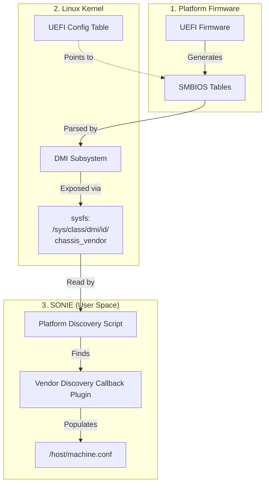
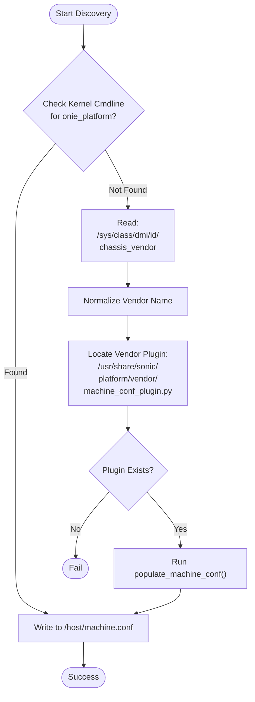

# HLD - Populating machine.conf via UEFI SMBIOS

## 1. Scope
This document describes the High-Level Design for populating the `/host/machine.conf` file in SONIE using UEFI SMBIOS tables. This mechanism provides a standardized way to identify hardware platforms without relying on hardcoded configurations or external database lookups during early boot or installation.

## 2. Definitions/Abbreviations
*   **SMBIOS**: System Management BIOS
*   **DMI**: Desktop Management Interface (often used interchangeably with SMBIOS)
*   **sysfs**: Linux virtual filesystem providing kernel object interfaces
*   **SONIE**: SONiC Install Environment (Recovery OS)

## 3. Overview & Background

Traditionally, SONiC relies on hardcoded static configurations or platform-specific image builds. By reading UEFI SMBIOS tables, a generic SONIE image can discover its platform identity dynamically and populate `/host/machine.conf`. This enables a single image to support multiple platforms from various vendors.

### 3.1 UEFI SMBIOS Background
The Unified Extensible Firmware Interface (UEFI) specification defines a standard interface between platform firmware and the operating system. One of the key structures it provides is the **System Management BIOS (SMBIOS)** table.

SMBIOS tables describe the hardware configuration of the platform. Key types include:
*   **Type 1 (System Information)**: Product Name, SKU, Serial Number, UUID.
*   **Type 2 (Baseboard/Module Information)**: Manufacturer, Product Name (often for the motherboard).
*   **Type 3 (Chassis Information)**: Enclosure Type, Vendor.
*   **Type 11 (OEM Strings)**: Custom strings defined by the vendor/OEM.

For reference, the outdated ONIE specification is located [here](https://opencomputeproject.github.io/onie/design-spec/x86_hw_requirements.html#system-bios-and-the-smbios-dmi-standard).
### 3.2 Interaction with the Operating System
1.  **UEFI Handoff**: During boot, the UEFI firmware creates SMBIOS tables in RAM. It passes a pointer to these tables via the UEFI Configuration Table.
2.  **Kernel Parsing**: The Linux kernel locates the tables and parses them into the DMI (Desktop Management Interface) subsystem.
3.  **Sysfs Exposure**: The kernel exposes these parsed values via `sysfs` at `/sys/class/dmi/id/` and `/sys/firmware/dmi/entries/`.
4.  **User Space Consumption**: SONIE scripts and installers read these sysfs files to identify the platform.

### 3.3 Functional Architecture Diagram



### 3.4 Platform Discovery Flow Chart



## 4. Requirements
*   **Command Line Override**: Allow overriding discovery via kernel command line parameters (e.g., `onie_platform=...`).
*   **Lightweight Extraction**: Read `/sys/class/dmi/id/chassis_vendor` (sysfs) to identify the vendor if no override is present.
*   **Vendor Delegation**: Delegate platform-specific discovery (like `onie_platform`) to vendor-provided callbacks.
*   **Standardized Naming**: Normalize vendor names (lowercase, replace spaces with underscores) to locate callbacks and identify platform elements.

## 5. High-Level Design

### 5.1 Proposed Mapping

The discovery process will read the Chassis Vendor to identify the vendor, and then delegate to a vendor callback to resolve platform-specific variables.

| Variable | Source | Note |
| :--- | :--- | :--- |
| `onie_vendor` | SMBIOS Type 3 | Read from `/sys/class/dmi/id/chassis_vendor` |
| `onie_platform` | Vendor Callback | Provided by vendor-specific plugin |
| `onie_machine` | Vendor Callback (Optional) | Can be provided by plugin or calculated |
| `onie_machine_rev` | Vendor Callback (Optional) | Can be provided by plugin |

#### 5.1.1 Command Line Overrides
If the kernel command line contains variables like `onie_platform=...` or `aboot_platform=...`, the discovery mechanism should honor these values over SMBIOS discovery. This is critical for emulation (VS platforms) and debugging image builds where the target hardware is not available.

### 5.2 Vendor Callback Mechanism

Once the `onie_vendor` is identified from SMBIOS Type 3 (`chassis_vendor`), the discovery service will look for a vendor-specific Python plugin to resolve the platform variables.

#### 5.2.1 Plugin Location & Installation
Plugins should be located in the vendor's platform directory:
`/usr/share/sonic/platform/${normalized_vendor}/machine_conf_plugin.py`

**Installation Requirements**:
-   **Pre-installed**: Plugins must be pre-installed in the generic image to enable out-of-the-box discovery without internet or runtime package installation dependencies.
-   **Source Origin**: Provided by the appropriate platform module source (either directly in the `sonic-buildimage` source tree or from a git submodule in the platform directory).
-   **Build Integration**: The build system must ensure these files are copied to the target path `/usr/share/sonic/platform/...` during image assembly.

#### 5.2.2 Plugin Interface
The plugin must implement a standard interface. It can be a Python module with specific functions:

```python
def get_onie_platform() -> str:
    """
    Returns the onie_platform string (e.g., 'x86_64-google-toggle').
    """
    pass

def populate_machine_conf(target_path: str) -> bool:
    """
    Optionally populates /host/machine.conf directly on the target.
    Returns True if successful, False if fallback to generic discovery is needed.
    """
    pass
```

#### 5.2.3 Fallback Mechanism
If no vendor plugin is found, or if the plugin fails, the system will fail to load the platform drivers. Out-of-band communication with the device via the CPU complex *should* be supported.

#### 5.2.4 Example: VS Platform Plugin

Here is an example of what a plugin for the `vs` platform might look like:

```python
# /usr/share/sonic/platform/vs/machine_conf_plugin.py

def get_onie_platform() -> str:
    """
    Returns the virtual switch platform identifier.
    """
    return "x86_64-kvm_x86_64-r0"

def populate_machine_conf(target_path: str) -> bool:
    """
    Populates machine.conf for virtual switch emulation.
    """
    try:
        with open(f"{target_path}/host/machine.conf", "w") as f:
            f.write(
                "onie_platform=x86_64-kvm_x86_64-r0\n"
                "onie_vendor=vs\n"
                "onie_machine=kvm_x86_64\n"
            )
        return True
    except Exception:
        return False
```

### 5.3 Integration Point
The population mechanism can run in two primary modes:

#### 5.4.1 During Installation
In the Installer (running in SONIE or ONIE), the platform identification runs before partition creation. If `machine.conf` is missing from the target, the installer will:
1.  Attempt syseeprom scan.
2.  Fallback to SMBIOS/DMI reading.
3.  Write the discovered variables to the target `/host/machine.conf`.

#### 5.4.2 During OS Boot
A script (e.g., `populate_machine_conf.sh`) can run early in the boot sequence (systemd service) to ensure `/host/machine.conf` is populated if it was reset or missing. This script will read sysfs and create the file if it doesn't exist.

## 6. Verification Plan

### 6.1 Unit Testing
- Test the string normalization logic (whitespace removal, lowercase conversion).
- Test parsing of mock `/sys/class/dmi/id/` files.

### 6.2 Manual Verification
- Deploy to platforms with valid SMBIOS tables and verify `/host/machine.conf` contains correct data.
- Verify `decode-syseeprom` and other platform-dependent utilities work seamlessly without manual configuration.
