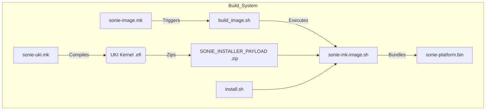
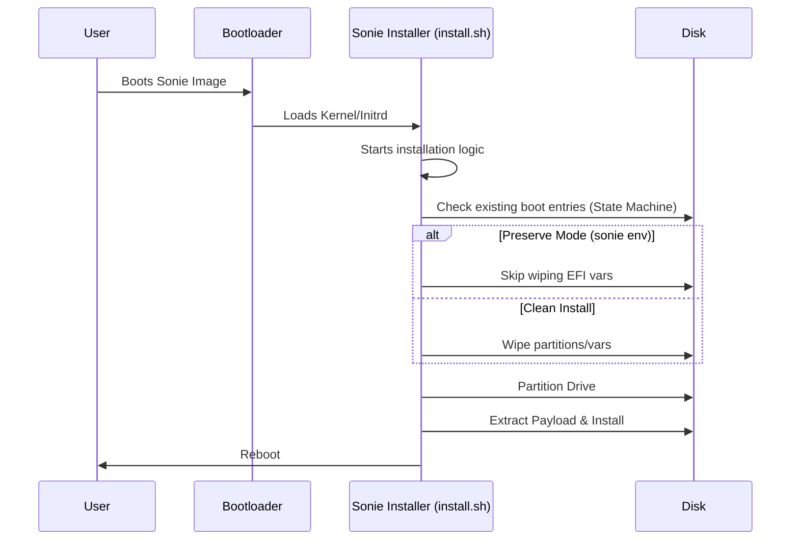
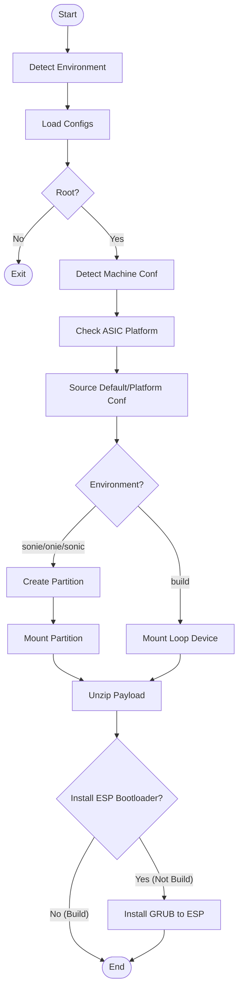

# Sonie Image and Installer HLD

## Table of Content
- [1. HLD Version](#1-hld-version)
- [2. Scope](#2-scope)
- [3. Definitions/Abbreviations](#3-definitionsabbreviations)
- [4. Overview](#4-overview)
- [5. Requirements](#5-requirements)
- [6. Architecture Design](#6-architecture-design)
- [7. High-Level Design](#7-high-level-design)
- [8. SAI API](#8-sai-api)
- [9. Configuration and management](#9-configuration-and-management)
- [10. Warmboot and Fastboot Design Impact](#10-warmboot-and-fastboot-design-impact)
- [11. Memory Consumption](#11-memory-consumption)
- [13. Testing Requirements/Design](#13-testing-requirementsdesign)
- [14. Open/Action items](#14-openaction-items)

## 1. HLD Version

| Rev | Date | Author | Change Description |
| --- | --- | --- | --- |
| 0.1 | 2026-01-15 | Google | Initial Version |

## 2. Scope
This document describes the design and implementation of the "Sonie" image and installer infrastructure within the SONiC build system. The scope includes the creation of a specialized installer image (`.bin`), the Unified Kernel Image (UKI) support for this installer, and the associated testing infrastructure using QEMU.

## 3. Definitions/Abbreviations
- **UKI**: Unified Kernel Image
- **Sonie**: A specialized SONiC installer/recovery image variant.
- **ONIE**: Open Network Install Environment.
- **QEMU**: Quick Emulator.

## 4. Overview
The Sonie image is a specialized build target designed for testing and recovery scenarios. It leverages the SONiC build system to generate a self-extracting installer image that supports modern boot mechanisms like systemd-boot and UKI. Key goals include providing a robust installer environment, supporting secure upgrades, and enabling efficient testing via QEMU.

## 5. Requirements
- The build system must support generating a `sonie-$(PLATFORM).bin` image.
- The image must use `systemd-boot` and support UKI (.efi) payloads.
- The installer must be capable of preserving existing bootloader states when running in a `sonie` environment.
- The build process must support image signing for secure upgrade workflows.
- A test infrastructure using QEMU must be provided to verify the installation process.
- The image must be smaller than a full SONiC image, containing only essential dockers (Database, Orchagent, Platform Monitor, Syncd Base).

## 6. Architecture Design
The Sonie architecture introduces a new image type (`IMAGE_TYPE=sonie`) and a corresponding installer workflow.

### Build System Integration
- **Makefiles**: New rules `sonie-image.mk` and `sonie-uki.mk` differ from standard SONiC rules by prioritizing UKI generation and packaging it into a ZIP payload for the installer script.
- **Installer Script**: A modified `install.sh` and `sonie-mk-image.sh` handle the creation of the self-extracting archive.
- **Bootloader**: The `bootloader_state_machine.grub` is enhanced to recognize the `sonie` environment and skip aggressive cleanup of other boot entries, facilitating safe recovery/reinstall operations.

### Build Flow Diagram

## 7. High-Level Design

### 7.1 Build Flow
1.  **UKI Generation**: `sonie-uki.mk` compiles the kernel and initrd into a single `.efi` executable (UKI).
2.  **Payload Packaging**: The UKI is zipped to create `SONIE_INSTALLER_PAYLOAD`.
3.  **Installer Image**: `sonie-image.mk` invokes `build_image.sh` with `IMAGE_TYPE=sonie`.
4.  **Script Bundling**: `sonie-mk-image.sh` bundles the payload and the `install.sh` script into the final `.bin` executable.

### 7.2 Installer Execution Sequence

### 7.3 Installer Logic Flow

### 7.4 Modules and Repositories
- **Repositories**: `sonic-buildimage`, `sonic-upstream`.
- **New Directories**:
    - `sonie-installer/`: Contains installer logic and configuration.
    - `sonie-test-trixie/`: QEMU test environment.
- **Modified Scripts**: `build_image.sh`, `slave.mk`, `build_debian.sh`.

### 7.5 Container Payload
The Sonie image includes a reduced set of containers to minimize size while maintaining essential functionality for recovery/testing:
- `DOCKER_DATABASE`
- `DOCKER_ORCHAGENT`
- `DOCKER_PLATFORM_MONITOR`
- `DOCKER_SYNCD_BASE`

### 7.6 Security
- **Secure Boot**: Supported via UKI signing.
- **Credentials**: No default hardcoded credentials; relies on `USERNAME`/`PASSWORD` build arguments or setup.

## 8. SAI API
N/A - This feature is a build system and installer enhancement, not a switch functionality change affecting SAI.

## 9. Configuration and management

### 9.1 CLI/YANG
No CLI or YANG changes are introduced by this feature itself. The resulting image runs standard SONiC software.

### 9.2 Build Configuration
- `IMAGE_TYPE=sonie`: Selects the Sonie build target.
- `SONIE_INSTALLER_PAYLOAD`: Path to the UKI payload.
- `SECURE_UPGRADE_MODE`: Enables signing.

## 10. Warmboot and Fastboot Design Impact
This feature involves the *installer* and *recovery* image. It does not directly impact the warmboot/fastboot data plane performance of the installed OS, but it provides a mechanism to install an OS that supports these features. The installer itself is designed to be reliable and safe (preserving boot entries).

## 11. Memory Consumption
The Sonie installer runs in a transient environment (initramfs/recovery OS). Its memory footprint is minimized by including only essential components.

## 13. Testing Requirements/Design

### 13.1 QEMU Test Environment
A dedicated test environment (`sonie-test-trixie`) is provided to validate the image:
- **PXE Boot**: Validates IPv4 and IPv6 PXE boot paths.
- **Virtual Machine**: Uses QEMU to emulate a SONiC device.
- **Progress Tracking**: Uses `http_server_progress.py` to monitor installation status.

### 13.2 Test Cases
1.  **Build Success**: Verify `make target/sonie-vs.bin` succeeds.
2.  **QEMU Install**: Boot the generated image in QEMU and verify successful installation to disk.
3.  **Bootloader Preservation**: Verify that existing ONIE/SONiC boot entries are not wiped during a Sonie install (if configured to preserve).

## 14. Open/Action items
- Refine recovery image build process to ensure all payloads are slimmed and signed.
