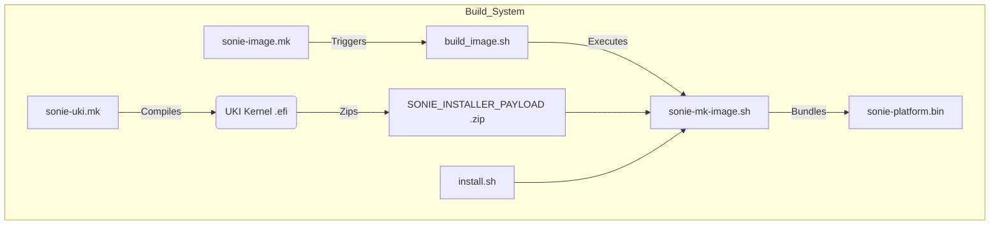
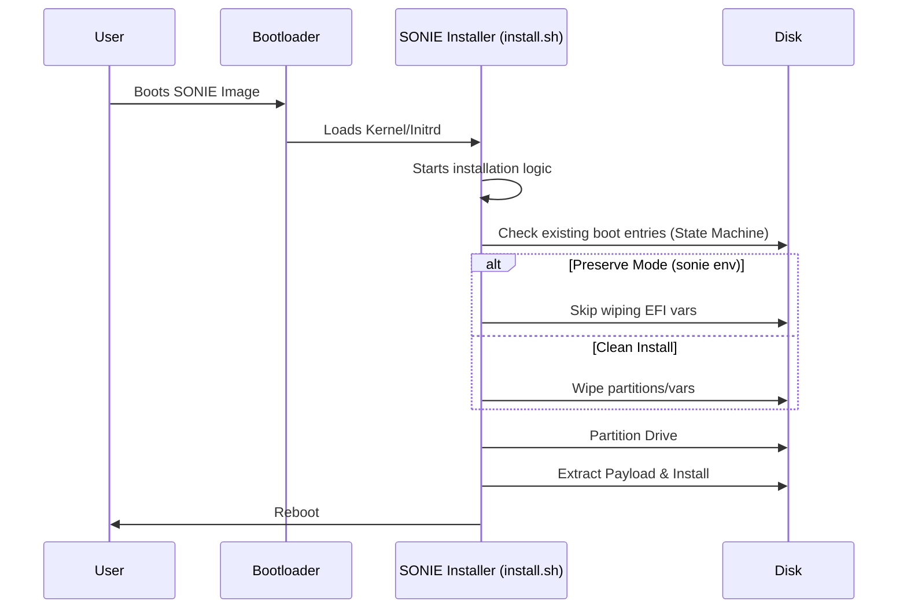
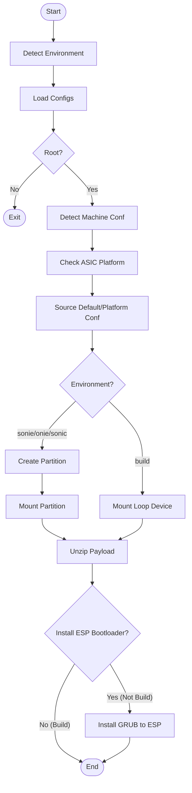
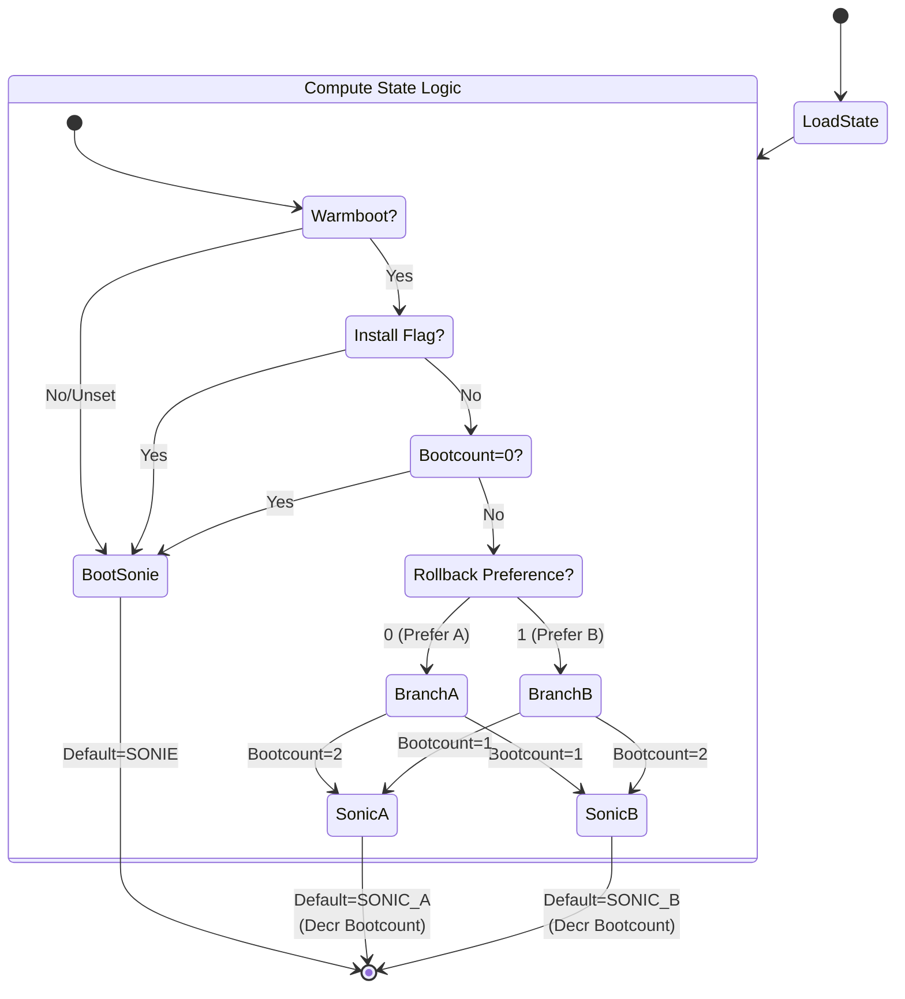
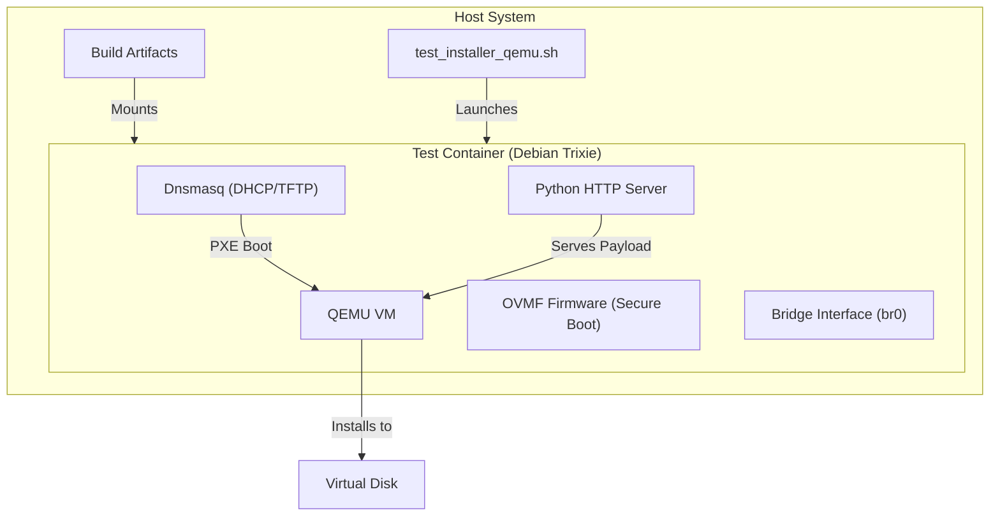
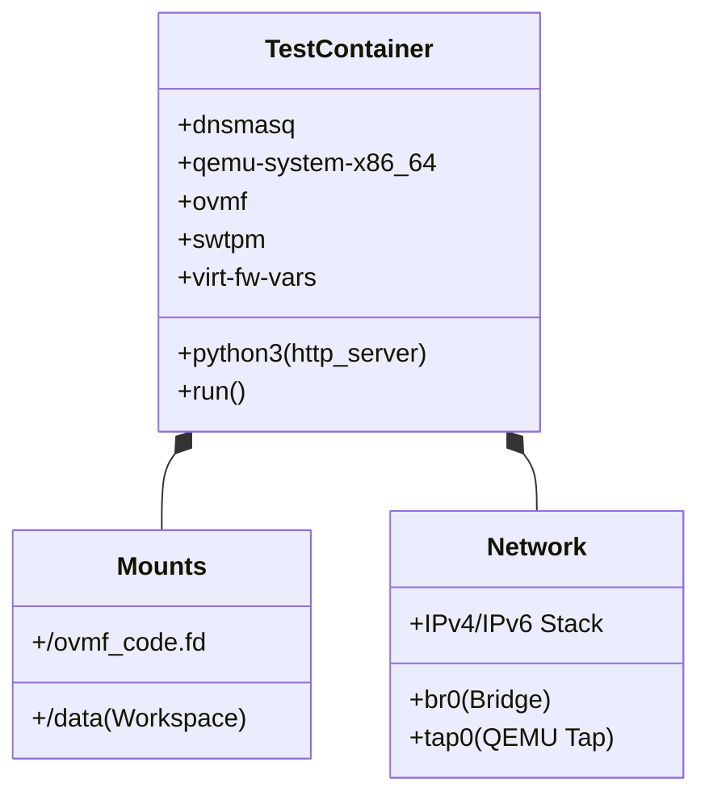

# SONIE Image and Installer HLD

## Table of Content
1.  [HLD Version](#1-hld-version)
2.  [Scope](#2-scope)
3.  [Definitions/Abbreviations](#3-definitionsabbreviations)
4.  [Overview](#4-overview)
5.  [Requirements](#5-requirements)
6.  [Architecture Design](#6-architecture-design)
7.  [High-Level Design](#7-high-level-design)
8.  [SAI API](#8-sai-api)
9.  [Configuration and management](#9-configuration-and-management)
10. [Warmboot and Fastboot Design Impact](#10-warmboot-and-fastboot-design-impact)
11. [Memory Consumption](#11-memory-consumption)
12. [Testing Requirements/Design](#12-testing-requirementsdesign)
13. [Open/Action items](#13-openaction-items)

## 1. HLD Version
| Rev | Date | Author | Change Description |
| --- | --- | --- | --- |
| 0.2 | 2026-01-23 | Google | Merged Image and Installer HLDs |
| 0.1 | 2026-01-15 | Google | Initial Version |

## 2. Scope
This document describes the design and implementation of the **SONIE (SONiC Initial Environment)** image and installer infrastructure within the SONiC build system. The scope includes:
*   Creation of a specialized installer image (`.bin`).
*   Unified Kernel Image (UKI) support.
*   Installation logic, partitioning strategy, and bootloader configuration.
*   State machine used for A/B updates and recovery.
*   Associated testing infrastructure using QEMU.

## 3. Definitions/Abbreviations
*   **SONIE**: SONiC Initial Environment (Recovery OS).
*   **ONIE**: Open Network Install Environment.
*   **UKI**: Unified Kernel Image.
*   **ESP**: EFI System Partition.
*   **XBOOTLDR**: Extended Boot Loader Partition (used for SONIE/OS).
*   **GPT**: GUID Partition Table.
*   **GRUB**: GRand Unified Bootloader.
*   **QEMU**: Quick Emulator.

## 4. Overview
The **SONIE image** is a specialized build target designed for testing and recovery scenarios. It leverages the SONiC build system to generate a self-extracting installer image (`sonie-installer`) that supports modern boot mechanisms like systemd-boot and UKI.

The **sonie-installer** is responsible for installing this recovery image onto the target storage device. It handles device detection, partitioning, payload extraction, and bootloader installation, ensuring a robust recovery environment that replaces ONIE and the main SONiC OS if needed. It implements a state machine in GRUB to handle A/B partitioning and seamless updates.

## 5. Requirements
*   **UEFI Support**: The platform must be UEFI-compliant (`/sys/firmware/efi/efivars` must exist).
*   **Start Environment**: Must run from ONIE, existing SONiC, or RAM-based SONIE environment.
*   **Storage**: Requires a block device capable of GPT partitioning.
*   **Privileges**: Must run as root.
*   **Build Integration**: The build system must support generating a `sonie-$(PLATFORM).bin` image.
*   **Boot Modernization**: The image must use `systemd-boot` (via UKI) and support .efi payloads.
*   **Preservation**: The installer must be capable of preserving existing bootloader states when running in a `sonie` environment.
*   **Security**: The build process must support image signing for secure upgrade workflows.
*   **Size**: The image must be smaller than a full SONiC image, containing only essential dockers.

## 6. Architecture Design

### 6.1 Build System Integration
*   **Makefiles**: New rules `sonie-image.mk` and `sonie-uki.mk` differ from standard SONiC rules by prioritizing UKI generation and packaging it into a ZIP payload for the installer script.
*   **Installer Script**: A modified `install.sh` and `sonie-mk-image.sh` handle the creation of the self-extracting archive.
*   **Bootloader**: The `bootloader_state_machine.grub` is enhanced to recognize the `sonie` environment and skip aggressive cleanup of other boot entries, facilitating safe recovery/reinstall operations.

### 6.2 Build Flow Diagram

### 6.3 Partition Layout
The installer uses a specific partition layout to maintain the recovery OS alongside the main OS.
*   **Partition 1 (ESP)**: FAT32, type `EF00`. Stores GRUB bootloader and environment.
*   **SONIE Partition**: FAT32/Ext4, type `EA00` (XBOOTLDR). Stores the SONIE UKI and potentially the main OS images during updates.

## 7. High-Level Design

### 7.1 Build Flow
1.  **UKI Generation**: `sonie-uki.mk` compiles the kernel and initrd into a single `.efi` executable (UKI).
2.  **Payload Packaging**: The UKI is zipped to create `SONIE_INSTALLER_PAYLOAD`.
3.  **Installer Image**: `sonie-image.mk` invokes `build_image.sh` with `IMAGE_TYPE=sonie`.
4.  **Script Bundling**: `sonie-mk-image.sh` bundles the payload and the `install.sh` script into the final `.bin` executable.

### 7.2 Installer Execution Sequence

### 7.3 Installer Logic Flow
The installation process follows a sequential flow: Environment Detection -> Config Loading -> Device Discovery -> Partitioning -> Payload Extraction -> Bootloader Setup.

#### 7.3.1 Data Flow & Dependencies
*   `/proc/mounts`: Used to detect RAM root (`rootfs`/`tmpfs`).
*   `/etc/lsb-release`: Checked for `DISTRIB_ID=onie`.
*   `/etc/machine.conf` or `/host/machine.conf`: Platform configuration source.
*   `*.zip`: The installer looks for a zip payload in `SCRIPT_DIR` to extract.
*   `default_platform.conf`: Sourced for platform-specific functions.
*   `bootloader_state_machine.grub`: Sourced and appended to `grub.cfg`.

### 7.4 Bootloader State Machine
The GRUB configuration implements a state machine to manage boot priorities between SONIE (Recovery) and SONiC (A/B slots).

**State Variables (stored in `sonie_env` on ESP):**
*   `warmboot_env`: Forces boot to SONIE if unset.
*   `install_env`: Forces boot to SONIE if set (used during updates).
*   `bootcount_env`: 3-state counter (0=Recovery, 1, 2). Decrements on successful boot selection.
*   `rollback_env`: Determines preference order (0 = A then B, 1 = B then A).

### 7.5 Modules and Repositories
*   **Repositories**: `sonic-buildimage`, `sonic-upstream`.
*   **New Directories**:
    *   `sonie-installer/`: Contains installer logic and configuration.
    *   `sonie-test-trixie/`: QEMU test environment.
*   **Modified Scripts**: `build_image.sh`, `slave.mk`, `build_debian.sh`.

### 7.6 Container Payload
The SONIE image includes a reduced set of containers:
*   `DOCKER_DATABASE`
*   `DOCKER_ORCHAGENT`
*   `DOCKER_PLATFORM_MONITOR`
*   `DOCKER_SYNCD_BASE`

### 7.7 Security
*   **Secure Boot**: Supported via UKI signing.
*   **Credentials**: No default hardcoded credentials; relies on `USERNAME`/`PASSWORD` build arguments or setup.

## 8. SAI API
N/A - This feature is a build system and installer enhancement, not a switch functionality change affecting SAI.

## 9. Configuration and management

### 9.1 CLI/YANG
No CLI or YANG changes are introduced by this feature itself.

### 9.2 Build Configuration
*   `IMAGE_TYPE=sonie`: Selects the SONIE build target.
*   `SONIE_INSTALLER_PAYLOAD`: Path to the UKI payload.
*   `SECURE_UPGRADE_MODE`: Enables signing.

### 9.3 Installer Files
*   Input: `machine.conf`, `platform.conf` (platform configuration).
*   Output: `grub.cfg`, `sonie_env` (GRUB environment block).

## 10. Warmboot and Fastboot Design Impact
This feature involves the *installer* and *recovery* image. It does not directly impact the warmboot/fastboot data plane performance of the installed OS, but it provides a mechanism to install an OS that supports these features. The installer itself is designed to be reliable and safe (preserving boot entries).

## 11. Memory Consumption
The SONIE installer runs in a transient environment (initramfs/recovery OS). Its memory footprint is minimized by including only essential components (`DOCKER_DATABASE` etc. are part of the target image, not necessarily running during install).

## 12. Testing Requirements/Design

### 12.1 QEMU Test Environment
A dedicated test environment (`sonie-test-trixie`) is provided to validate the image.

#### 12.1.1 Test Architecture

#### 12.1.2 Docker Container Design

### 12.2 Test Cases
#### 12.2.1 Unit Test Cases
*   Verify `install.sh` logic using mocks (as seen in `tests/test_installer_sonie_logic.sh`).
*   Verify `bootloader_state_machine.grub` logic by simulating GRUB environment variables.

#### 12.2.2 System Test Cases
1.  **Build Success**: Verify `make target/sonie-vs.bin` succeeds.
2.  **QEMU Fresh Install**: Boot the generated image in QEMU and verify successful installation to disk (blank disk).
3.  **Bootloader Preservation**: Verify that existing ONIE/SONiC boot entries are not wiped during a SONIE install (if configured to preserve).
4.  **State Machine Verification**: Manually manipulate `sonie_env` and verify boot selection (A vs B vs Recovery).

## 13. Open/Action items
*   Refine recovery image build process to ensure all payloads are slimmed and signed.
