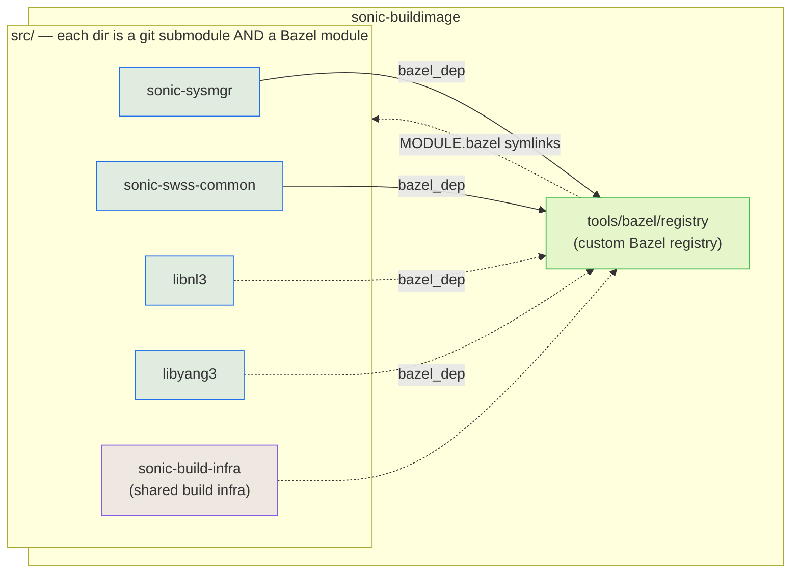

# Bazel for SONiC: A Build Engineer Primer

> [!warning]
> This document is meant for folks actively changing the Bazel build of SONiC.
> If you just want to _use_ the build to generate artifacts,
> please refer to [The `SONIC_BAZEL_DOCKER_IMAGES` target](/README.buildsystem.md) in the regular build.

## Pre-requisites

Please ensure that you have [installed Bazel](https://bazel.build/install). We also recommend that you familiarize yourself with the basics of [Bazel terminology](https://bazel.build/reference/glossary), as well as going through [this introductory video course](https://www.youtube.com/playlist?list=PLLU28e_DRwdswrrZaNqnFFm9OawpxN4CB). Bazel has many complex moving parts, so building a solid foundation will ensure that the rest of this text makes sense.

In general, you should be comfortable with the Bazel terms "target", "label", "rule", "repository rule",  "module", "toolchain", and "action" before continuing.

## Bazel in SONiC Overview

The Bazel build for SONiC has tried to mirror that of the Make-based build:

- Most builds start from `sonic-buildimage`.
- Each component lives in `sonic-buildimage/src`, as a Git submodule.
- Each component is its own Bazel **module**, which can be built independently of the others.

> [!tip]
> To see how Bazel integrates with the rest of the SONiC build system, please refer to the [High Level Design document for Bazel](https://github.com/sonic-net/SONiC/pull/2396/changes#diff-0e576fff1d0a074c7d42c46f007869a6c26acc487769aeb7ece71d3bd168c61aR209).

### Depending on Other Modules

To resolve dependencies between modules (e.g. `sonic-sysmgr` depends on `sonic-swss-common`), we rely on a custom Bazel registry.

A Bazel registry is like npm, or PyPi: A place where we can list versions of Bazel modules. When a build declares a Bazel dependency, Bazel wil look at the available registries to find an appropriate version, and fetch it. Here is the [full documentation](https://bazel.build/external/registry) on Bazel registries.

Our Bazel registry lives in `sonic-buildimage/tools/bazel/registry`, and links to all the Bazel modules in `src`:



This way, any module that needs `sonic-swss-common` can refer to it like this:

```starlark
bazel_dep(name = "sonic-swss-common", version="0.0.0")
```

The same is true for third party dependencies that we patch. For instance, `src/libnl3` contains the Bazel build for a patched `libnl3`. We have a module for it in the custom Bazel registry:

```
tools/bazel/registry/modules/libnl3
├── 3.7.0
│   ├── MODULE.bazel -> ../../../../../../src/libnl3/MODULE.bazel
│   └── source.json
└── metadata.json
```

A component can depend on it exactly as if it were part of the BCR:

```
bazel_dep(name = "libnl3", version="3.7.1")
```

> [!tip]
> To see how we achieve that, please refer to [`.bazelrc`](/.bazelrc). Specifically, to the values of the `--registry` flag. By specifying multiple registries, we allow our Bazel registry to interoperate with the BCR.
> 
> Each submodule has a similar `.bazelrc` file.

### `src/sonic-build-infra`

There is one new, Bazel-specific module: `sonic-build-infra`. This module holds any common build infrastructure code that could be needed by more than one component. For instance, this module holds:

- The definition of the gcc toolchain that every SONiC project should be compiled with, in `sonic-build-infra/toolchains`.
- A common list of Debian modules that modules need.
- Bazel rules to handle `swig`, in `sonic-build-infra/swig`.
- Build rules to generate debug images, such as a rule to strip the debug symbols off of a binary and expose them to Bazel.
- ...

In general, the rule is: If more than one module should use it, we should put it in `sonic-build-infra`.

## SONiC Bazel Patterns

> That's all great, but how do I _do_ things in Bazel?
>   -- You, probably

This section outlines the different patterns we've found when migrating SONiC code to use Bazel. They are presented as loose collection of examples. If you want to see how an end-to-end migration looks, head to [the end-to-end example](#end-to-end-example-migrating-docker-sysmgr).

### Creating Component Containers

This is the main entry point to Bazel. A component container is what we request from the command line, and what will eventually be deployed to a switch. You can find an example of one such container in [`dockers/docker-sysmgr/BUILD.bazel`](/dockers/docker-sysmgr/BUILD.bazel).

In Bazel, we use `rules_oci` to build [OCI Images](https://github.com/opencontainers/image-spec) without Docker. We model containers as lists of layers, where each layer is a `tar` archive:

```starlark
tar(                                # From `@tar.bzl`
	name = "loose_files",
	...
)

oci_image(
	name = "example_image",
	layers = [
		":loose_files",
		"@external_repo//pkg:dist_package",
		...
	],
)
```

As layers represent changes over the root file system, the tars we use must mirror that.

We use `mtree` to be able to place files in arbitrary locations, including `/`, as well as change permissions:

```starlark
tar(
    name = "loose_files",
    srcs = [
	    # Files in the filesystem, siblings to this `BUILD.bazel` file
        "critical_processes",
        "supervisord.conf",
        
        # Another target in the repository that creates a single file
        "//config_gen:config_status_gen",
    ],
    mtree = [
        "./etc/supervisor/conf.d/supervisord.conf time=0 type=file content=$(location :supervisord.conf)",
        "./etc/supervisor/critical_processes time=0 type=file content=$(location :critical_processes)",
        "./var/sonic type=dir time=0",
        "./var/sonic/config_status time=0 type=file content=$(location //config_gen:config_status_gen)",
    ],
)

oci_image(
	name = "example_image",
	layers = [
		":loose_files", # Add it as a layer
		...
	],
)
```

Sometimes, we need some advanced setup, such as `passwd`. In those cases, it's worth looking into `rules_distroless` , which includes utilities to create these special layers (e.g. [`passwd` in `rules_distroless`](https://github.com/bazel-contrib/rules_distroless/blob/4ca17c0969c229b93e1934df390e00f6d6ea620e/distroless/private/passwd.bzl#L10)):

```starlark
load("@rules_distroless//distroless:defs.bzl", "passwd")

passwd(
    name = "passwd",
    entries = [
        {
            "uid": 0,
            "gid": 0,
            "home": "/root",
            "shell": "/bin/bash",
            "username": "root",
        },
    ],
)
```

### Translating Debian Dependencies

SONiC relies on apt-installed dependencies in two places: As build-time dependencies, when installing them in the slave container, and at runtime, when installing them in the component containers.

In both cases, we use `rules_distroless` to fetch packages from a Debian snapshot. `rules_distroless` will resolve dependencies, unpack them, and overlay a Bazel build on top of them so that we can use them within our targets.

The full, centralized list of packages lives in the `apt.install` block of [`sonic-build-infra`'s `MODULE.bazel`](/src/sonic-build-infra/MODULE.bazel). Modules that depend on `sonic-build-infra` re-export this list (via the `bookworm` hub repo), so they don't have to declare their own apt dependencies.

This will create appropriate Bazel targets for all the relevant parts of the Debian package:

```
➜ bazel query @bookworm//libc6-dev:all
@bookworm//libc6-dev:control
@bookworm//libc6-dev:data
@bookworm//libc6-dev:libc6
@bookworm//libc6-dev:libc6-dev
```
#### Adding Debian packages to Images

This fits nicely with the structure of Debian packages. Their `data` sections were designed to be unpacked directly in a system's root, so they can serve directly as a layer:

```starlark
oci_image(
	name = "example_image",
	layers = [
		"@bookworm//libc6-dev:data", # Add it as a layer directly
		...
	],
)
```

If your image needs several dependencies, but you want to keep them in a single image, we can use the `rules_distroless` rule `flatten` :

```starlark
flatten(
    name = "apt_deps",
    deduplicate = True,
    tars = [
	    # Note the lack of `:data`. `flatten` is smart enough to figure it out.
        "@bookworm//libdbus-1-3",
        "@bookworm//libdbus-c++-1-0v5",
        "@bookworm//libprotobuf32",
    ],
)

oci_image(
	name = "example_image",
	layers = [
		":apt_deps", # Add all dependencies as a single layer
		...
	],
)
```
#### Depending on Debian packages during the build

> [!warning]
> While fetching **build** dependencies from `apt` is handy, it is not the ideal way of handling external dependencies in Bazel.
> 
> For one, dependencies fetched from `apt` are hardcoded to a single Debian snapshot may depend on host libraries themselves, such as a particular version of `libstdc++`.
> 
> Please see [this document](/tools/bazel/docs/import-external-projects.md) for alternatives and guidance on handling external dependencies.

Let's say our binary `:foo` depends on `libc6` being installed and present in the system. Outside Bazel, what we would do is install the `libc6-dev` package, which will install the required dynamic libraries and headers. For SONiC, this happens when we create the slave container.

`rules_distroless` allows us to translate this pattern easily into Bazel. First, we list `libc6-dev` as a dependency we want to fetch from `apt`:

```starlark
# MODULE.bazel
apt.install(
    dependency_set = "bookworm",
    packages = [
        "libc6-dev",
        ...
    ],
    suites = [
        "bookworm",
        "bookworm-updates",
        "bookworm-security",
    ],
)
```

This will automatically create the `@bokworm/libc6-dev` bazel module, along with the handy `@bookworm//libc6-dev:libc` target. This is a target that bundles `libc6`'s `so` files and headers:

```starlark
➜ bazel query --output label_kind @bookworm//libc6-dev/...
alias rule @bookworm//libc6-dev:control
alias rule @bookworm//libc6-dev:data
alias rule @bookworm//libc6-dev:libc6
filegroup rule @bookworm//libc6-dev:libc6-dev
filegroup rule @bookworm//libc6-dev/amd64:amd64
alias rule @bookworm//libc6-dev/amd64:control
alias rule @bookworm//libc6-dev/amd64:data
```

So, to make it available to `:foo`, we should be able to depend on it:

```starlark
cc_binary(
	name = "foo",
	deps = [
		"@libc-dev//:libc",
	],
)
```

As `rules_distroless` creates standard Bazel `rules_cc` targets, this new dependency will work just as well as if we'd had vendored the source code from `libc`.

## End-to-end Example: Migrating `docker-sysmgr`

Let's see how all of this works on a long, end-to-end example.

We're going to retrace the steps we took to generate [this PR](https://github.com/sonic-net/sonic-buildimage/pull/28005), systematically migrating `docker-sysmgr` to Bazel. Our goal, by the end, is to have an OCI image for `docker-sysmgr` that we can just load into our switches.

The rough process is as follows:

1. Understand the current build, with the goal to identify the components we need to migrate
2. One by one, migrate those components, adding them to the registry as we go.
3. Write the container images
### 1. Understanding The Current Build

We should start from `rules/docker-sysmgr.mk`. If we open it, we'll see the following line:

```
$(DOCKER_SYSMGR)_DEPENDS += $(SYSMGR)
```

So, we need to somehow depend on `$(SYSMGR)`. A little more spelunking takes us to `rules/sysmgr.mk`, which has the following lines:

```
$(SYSMGR)_SRC_PATH = $(SRC_PATH)/sonic-sysmgr
$(SYSMGR)_DEPENDS += $(LIBSWSSCOMMON_DEV) \
 			$(PROTOBUF) $(PROTOBUF_LITE) $(PROTOBUF_DEV) $(PROTOBUF_COMPILER)

$(SYSMGR)_RDEPENDS += $(LIBSWSSCOMMON) $(PROTOBUF)
```

From here, we learn three things:
- `*_SRC_PATH`: Which source code we actually need to build.
- `*_DEPENDS`: Which dependencies we need _when we are building_ `sysmgr`. These do not need to be in the container, but we'll have to find a way to feed them to Bazel.
- `*_RDEPENDS`: Which dependencies _need to be in the container_ in order for `sysmgr` to run. These will have to be bundled in the `oci_image` somehow.

For now, we're just going to jot down the modules we need to migrate:

```
ModulesToMigrate:
 - src/sonic-sysmgr      # Because it's the source we're interested in
   
Modules to look into
 - LIBSWSSCOMMON{,DEV}
   
We may need to migrate:
 - Protobuf
```

We may or may not need to migrate protobuf, depending on a series of factors. For instance, [protobuf is already in the BCR](https://registry-preview.bazel.build/modules/protobuf), which means we can pull it from there at build time if we find a suitable version. There is also a Debian package for protobuf, which means we could put _that package_ in the final runtime container.

Now, we repeat the process with `rules/swss-common.mk`:

```
$(LIBSWSSCOMMON)_SRC_PATH = $(SRC_PATH)/sonic-swss-common
$(LIBSWSSCOMMON)_DEPENDS += $(LIBNL3_DEV) $(LIBNL_GENL3_DEV) \
                            $(LIBNL_ROUTE3_DEV) $(LIBNL_NF3_DEV) \
                            $(LIBNL_CLI_DEV) $(LIBYANG3_DEV) $(LIBYANG3) $(LIBYANG3_PY3)
$(LIBSWSSCOMMON)_RDEPENDS += $(LIBNL3) $(LIBNL_GENL3) \
                             $(LIBNL_ROUTE3) $(LIBNL_NF3) $(LIBNL_CLI) $(LIBYANG3)
$(LIBSWSSCOMMON)_WHEEL_DEPENDS += $(SONIC_YANG_MGMT_PY3) $(SONIC_YANG_MODELS_PY3) 
```

We add `src/sonic-swss-common` to our list of dependencies:

```
ModulesToMigrate:
 - src/sonic-sysmgr      # Because it's the source we're interested in
 - src/sonic-swss-common # Because it produces LIBSWSSCOMMON{,_DEV}
   
Modules to look into 
 - LIBNL3_*
 - LIBYANG3_*
   
We may need to migrate:
 - Protobuf
```

We follow this process again, and we add `src/libnl3` and `src/libyang3` to our list:
```
ModulesToMigrate:
 - src/sonic-sysmgr      # Because it's the source we're interested in
 - src/sonic-swss-common # Because it produces LIBSWSSCOMMON{,_DEV}
 - src/libyang3          # Dep of LIBSWSSCOMMON
 - src/libnl3            # Dep of LIBSWSSCOMMON
```

Luckily for us, the list of dependencies for `sysmgr` ends there.

We now have 4 targets that we need to migrate to Bazel. Also, because of the nature of our traversal, we have a topologically sorted list: Targets at the bottom don't depend on targets above them.

So, we just pick the bottom one `libnl3`, and start migrating. But, how do we do that?
### 2. Migrating Components To Bazel

> [!warning]
> In reality, we don't _have_ to migrate all of these dependencies for now. As per the HLD, we're going to consume the base images from Make, and the base images already have these dependencies baked in.
> 
> However, we _will_ have to eventually migrate these components, so it's worth learning how to do it now.
#### Migrating a patched dependency: `libnl3`

If we open up `src/libnl3`, we see [the following Makefile](https://github.com/sonic-net/sonic-buildimage/blob/master/src/libnl3/Makefile):

```make

$(addprefix $(DEST)/, $(MAIN_TARGET)): $(DEST)/% :
	# Obtaining the libnl3
	rm -rf ./libnl3-$(LIBNL3_VERSION_BASE)
	dget https://deb.debian.org/debian/pool/main/libn/libnl3/libnl3_$(LIBNL3_VERSION).dsc
	pushd libnl3-$(LIBNL3_VERSION_BASE)

	# Create a git repository here for stg to apply patches
	git init
	git add -f *
	git commit -qm "initial commit"

	# Apply patch series
	stg init
	stg import -s ../patch/series

ifeq ($(CROSS_BUILD_ENVIRON), y)
	DPKG_GENSYMBOLS_CHECK_LEVEL=0 dpkg-buildpackage -rfakeroot -b -us -uc -a$(CONFIGURED_ARCH) -Pcross,nocheck -j$(SONIC_CONFIG_MAKE_JOBS) --admindir $(SONIC_DPKG_ADMINDIR)
else
	DPKG_GENSYMBOLS_CHECK_LEVEL=0 dpkg-buildpackage -rfakeroot -b -us -uc -j$(SONIC_CONFIG_MAKE_JOBS) --admindir $(SONIC_DPKG_ADMINDIR)
endif

	popd

	mv $(DERIVED_TARGETS) $* $(DEST)/

$(addprefix $(DEST)/, $(DERIVED_TARGETS)): $(DEST)/% : $(DEST)/$(MAIN_TARGET)
```

In simple terms, the rough operations are:
- Download the source code for `libnl3` at `LIBNL3_VERSION`.
- Apply the patches in `src/libnl3/patch`.
- Use `dpkg-buildpackage` to build each deb package.

So, this is a dependency that:
- We have to build from source (because we have to patch it), and
- Has a relatively simple build process.

With these constraints, [Method 3](/tools/bazel/docs/import-external-projects.md#method-3-port-the-dependency-into-bazel) on the guide to dealing with external dependencies is the most appropriate. Please read that section for instructions on how to structure the migration.

At the end, you we'll have well-formed Bazel project in `src/libnl3`, which can be:
- built directly (and successfully) with `cd src/libnl3 && bazel build ...`, and 
- imported into any other module that depends on it with `bazel_dep(name = "libnl3", version = "3.7.0")`, and used with `@libnl3//<target>`.

Some useful tips we used to migrate `libnl3`:
- Some dependencies were assumed to be in the system, like `flex` and `bison`. In the Make build, they are installed in the slave container. Luckily, [someone has already ported them to the BCR](https://registry-preview.bazel.build/modules/rules_flex), so we can just use that ([Method 1](/tools/bazel/docs/import-external-projects.md#method-1-pull-from-the-bazel-central-registry-bcr)).
- `libnl3` is built with autotools. Sometimes, autotools creates header files after configuring itself. Because we know exactly which configuration we're going to need (from the call to `dpkg` in the SONiC Makefile), we can predict what these header files will contain, and just write them as constants into the build (see `@libnl3_src//:defs_h` for an example). Same goes for `pkg-config` files.

#### Next: `libyang3`

`libyang3` has a very similar pattern as `libnl3`: It's a dependency that we patch, that we have to replicate the build for. 

We will not dwell on libyang3, as it doesn't add anything interesting.

#### Next: `sonic-swss-common`

`sonic-swss-common` is not a large library, but it is the first time we're migrating first party code, so it's worth diving into.

If we look into the current build (`rules/swss-common.mk`), we'll see that `sonic-swss-common` exports many packages, including `LIBSWSSCOMMON`, `LIBSWSSCOMMON_DEV`, `PYTHON3_SWSSCOMMON`, and `SONIC_DB_CLI`.

Luckily, as per `rules/sonic-sysmgr.mk`, we only need two of them:
- `LIBSWSSCOMMON_DEV` as a `_DEPS`, or build time dependency, and 
- `LIBSWSSCOMMON` in the final container, as a runtime dependency.

Since `LIBSWSSCOMMON_DEV` is only needed at build time, it's very likely that it'll be replaced by the Bazel graph in the Bazel world. Therefore, **let's just focus on `LIBSWSSCOMMON`**.

##### Migrating `LIBSWSSCOMMON`

All these targets correspond with `.deb` archives. This one is no different:

```make
# rules/swss-common.mk

LIBSWSSCOMMON = $(LIBSWSSCOMMON_NAME)_$(LIBSWSSCOMMON_VERSION)_$(CONFIGURED_ARCH).deb
```

Resolving the variables, we get that:
```make
LIBSWSSCOMMON = libswsscommon_1.0.0_amd64.deb
```

And we know from the same file, that the source code is in `src/sonic-swss-common`:

```make
# rules/swss-common.mk

$(LIBSWSSCOMMON)_SRC_PATH = $(SRC_PATH)/sonic-swss-common
```

So, we have to search how `src/sonic-swss-common` builds `libswsscommon_1.0.0_amd64.deb`.

Digging around in `src/sonic-swss-common/debian`, we see that the `libswsscommon` package has three important files:

```
➜ ls src/sonic-swss-common/debian
...
libswsscommon.dirs
libswsscommon.install
```

These will tell us what we expect to see in the packages. Reading them is left as an exercise to the reader, but a useful summary would be that `libswsscommon`:

1. Builds all shared libraries, and places them in `/usr/lib/<arch>/lib` . Reading a little deeper, we see that there is only one shared library: `/usr/lib/<arch>/lib/libswsscommon.so`.
2. Places all the Lua files in `/usr/share/swss`.
3. Places the database config in `/var/run/redis/sonic-db/database_config.json`.
4. Builds the `swssloglevel` binary, and places it in `/usr/bin/swssloglevel`

Looking at this overall structure, we can start to sketch the tars (from `tar.bzl`) we'll need. We'll need one tar to hold loose files (1, 3, and 4), and another to hold all the Lua files (2). Lastly, we'll `flatten` them to expose them as a single package:

```starlark
# src/sonic-swss-common/BUILD.bazel

# All lua files
tar(
    name = "dist_lua",
    srcs = [":all_luas"],
    mtree = ":dist_lua_mtree",
)

# Loose files: shared library, config, and binaries
tar(
    name = "dist_loose",
    ...
)

# Final package: What the consumers will see
flatten(
    name = "libswsscommon_pkg",
    tars = [
        ":dist_lua",
        ":dist_loose",
    ],
    visibility = ["//visibility:public"],
)
```

Let's now fill in the blanks, starting with the easiest: The redis database configuration.

To add a single file to a tar, we can just add it to the `srcs`, and place it in the right place with `mtree`:

```starlark
# src/sonic-swss-common/BUILD.bazel

tar(
    name = "dist_loose",
    srcs = [
		"//common:database_config.json",
    ],
    mtree = [
       "var/run/redis/sonic-db/database_config.json type=file content=$(location //common:database_config.json)",
    ],
)
```

Easy.

Next, we'll work on the Lua headers. It looks like we don't do anything special. Specifically, it looks like **we don't generate any of these luas at build time**. This is great, because it means we can just glob them in a `filegroup`:

```starlark
# src/sonic-swss-common/common/BUILD.bazel

filegroup(
    name = "luas",
    srcs = glob(["*.lua"]),
)
```

And include them in the tar, with some mtree mutations to make sure they end up in the right place:

```starlark
mtree_spec(
    name = "dist_lua_mtree_base",
    srcs = [":all_luas"],
)

mtree_mutate(
    name = "dist_lua_mtree",
    mtree = ":dist_lua_mtree_base",
    strip_prefix = "common",
    package_dir = "usr/share/swss",  # Place them in `/usr/share/swss`
)

tar(
    name = "dist_lua",
    srcs = [":all_luas"],
    mtree = ":dist_lua_mtree",
)
```

Next, we have to figure out the `swssloglevel` binary. Looking at the Make build, it looks like it's using `autotools`  to build it, and the configuration lives in `common/Makefile.am`:

```make
common_swssloglevel_CXXFLAGS = $(DBGFLAGS) $(AM_CFLAGS) $(CFLAGS_COMMON) $(CODE_COVERAGE_CXXFLAGS)
common_swssloglevel_CPPFLAGS = $(DBGFLAGS) $(AM_CFLAGS) $(CFLAGS_COMMON) $(CODE_COVERAGE_CPPFLAGS)
common_swssloglevel_LDADD = common/libswsscommon.la $(CODE_COVERAGE_LIBS)
common_swssloglevel_LDFLAGS = -Wl,-z,now $(LDFLAGS)
```

Unfortunately, it does look like we need the static library version of `libswsscommon` to compile it (`libswsscommon.la`), so we'll put it aside for now.

Lastly, we need to figure out how to build `libswsscommon` itself.

This is a process that requires reading and understanding the autotools build, and translating it to Bazel. It's hard to generalize, but the end result should be a `cc_binary` or `cc_shared_library` target that we can depend on. This is what we ended up with, after much experimentation:

```starlark
# Release-ready .so library. This should go in the tar.
# The specific flags of this target were the result of experimentation, please do not assume your library will need the same ones.
cc_binary(
    name = "libswsscommon_consolidated_base",
    srcs = [
        # Include static libraries directly to force static linking and bypass linker scripts
        "@@rules_distroless++apt+bookworm_libbsd-dev-amd64_0.11.7-2//:usr/lib/x86_64-linux-gnu/libbsd.a",
        "@@rules_distroless++apt+bookworm_libmd-dev-amd64_1.0.4-2//:usr/lib/x86_64-linux-gnu/libmd.a",
    ],
    linkshared = True,
    linkopts = [
        "-static-libstdc++",
        "-static-libgcc",
        # Allow undefined symbols from external runtime deps (hiredis, zmq, etc.)
        # These are resolved at runtime when the .so is loaded
        "-Wl,--allow-shlib-undefined",
        "-Wl,--undefined-version",
        # Exclude libbsd from dynamic linking - we use static .a files above
        "-Wl,--exclude-libs,libbsd.a",
        "-Wl,--exclude-libs,libmd.a",
    ],
    deps = [":common"],
)

# Custom transition needed to make sure some compile flags are applied to the dependencies of `libswsscommon`.
alwayslink_cc_binary(
  name = "libswsscommon_consolidated.so",
  binary = "libswsscommon_consolidated_base",
)
```

And now we can place the library in the deployment tar:

```starlark
# src/sonic-swss-common/BUILD.bazel

tar(
    name = "dist_loose",
    srcs = [
	    ":libswsscommon_consolidated.so", # <==== NEW
		"//common:database_config.json",
    ],
    mtree = [
        "usr/lib/x86_64-linux-gnu/libswsscommon.so type=file content=$(location :libswsscommon_consolidated.so)", # <==== NEW
       "var/run/redis/sonic-db/database_config.json type=file content=$(location //common:database_config.json)",
    ],
)
```

Incidentally, now that we can build `libswsscommmon`, we can build `swssloglevel` as well:
```starlark

# Bazel dependency. `swssloglevel` and other bazel targets should depend on this
cc_library(
    name = "libswsscommon",
    hdrs = swss_common_hdrs,
    include_prefix = "swss",
    strip_include_prefix = "common",
    deps = [":common"],
)

cc_binary(
    name = "swssloglevel",
    srcs = ["//common:loglevel_srcs"],
    deps = ["libswsscommon"],
    linkopts = [
        "-Wl,-z,now",
    ],
    cxxopts = CXXFLAGS_COMMON,
    linkstatic = True,
)
```

And add it to the deployment tar:

```starlark
# src/sonic-swss-common/BUILD.bazel

tar(
    name = "dist_loose",
    srcs = [
	    ":libswsscommon_consolidated.so",
		"//common:database_config.json",
		":swssloglevel", # <==== NEW
    ],
    mtree = [
        "usr/lib/x86_64-linux-gnu/libswsscommon.so type=file content=$(location :libswsscommon_consolidated.so)",
       "var/run/redis/sonic-db/database_config.json type=file content=$(location //common:database_config.json)",
       "usr/bin/swssloglevel type=file mode=0755 content=$(location :swssloglevel)", # <==== NEW
    ],
)

flatten(
    name = "libswsscommon_pkg",
    tars = [
        ":dist_lua",
        ":dist_loose",
    ],
    visibility = ["//visibility:public"],
)
```

And that's it! We have finally migrated `libswsscommon_pkg`. Please refer to [Method 3](/tools/bazel/docs/import-external-projects.md#method-3-port-the-dependency-into-bazel) to learn how to consume `libswsscommon_pkg` from the rest of the build.
##### A note about headers

When we're dealing with headers, we can probably get away with a `filegroup` that globs the sources, and pass that into a `tar`. The only potential problem are **generated headers**:

Headers like `config.h` and `defs.h` are generated at build time, so globbing the source files may not be enough. In our case, the header `cfg_schema.h` is generated at build time, and it depends on whether yang models are enabled for the build.

So, we need to take it into account when bundling the sources:

```starlark
# src/sonic-swss-common/common/BUILD.bazel

genrule(
	name = "cfg_schema_h",
	outs = ["cfg_schema.h"],
	cmd = "...", # Command replicating the Make functionality
)

# All library headers, including the generated cfg_schema.h.
filegroup(
    name = "hdrs",
    srcs = glob(
	    ["*.h", "*.hpp"], allow_empty = True,
	) + [
	    ":cfg_schema_h",
	],
)
```

#### Next: `sonic-sysmgr`

To migrate `sonic-sysmgr`, we're going to follow a process similar to `sonic-swss-common`. It does have its unique challenges and subtleties, but they're not terribly generalizable, and they are well-documented in the code itself in case you're curious.

For now, we're going to assume that it is building, and producing the deb archive `sysmgr_pkg`, which contains a single binary, `rebootbackend`:

```starlark
load("@rules_distroless//distroless:defs.bzl", "flatten")
load("@tar.bzl", "tar")
load("@sonic_build_infra//tar:sonic_deploy_tar.bzl", "sonic_deploy_tar")

sonic_deploy_tar(
    name = "sysmgr_pkg",
    srcs = ["//rebootbackend"],
    force_debug_build = True,
    binaries = {
      "./usr/bin/rebootbackend type=file": "//rebootbackend:rebootbackend",
    },
    visibility = ["//visibility:public"],
)
```

Note that we're using `sonic_deploy_tar`, instead of `tar`. This is a SONiC-specific rule that will make sure all binaries are stripped of debug information, and it will expose it in a convenient way to create debug images later. To learn more about `sonic_deploy_tar`, please read [its definition in `sonic-build-infra`](src/sonic-build-infra/tar/sonic_deploy_tar.bzl).
### 3. Writing Container Images

We've done the hard part, migrating all the actual components. Now, it's time to assemble the container image so that we can load it.

For that, we're going to use [`rules_oci`](https://registry.bazel.build/modules/rules_oci). In particular, we're going to use `oci_image` to generate the actual images. Here is the rough shape:

```starlark
# dockers/docker-sysmgr/BUILD.bazel

oci_image(
	name = "docker-sysmgr",
	base = [...],                 # Base image
	entrypoint = ["..."]          # Entry point, from the Dockerfile
    tars = [...],                 # Layers of tars
    ...
)
```

Let's go step by step, from top to bottom.

#### Base Image

The `base` attribute corresponds with the base image we want to run. As per the [Bazel HLD](https://github.com/sonic-net/SONiC/pull/2396), this base image will be imported from the Make-based build. You can read about _how_ we interface with Make in `README.buildsystem.md`, but for now we can assume that, **by the time Bazel runs, the base image will be placed in the `target/*` directory**.

So, we only have to capture it in the `BUILD.bazel` file, as any other source file:

```starlark
# dockers/docker-sysmgr/BUILD.bazel

load("//tools/bazel/oci:docker_archive_to_oci.bzl", "docker_archive_to_oci_layout")

docker_archive_to_oci_layout(
    name = "config_engine_base_layout",
    src = "//:target/docker-config-engine-bookworm.gz",
)
```

`docker_archive_to_oci_layout` is important here. The Make-based build system produces Docker images, which do not conform to the OCI standard. We have written a small script to take those images, transform them, and lay them out on disk in a format that `rules_oci` can consume.

With that done, we can fill out the `base` attribute:

```starlark
# dockers/docker-sysmgr/BUILD.bazel

oci_image(
	name = "docker-sysmgr",
	base = [":config_engine_base_layout"],
	...
)
```

#### Layers

Now, we're going to assemble the layers. For now, we're going to replicate the behaviour of the current build system, which means we have to look into the `Dockerfile.j2`. Going line by line:

```jinja
# dockers/docker-sysmgr/Dockerfile.j2


ARG BASE=docker-config-engine-trixie-{{DOCKER_USERNAME}}:{{DOCKER_USERTAG}}

FROM $BASE AS base
...
```

We set the base image, which we've already done, as well as import some useful functions. Nothing new here.

```Dockerfile
# dockers/docker-sysmgr/Dockerfile.j2

ARG docker_container_name
RUN [ -f /etc/rsyslog.conf ] && sed -ri "s/%syslogtag%/$docker_container_name#%syslogtag%/;" /etc/rsyslog.conf
```

This is currently a no-op, since the base image doesn't have the `/etc/rsyslog.conf` file. We're happy to ignore it for now.

```Dockerfile
## Make apt-get non-interactive
ENV DEBIAN_FRONTEND=noninteractive
```

This sets an environment variable, which we can model in `oci_image` directly:

```starlark
# dockers/docker-sysmgr/BUILD.bazel

oci_image(
	name = "docker-sysmgr",
	base = [":config_engine_base_layout"],
	env = {
        "DEBIAN_FRONTEND": "noninteractive",
    },
	...
)
```

Next, we move onto the apt installs:

```Dockerfile
RUN apt-get update        && \
    apt-get install -f -y    \
        libdbus-1-3          \
        libdbus-c++-1-0v5
```

These are the apt packages that our image needs at runtime. Referring back to [Translating Debian Dependencies](#translating-debian-dependencies), we know that we can just refer to the `@bookworm` dependencies we imported via `rules_distroless`.

```starlark
# dockers/docker-sysmgr/BUILD.bazel

flatten(                   # Flatten them so that all deps are one layer.
    name = "apt_deps",
    deduplicate = True,
    tars = [
        "@bookworm//libdbus-1-3",
        "@bookworm//libdbus-c++-1-0v5",

        # We can add protobuf here, since it is listed in `RDEPS`
        "@bookworm//libprotobuf32",
    ],
)

oci_image(
	name = "docker-sysmgr",
	base = [":config_engine_base_layout"],
	env = {
        "DEBIAN_FRONTEND": "noninteractive",
    },
    tars = [
	    ":apt_deps",
    ],
)
```

Next, we install the first party dependencies -- the things we spent so long migrating:

```jinja

# Copy locally-built Debian package dependencies
{{ copy_files("debs/", docker_sysmgr_debs.split(' '), "/debs/") }}

# Install locally-built Debian packages and implicitly install their dependencies
{{ install_debian_packages(docker_sysmgr_debs.split(' ')) }}

```

Since we have the tars already, we should be able to plop them in `tars`. Just make sure they're all `sonic_deploy_tars`:

```starlark
# dockers/docker-sysmgr/BUILD.bazel

oci_image(
	name = "docker-sysmgr",
	base = [":config_engine_base_layout"],
	env = {
        "DEBIAN_FRONTEND": "noninteractive",
    },
    tars = [
	    ":apt_deps",
        # libswsscommon (and libnl3/libyang3) come from the config-engine base.
	    "@sonic_sysmgr//:sysmgr_pkg",
    ],
)
```

Next, we have a few loose source files:

```Dockerfile
# creating sonic conig_status file.
RUN mkdir -p /var/sonic
RUN echo "# Config files managed by sonic-config-engine" > /var/sonic/config_status

COPY ["supervisord.conf", "/etc/supervisor/conf.d/"]
COPY ["critical_processes", "/etc/supervisor"]
```

These are easy to model using plain `tar`:

```starlark
# dockers/docker-sysmgr/BUILD.bazel

load("@bazel_skylib//rules:write_file.bzl", "write_file")
load("@tar.bzl", "tar")

write_file(
    name = "config_status_gen",
    out = "config_status",
    content = ["# Config files managed by sonic-config-engine"],
)

tar(
    name = "source_files",
    srcs = [
        "critical_processes",
        "supervisord.conf",
        ":config_status_gen",
    ],
    mtree = [
        "./etc/supervisor/conf.d/supervisord.conf time=0 type=file content=$(location :supervisord.conf)",
        "./etc/supervisor/critical_processes time=0 type=file content=$(location :critical_processes)",
        "./var/sonic type=dir time=0",
        "./var/sonic/config_status time=0 type=file content=$(location :config_status_gen)",
    ],
)

oci_image(
	name = "docker-sysmgr",
	base = [":config_engine_base_layout"],
	env = {
        "DEBIAN_FRONTEND": "noninteractive",
    },
    tars = [
	    ":apt_deps",
	    "@sonic_sysmgr//:sysmgr_pkg",
	    ":source_files",
    ],
)
```

And lastly, we set the entry point:

```Dockerfile
ENTRYPOINT ["/usr/local/bin/supervisord"]
```

Also easy to model in `rules_oci`:

```starlark
# dockers/docker-sysmgr/BUILD.bazel

oci_image(
	name = "docker-sysmgr",
	base = [":config_engine_base_layout"],
    entrypoint = ["/usr/local/bin/supervisord"], # <==== New
	env = {
        "DEBIAN_FRONTEND": "noninteractive",
    },
    tars = [
	    ":apt_deps",
	    "@sonic_sysmgr//:sysmgr_pkg",
	    ":source_files",
    ],
)
```

And that's it! That's the whole image. Now `bazel build //dockers/docker-sysmgr:docker-sysmgr` should build a correct OCI image that you can move around.

However, there are a couple of niceties we can add.

#### Easier debugging with `oci_load`:

`rules_oci` offers a nice rule type:

```starlark
# dockers/docker-sysmgr/BUILD.bazel

oci_load(
    name = "load",
    image = ":docker-sysmgr",
    repo_tags = ["docker-sysmgr:latest"],
)
```

When you `bazel run //dockers/docker-sysmgr:load`, it will load the latest image into your machine's local registry. Very handy to do some local validation.

#####Packaging images into `target/docker-sysmgr.gz` for Make interoperability

During the migration, Bazel will be called from Make. To make the transition seamless, we need to tell Bazel to place the build artifacts where Make expects them. In this case, Make expects the final image to be written to  `target/docker-sysmgr.gz`.

To accomplish that, we can lean on `bazel_lib`'s utility rules:

```starlark
# dockers/docker-sysmgr/BUILD.bazel

# Get a tar archive from ":load"
filegroup(
    name = "docker-sysmgr.tar",
    srcs = [":load"],
    output_group = "tarball",
)

# Compress it
gzip(
    name = "docker-sysmgr.gz",
    src = ":docker-sysmgr.tar",
)

# Write it back to the source tree
write_source_files(
    name = "write_docker-sysmgr.gz",
    check_that_out_file_exists = False,
    files = {
        # Root-package label so the file lands in the repo-root target/
        # (where SONiC expects it), not this package's dir.
        "//:target/docker-sysmgr.gz": ":docker-sysmgr.gz",
    },
)
```

Now, Make can call Bazel with `bazel run //dockers/docker-sysmgr:write_docker-sysmgr.gz`, and Bazel will correctly place the image archive in `target/docker-sysmgr`.

#### Debug Images

To create a debug image (an image containing the debug symbols of the binaries in the image), we should lean heavily on the utilities in `src/sonic-build-infra`.

Specifically:
- If we wrap all relevant component archives in `sonic_deploy_tar` (like we do in `sonic-sysmgr/BUILD.bazel`),
- Then we should be able to derive a debug layer automatically with `debug_symbols_layer`:

```starlark
# dockers/docker-sysmgr/BUILD.bazel

load("@sonic_build_infra//oci:debug_symbols_layer.bzl", "debug_symbols_layer")

debug_symbols_layer(
    name = "docker-sysmgr.debug_symbols",
    image = ":docker-sysmgr",
)
```

That target produces an OCI-compatible layer that contains the debug symbols for all the binaries in `docker-sysmgr`.

We can then create another `oci_image` for debugging, just like before:

```starlark
# dockers/docker-sysmgr/BUILD.bazel

oci_image(
    name = "docker-sysmgr.debug",
    base = ":docker-sysmgr",             # Note the base is docker-sysmgr
    tars = [
        "//tools/bazel:debug_utils_pkg", # A layer containing gdb, vim, etc.
        ":docker-sysmgr.debug_symbols",  # The debug symbols
    ],
    ...
)
```
